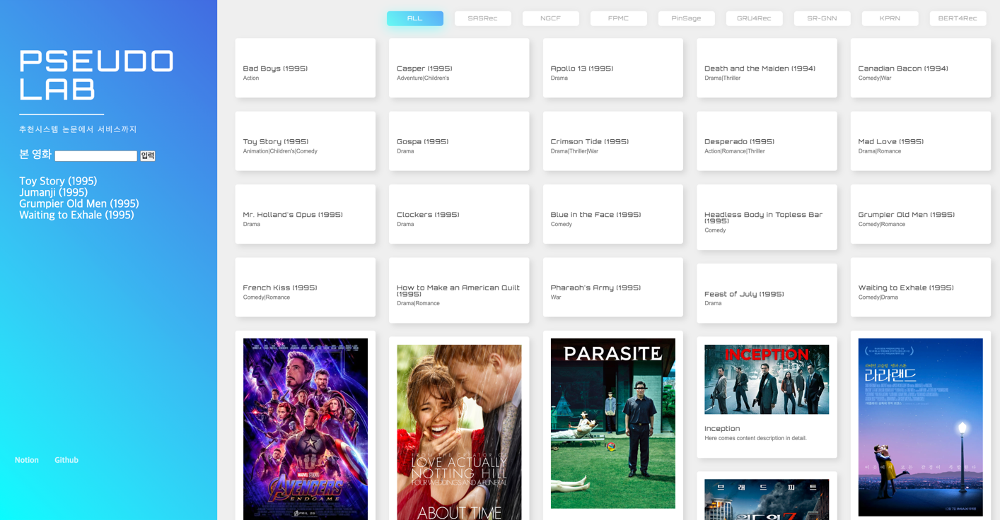

# 추천시스템 서비스 배포

# 접속
http://13.209.69.81/

# runserver
```shell
docker-compose up -d
export RDS_MYSQL_PW=${PASSWORD}
python manage.py runserver
```
# docker
```
docker build -f Dockerfile . -t pseudorec
docker run -p 80:8000 pseudorec
```

# django 설치
```
pip install 'django<5'
```


~ 9/21 진행상황 


## Reference
- 인터랙티브 웹 페이지 만들기
- 이한영의 Djagno 입문

