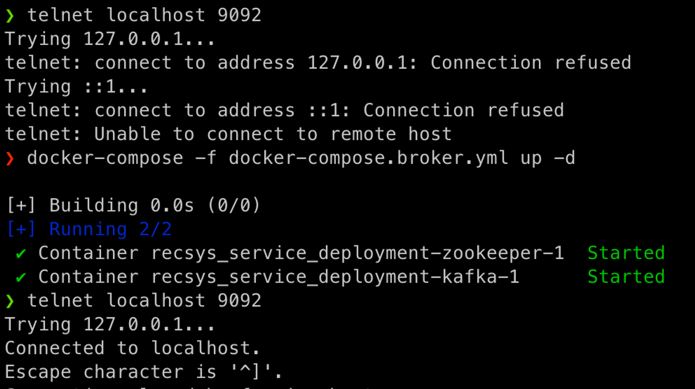
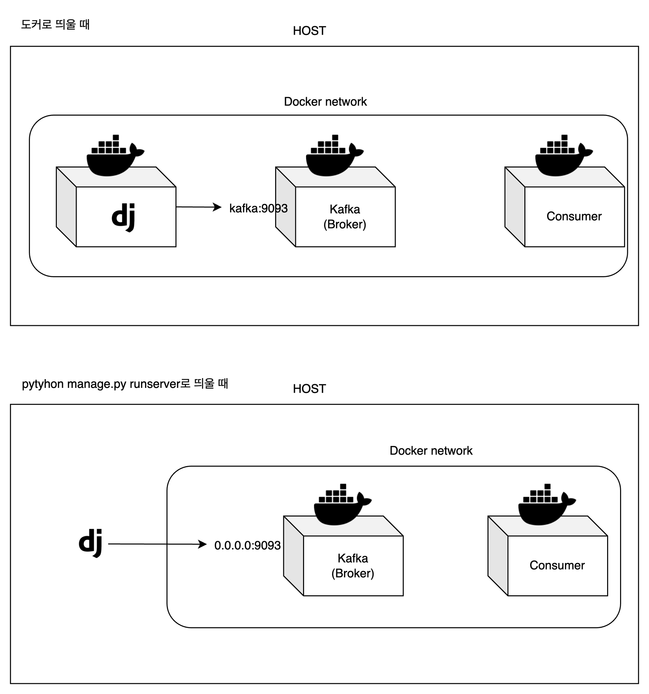

카프카 요약

- 클릭로그 : Producer → Broker → Consumer
- Producer : Django 내 python 모듈
- Broker : zookeeper Container → kafka Container
- Consumer : Container

---

서버에 장고를 컨테이너로 띄우기로 했다. 근데 테스트할 때마다 이미지를 빌드하는 것은 비효율적이었고, 그러면 `python manage.py runserver`로 작업물을 확인하며 개발해야 했는데… 웹을 컨테이너로 띄울 때와 `runserver`로 띄울 때 Producer(장고 내부, 배포는 컨테이너로, 개발은 localhost로), Broker, Consumer 각각의 컨테이너끼리 통신할 포트를 다르게 설정해야 한다는 것을 알게되었다.

현재 우리의 Kafka Producer와 Broker 연결은 다음과 같이 되어있다.

```python
# utils/kafka.py
import os
from dotenv import load_dotenv

load_dotenv('.env.dev')

def get_broker_url():
    if os.getenv('IN_CONTAINER') == 'YES':  # <1>
        broker_url = os.getenv('BROKER_URL_IN_CONTAINER')
    else:
        broker_url = 'localhost:9092'  # <2>
    print(f"\tL [IN_CONTAINER? {os.getenv('IN_CONTAINER', 'NO')}] broker url : {broker_url}")
    return broker_url

broker_url = get_broker_url()
producer = KafkaProducer(bootstrap_servers=[broker_url],
                         value_serializer=lambda v: json.dumps(v).encode('utf-8'))
```

<1> 장고가 컨테이너로 띄워지면, 해당 컨테이너 안에 `IN_CONTAINER`라는 환경변수를 `YES`로 설정하게 했다. 그러면 `.env.dev` 파일에서 `BROKER_URL_IN_CONTAINER`값을 브로커의 url로 사용한다. `kafka:9093`으로 설정되어있다.

<2> 장고 앱이 로컬에서 띄워지면 (`python manage.py runserver`로 띄우면), 브로커의 url은 `localhost:9092`가 되도록 설정했다. 즉 개발할 때!

```docker
# docker-compose.broker.yml

version: '3'
services:
  zookeeper:
    image: wurstmeister/zookeeper:3.4.6
    ports:
      - "2181:2181"
  kafka:
    image: wurstmeister/kafka:latest
    ports:
      - "9092:9092"  # <1>
    environment:
	    KAFKA_LISTENER_SECURITY_PROTOCOL_MAP: INSIDE:PLAINTEXT,OUTSIDE:PLAINTEXT  # <2>
      KAFKA_LISTENERS: INSIDE://0.0.0.0:9093,OUTSIDE://0.0.0.0:9092  # <3>
      KAFKA_ADVERTISED_LISTENERS: INSIDE://kafka:9093,OUTSIDE://localhost:9092  # <4>
      KAFKA_INTER_BROKER_LISTENER_NAME: INSIDE
      KAFKA_ZOOKEEPER_CONNECT: zookeeper:2181
      KAFKA_OFFSETS_TOPIC_REPLICATION_FACTOR: 1  # replication factor를 1로 설정
    volumes:
      - /var/run/docker.sock:/var/run/docker.sock
```

브로커 컨테이너의 docker-compose 파일이다. 포트가 너무 많아 헷갈린다.

<1> “{host port 번호} : {컨테이너 포트 번호}”를 의미한다. kafka 컨테이너를 띄우기 전에는 localhost:9092로 연결이 안되지만, kafka 컨테이너 띄운 후 연결 된다.



<2> {listener 이름} : {보안 프로토콜} 형식으로 적는다. “INSIDE”와 “OUTSIDE”라는 이름의 리스너를 적는다.

<3> `KAFKA_LISTENERS`는 카프카 브로커가 내부적으로 바인딩하는 주소이다. 즉, `0.0.0.0:9093`으로 들어오면 ‘INSIDE’ 리스너로 인식한다.

<4> `KAFKA_ADVERTISED_LISTENERS`가 좀 헷갈리던데…! 일단 카프카 프로듀서, 컨슈머에게 노출할 주소이다. 외부의 Producer는 Broker에게 바로 데이터를 보내는게 아니라 Broker 서버의 정보와 토픽 정보를 먼저 요청한 후, 서버리스트를 받고나서 거기에 데이터를 보내는데, `KAFKA_ADVERTISED_LISTENERS` 가 바로 ‘여기로 보내면 돼’라고 Producer client에게 반환해주는 서버리스트라고 한다.


