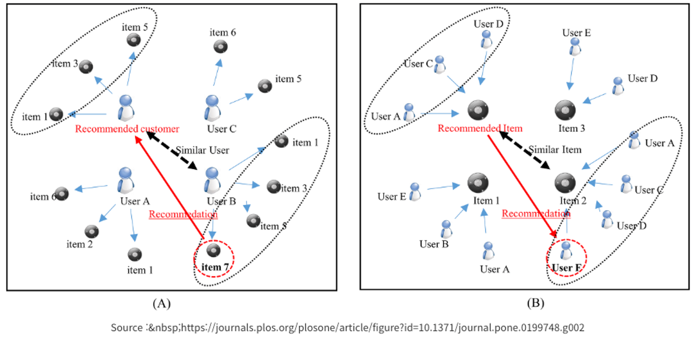
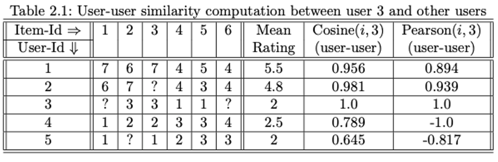
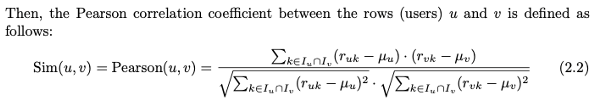
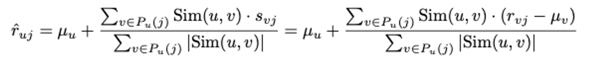
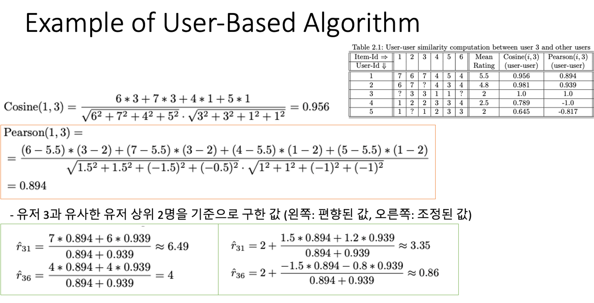
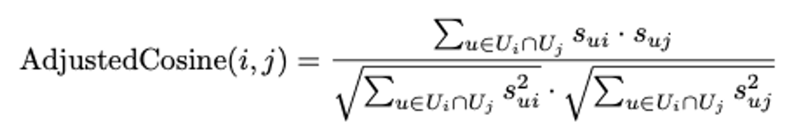
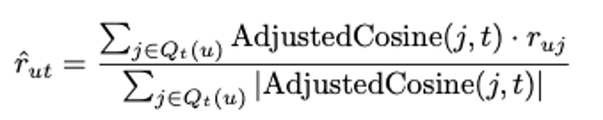
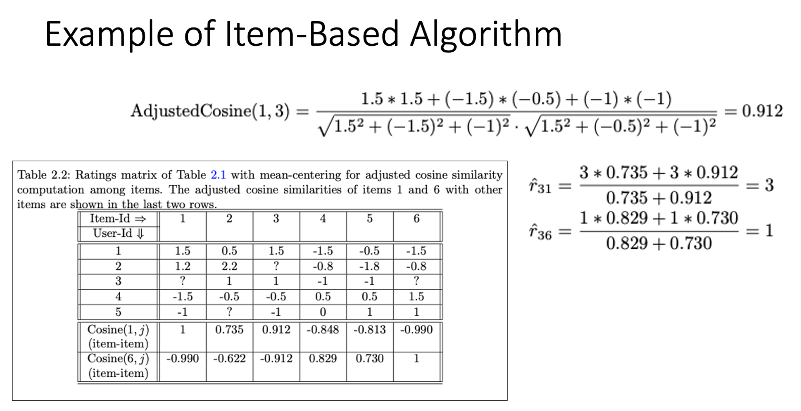

- 참고 내용
    - Recommender Systems The Textbook
    - Chat GPT

# Neighborhood-based CF

이웃 기반 방법은 k-최근접 이웃(k-Nearest Neighbor, k-NN) 분류기를 일반화한 것으로 볼 수 있습니다. k-NN은 기계 학습에서 널리 사용되는 인스턴스 기반(instance-based) 또는 게으른 학습(lazy learning) 방법의 한 예입니다. 이 방식에서는 예측을 위해 사전에 구체적인 모델을 생성하지 않고, 대신 데이터의 인스턴스(예: 사용자 또는 아이템) 간의 유사성을 바탕으로 예측을 수행합니다. 예를 들어, 사용자 기반 이웃 방법(user-based neighborhood methods)에서는 타겟 사용자와 유사한 사용자(이웃)를 찾아 이들의 선호도를 바탕으로 예측을 진행합니다.

## Two types of neighborhood-based CF

1. User-based CF : 비슷한 사용자들은 같은 아이템에 대해 비슷한 평점을 줍니다. 따라서, 앨리스와 밥이 과거에 영화에 대해 비슷한 방식으로 평가를 했다면, 터미네이터 영화에 대한 앨리스의 관찰된 평점을 사용하여 밥의 관찰되지 않은 평점을 예측할 수 있습니다.
    
    
    
2. Item-based CF : 비슷한 아이템들은 같은 사용자에 의해 비슷한 방식으로 평가됩니다. 따라서, 에일리언과 프레데터와 같은 비슷한 과학 영화에 대한 밥의 평점은 터미네이터에 대한 그의 평점을 예측하는 데 사용될 수 있습니다.
    
    
    

---

## (1) User-based CF (사용자 기반 협업 필터링)

User-based CF는 '사용자 간의 유사성'에 기반을 두고 추천을 생성합니다. 이 방식에서는 특정 사용자와 비슷한 선호도를 가진 다른 사용자들을 찾고, 이 '이웃(neighbors)'들이 선호하는 아이템을 해당 사용자에게 추천합니다.

1. **유사성 계산**: 사용자 간의 유사성을 평가합니다. 이는 보통 코사인 유사도, 피어슨 상관관계, 자카드 유사도 등으로 계산합니다.
    
    1) Cosine Similarity 
    
    $$
    \text{Cosine Similarity}(A, B) = \frac{A \cdot B}{\|A\| \|B\|} = \frac{\sum_{i=1}^{n} A_i B_i}{\sqrt{\sum_{i=1}^{n} A_i^2} \sqrt{\sum_{i=1}^{n} B_i^2}}
    $$
    
    2) Pearson Correlation Coefficient 
    
    - 피어슨 상관계수를 구할 때 일반적으로 두 사용자가 공통으로 평가한 항목들에 대해서만 평균(μ)을 계산해야 합니다. 하지만 실제로는 계산의 간소화를 위해 사용자별로 평균을 한 번만 계산하고, 이를 모든 항목에 동일하게 적용하는 방식이 흔히 사용됩니다. 이렇게 하더라도 어느 한 방식이 다른 방식보다 항상 더 좋은 추천 결과를 보장한다고 단정 지을 수 없습니다. 특히, 두 사용자가 단 하나의 항목에 대해서만 평점을 매겼을 때는 평균을 한 번만 계산하는 방식이 더 유용한 정보를 제공할 수 있습니다. 그러나 사용자 기반 방법을 구현할 때는 여전히 피어슨 계산 시 두 사용자 간의 평균을 쌍으로 계산하는 경우가 많습니다.
    - 엄격한 의미에서는 유저 i와 j가 공통적으로 rating을 남긴 item들에 대한 평균만 구해야합니다. 하지만, 현실의 문제는 sparsity가 높기 때문에 그냥 전체 item의 평균을 사용한다고 합니다.
    
    
    
2. **이웃 선택**: 현재 사용자(A)와 유사한 사용자(N)들을 찾습니다. 이를 '이웃'이라 합니다.
3. **평점 예측 (Prediction Function)**: 사용자 A가 평가하지 않은 아이템에 대한 평점을, 사용자 A와 유사한 이웃들의 평점을 가중평균하여 예측합니다.
    
    
    
    $$s_{uj} = r_{uj} - \mu_{u} \quad \forall u \in \{1...m\}$$
    
4. **추천 생성**: 예측 평점이 가장 높은 아이템을 상위 목록으로 추천합니다.

User-based 유사성 계산 (예시)

- 결과 해석
    - 초록색 왼쪽 박스를 통해 사용자 3에게 아이템 1을 아이템 6보다 우선 추천해야 한다는 것이 제안됩니다. 이 예측은 사용자 3이 자신이 이미 평가한 영화들보다 영화 1과 6에 더 관심을 보일 가능성이 있다고 말하고 있습니다. 하지만, 이는 사용자 3과 비교해 보았을 때, **사용자 1과 2의 피어 그룹이 더 긍정적인 평가를 하는 경향이 있는 그룹이라는 사실 때문에 나타난 편향된 결과입니다.**
    - 평균을 중심으로 한 평가의 영향을 알아보기 위해, 평균 중심의 평가를 사용한 예측 결과를 살펴봅시다. 평균 중심의 평가는 예측을 더 정확하게 만들기 위해 사용되며, 사용자 3에 대한 아이템 1과 6의 평가 예측은 초록색 오른쪽 박스와 같이 변경될 수 있습니다.

### User-based CF 장단점

- **장점**:
    - **개인화**: 각 사용자의 고유한 선호도를 반영할 수 있는 개인화된 추천을 제공합니다.
    - **직관적**: 사용자가 이해하기 쉬운 추천을 생성할 수 있습니다. "유사한 사용자가 좋아하는 상품"이라는 방식은 설명하기 쉽습니다.
- **단점**:
    - **규모의 복잡성**: 사용자 수가 많을수록 계산 비용이 증가하며, 실시간 추천에 한계가 있습니다.
    - **콜드 스타트 문제**: 새로운 사용자에 대한 정보가 충분하지 않을 때 추천을 생성하기 어렵습니다.
    - **데이터 희소성**: 대부분의 사용자가 시스템의 소수의 아이템에만 평가를 남기기 때문에, 유사한 사용자를 찾기 어려울 수 있습니다.

---

## (2) Item-based CF (아이템 기반 협업 필터링)

Item-based CF는 '아이템 간의 유사성'에 초점을 맞춘 방법으로, 사용자가 과거에 평가했던 아이템과 유사한 아이템을 추천합니다. 이 방식은 Amazon에서 추천 시스템을 구축하는 데 사용되어 큰 성공을 거두었습니다.

1. **유사성 계산**: 아이템 간의 유사성을 평가합니다. 여기서도 코사인 유사도나 피어슨 상관관계를 사용할 수 있습니다.
    
    1)Adjusted Cosine Similarity 
    
    
    
    2) Pearson Correlation Coefficient 
    
2. **이웃 선택**: 특정 아이템(I)과 유사한 아이템을 찾습니다.
3. **평점 예측 (Prediction function)**: 사용자가 평가한 아이템의 유사 아이템들의 평점을 바탕으로, 사용자가 평가하지 않은 아이템의 평점을 예측합니다.
    
    
    
4. **추천 생성**: 사용자에게 예측 평점이 가장 높은 아이템을 추천합니다.

Item-based 유사성 계산 (예시)

- 결과 해석
    - 아이템 2와 3이 아이템 1과 가장 유사하고 아이템 4와 5가 아이템 6과 가장 유사합니다.

### Item-based CF 장단점

- 장점:
    - **안정성**: 아이템 간의 유사성은 시간이 지나도 상대적으로 안정적입니다. 따라서 새로운 사용자 평가가 들어오더라도 기존 아이템 프로파일에 큰 영향을 주지 않습니다.
    - **효율성**: 아이템 수는 사용자 수보다 일반적으로 적으므로 계산 효율성이 더 높습니다.
    - **콜드 스타트에 강함**: 새로운 사용자가 시스템을 이용하기 시작해도, 이미 구축된 아이템 프로파일을 바탕으로 추천을 할 수 있습니다.
- 단점
    - **새로운 아이템**: 새로운 아이템에 대해서는 유사성을 평가할 데이터가 부족해 콜드 스타트 문제가 발생할 수 있습니다.
    - **다양성 부족**: 사용자의 과거 선호도만을 반영하기 때문에, 사용자의 다양한 취향을 발견하는 데 한계가 있을 수 있습니다.

---

# Comparing User-based and Item-based Methods

아이템 기반 방법과 사용자 기반 방법은 추천 시스템에서 사용되는 두 가지 주요 방법입니다. 각각의 방법은 장단점을 가지고 있으며, 상황에 따라 어느 한쪽이 더 나은 결과를 제공할 수 있습니다.

- **아이템 기반 방법의 특징**
    1. **Robustness to Shilling Attacks**: 아이템 기반 방법은 shilling attack에 대해 더 강건합니다. 이는 공격자가 추천 시스템을 조작하기 위해 가짜 평점을 입력하는 것을 어렵게 만듭니다.
    2. **추천에 대한 구체적인 이유 제공**: 아이템 기반 방법은 "당신이 이것을 좋아했기 때문에, 이것을 추천합니다"와 같이 추천에 대한 구체적인 이유를 제공할 수 있습니다. 이는 사용자에게 추천의 맥락을 제공하고, 추천에 대한 신뢰도를 높일 수 있습니다.
    3. **평점 변화에 대한 안정성**: 아이템 기반 방법은 평점의 변화에 대해 더 안정적입니다. 사용자보다 아이템의 수가 적기 때문에, 새로운 평점이 추가되어도 전체 시스템에 미치는 영향이 적습니다.
- **사용자 기반 방법의 특징**
    1. **다양성 (Diversity)**: 사용자 기반 방법은 추천 목록에서의 다양성을 증가시킬 수 있습니다. 이는 사용자가 예상치 못한 새로운 아이템을 발검할 기회를 제공하며, 시스템의 탐색성을 증가시킵니다.
    2. **설명의 어려움**: 사용자 기반 방법은 추천에 대한 구체적인 이유를 제공하기가 어렵습니다. 이웃 사용자의 정보를 기반으로 한 추천이기 때문에, 개인 정보 보호 등의 이유로 사용자에게 직접적인 설명을 제공하기 어렵습니다.
    3. **모델 유지의 어려움**: 사용자 기반 방법은 시스템에 새로운 사용자나 평점이 추가될 때 마다 유사도 계산을 다시 해야 하는 등 모델을 유지하기가 더 복잡합니다.

# 협업 필터링의 장단점

### **장점**

1. **구현 및 디버그 용이**: 간단함으로 인해 구현과 디버그가 쉽습니다. 이는 초기 추천 시스템 프로젝트나 빠른 프로토타이핑이 필요할 때 매력적인 옵션입니다.
2. **설명 가능성**: 모델 기반 접근법에 비해 더 나은 설명 가능성을 제공합니다. 이 방법으로 만들어진 추천은 왜 아이템이 추천되었는지 명확한 이유를 제공할 수 있습니다.
3. **새로운 항목 및 사용자에 대한 안정성**: 새로운 정보에 대해 전체 모델을 다시 학습할 필요 없이 적응할 수 있어 동적 환경에서 안정적입니다.

### **단점**

1. **대규모 설정에서의 속도 문제**: 대규모 데이터셋에서 모든 사용자 또는 아이템 쌍 간의 유사도를 계산하는 것은 상당한 계산 자원을 요구하며, 오프라인 단계에서 계산 비용이 많이 들 수 있습니다.
2. **희소성 문제**: 사용자-아이템 상호작용의 희소성은 이웃 기반 방법의 가장 큰 도전 중 하나입니다. 많은 사용자들이 소수의 아이템에만 평가를 하고, 많은 아이템이 소수의 사용자에 의해서만 평가될 수 있습니다. 이러한 희소성은 유사도 계산의 효과를 제한하고 추천의 질을 저하시킬 수 있습니다.

# 현재 사용되는 기법 (Chat GPT 왈)

최근에는 순수한 User-based나 Item-based CF보다 더 발전된 협업 필터링 기법이 널리 사용되고 있습니다. Matrix Factorization, Deep Learning 기반의 추천 시스템, Hybrid 모델(협업 필터링과 콘텐츠 기반 필터링의 결합), Context-Aware 추천 시스템 등이 사용자의 다양한 요구와 복잡한 행동 양상을 반영하기 위해 개발되었습니다.
