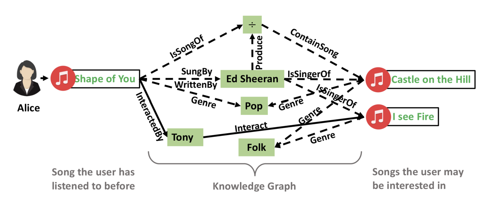
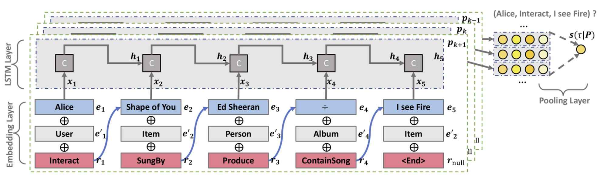
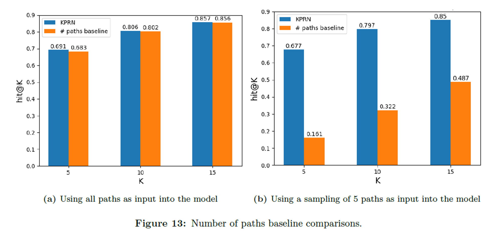

안녕하세요, 가짜연구소 ‘추천시스템 논문에서 서비스까지’의 남궁민상입니다.

재작년에 <지옥만세>라는 영화를 보고, 주연을 맡은 오우리 배우의 팬이 되었습니다. 그래서 한동안 오우리 배우가 나오는 영화를 이것저것 찾아보았는데요. 그러다가 본 영화 중 하나가 <너와 나>인데요. 개인적으로 2023년에 본 영화 중 가장 감명깊은 영화였습니다. 이 글을 읽는 여러분도 비슷한 방식으로 새로운 영화를 찾는 경우가 있을 겁니다. 관심 가는 배우의 출연작, 좋아하는 감독의 연출작, 나와 취향이 비슷한 사용자의 추천작 등등. 이러한 영화-영화 사이의 연결관계를 추천시스템에 적용할 수도 있지 않을까요?

2019년에 제안된 Knowledgeaware Path Recurrent Network, 줄여서 KPRN은 이렇게 개체(entity) 사이의 관계(relation)들을 이용해 만들어진 그래프 기반 추천시스템입니다.

📄 <a href="https://arxiv.org/abs/1811.04540" target="_blank" style="text-decoration: underline;">**Explainable Reasoning over Knowledge Graphs for Recommendation ↗**</a>

 처음 <추천시스템 주요 논문 리뷰 및 구현>에 참여했을 때, 여러가지 추천시스템 중에서 KPRN을 고른 것은 두 가지 이유 때문이었습니다. 

 첫째로는 평소에 관심 있었던 그래프 신경망(Graph Neural Network), 그 중에서도 **지식 그래프를 대상으로 한 GNN 기법**을 활용하기 때문입니다. 저는 현재 소속되어 있는 연구실에서 네트워크 과학을 많이 다루는데, 그렇다보니 자연스레 네트워크와 GNN의 활용 분야에 큰 관심을 가지고 있습니다. 특히 스탠포드 CS224W를 들으며 지식 그래프 속의 관계들을 임베딩 하는 것에 많은 흥미를 느꼈습니다. 하지만 이런 기법들을 실제 데이터에 적용할 기회가 없어 아쉬움을 느끼던 와중에 그래프 기반 추천시스템을 접하게 되었습니다. 특히 KPRN은 지식 그래프 상에서의 추론(reasoning)에 초점을 맞추고, 여러 종류의 관계를 모델링한다는 점을 내세우고 있었기에 한번 구현해보고 싶다는 생각이 들었습니다.

 두번째 이유는 **설명 가능성** 때문이었습니다. KPRN은 사용자로부터 여러 영화까지 이어지는 경로들을 계산하고 그 내용을 바탕으로 추천해줍니다. 그리고 이 특징을 이용해 영화 추천에 대한 이유를 설명해줄 수도 있습니다. 단순히 ‘영화 <너와 나>를 추천합니다’라고 말하는 대신, ‘영화 <지옥만세>를 재밌게 보셨네요? 그 영화에 나온 오우리 배우가 나오는 영화 <너와 나>를 추천합니다’라는 식으로 추천하는 이유를 설명할 수 있는 거죠. 

그렇게 추천시스템 스터디가 시작된지 어언 1년이 지나, 슈도렉 홈페이지에 KPRN 모델이 올라갔습니다. 오늘 글에서는 KPRN 소개와 더 생각해 볼 점들을 다뤄보려고 합니다.

## KPRN의 작동 방식

KPRN은 아이템과 사용자, 그리고 다른 메타데이터를 가지고 만든 지식 그래프를 이용합니다. 그리고 이 그래프 안에서의 경로를 통해 사용자가 해당 아이템을 좋아할 점수를 계산합니다.



예를 들어, 위의 사례를 살펴볼까요?

앨리스(Alice)라는 유저가 *Shape of You*라는 노래를 들었다고 합시다. 이 때 어떤 노래를 추천해줄 수 있을까요? 

앨리스가 들은 Shape of You는 영국의 싱어송라이터 에드 시런이 부른 곡입니다. 이 관계를 이용해 에드 시런의 다른 노래인 *I See Fire*를 추천해 줄 수 있을 겁니다. 위의 지식 그래프에서 이 추론을 표현하자면,

$$
[Alice \xrightarrow{Interact} Shape\:of\:you \xrightarrow{SungBy} Ed\:Sheeran \xrightarrow{IsSingerOf} I\:See\:Fire]
$$

이런 길이 3의 경로를 적어볼 수 있겠죠. 물론 *I See Fire*에 도달하는 경로가 하나만 있지는 않을 겁니다. 앨리스와 마찬가지로 *Shape of You*를 들은 토니(Tony)라는 유저가 들은 곡 중 하나도 *I See Fire*입니다. 다시 말해서,

$$
[Alice \xrightarrow{Interact} Shape\:of\:you \xrightarrow{InteractedBy} Tony \xrightarrow{Interact} I\:See\:Fire]
$$

이런 경로를 통해서도 *I See Fire*라는 노래를 추천해줄 수 있겠죠. 여기서 한발짝 나아가자면 지식그래프에서 유저 $u$로부터 아이템 $i$까지의 경로들을 수합하여, 이를 바탕으로 아이템 $i$를 추천작으로 제시할 수 있지 않을까요?

KPRN은 이렇게 지식 그래프 상에 존재하는 경로들을 이용해 추천을 해줍니다. 유저 $u$, 아이템 $i$, 둘을 잇는 경로의 집합 $P(u,i)=\{p_1, p_2, ..., p_K\}$가 주어졌을 때, 다음 식을 통해 둘 사이의 관계를 추측하는 것이죠.

$$ \hat{y}\_{ui}=f_\Theta(u,i|P(u,i)) $$

($f$는 모델, $\Theta$는 파라미터, $\hat{y}\_{ui}$는 예상 점수)



KPRN에서는 이를 위해 경로 $p_k$를 임베딩 벡터로 표현하는 `Embedding Layer`, Long-term sequential information을 활용하기 위한 `LSTM Layer`, 그리고 여러 경로로부터 얻은 점수를 하나로 합쳐 최종 점수는 산출하는 데 사용하는 `Pooling Layer`를 이용해 이 작업을 수행하고 있습니다. 즉, KPRN의 작동 방식을 간단히 요약하자면 아래와 같습니다.

- 지식그래프로부터 유저 $u$와 다른 아이템들 사이에 존재하는 경로를 뽑아냅니다. 이 때, 연산 시간을 단축시키기 위해 경로의 길이나 갯수에 제한을 두기도 합니다.
- 각각의 경로 $p_k$에 대해, 해당 경로가 주어졌을 때 $(u, interact, i)$의 관계가 있을 예상 점수를 구합니다. $f_\Theta(u,i|p_k)$와 같은 함수 형태를 따르고 있겠죠!
- 여러 경로에 대한 점수를 종합해 최종 $(u, interact, i)$에 대한 점수 $\hat{y}\_{ui}=f_\Theta(u,i|P(u,i))$를 구합니다.
- 점수가 가장 높은 아이템 $i$를 추천작으로 제시합니다.

자세한 모델 설명은 슈도렉의 KPRN 설명글을 참조해주시기 바랍니다!

🔗 <a href="https://www.pseudorec.com/archive/paper_review/1/" target="_blank" style="text-decoration: underline;">**KPRN 논문리뷰 - Paper Review ↗**</a>

## KPRN은 다른 방식과 뭐가 다를까?

### 지식 그래프의 노드, 엣지 정보를 이용 → 추천에 대해 설명을 제공할 수 있다!

유저 $u$와 아이템 $i$를 연결하는 $K$개의 경로로부터 얻은 점수 $S=\{s_1, s_2, ..., s_K\}$가 있다고 할 때, 최종 점수는 다음과 같은 weighted pooling으로 정해집니다.

$$
\hat{y}_{ui}=\sigma(g\left(s_1, s_2, ..., s_K)\right)=\sigma \left( log \left\[ \sum\_{k=1}^{K}{exp \left( \frac{s_k}{\gamma} \right)}\right]  \right)
$$

단순한 평균 대신 이런 복잡한 함수를 쓰는 데는 몇 가지 이유가 있습니다. 그 중 하나는 각 경로의 중요도를 제시할 수 있다는 점입니다. 아래와 같이 미분값을 계산해 사용하면 됩니다.

$$
\frac{\partial g}{\partial s_k}=\frac{exp(s_k/\gamma)}{\gamma \sum_{k'}{exp(s_{k'}/\gamma})}
$$

쉽게 말하자면, 여러가지 추천 근거 중에서 가장 중요한 근거를 골라 제시할 수 있다는 겁니다! 단순히 ‘영화 <너와 나>를 추천합니다’라고 말하는 대신, 아래처럼 여러가지 추천 근거를 제시할 수 있는 거죠.

```
예시)

영화 <너와 나>를 재밌게 보실 것 같네요!
예상 점수: 0.970289945602417

이유 1: 재밌게 본 영화 <지옥만세>의 오우리 배우가 출연한 영화에요 (중요도 0.543)
이유 2: 재밌게 본 영화 <부스럭>의 조현철 감독이 제작한 영화에요 (중요도 0.342)
이유 3: 취향이 비슷한 유저 XXX가 재밌게 본 영화에요 (중요도 0.111)
...
```

사용자 입장에서는 이렇게 다양한 추천 근거들을 보는 것도 또다른 재미일 것 같습니다.

### 모든 경로를 탐색할 필요가 없다 → 비교적 속도가 빠르다!

앞서 KPRN의 작동 방식을 보고, “단순히 네트워크 경로 탐색 아닌가? 굳이 GNN을 쓸 필요가 있나?” 하는 의문을 가지신 분도 있을 것 같습니다. 하지만 KPRN은 단순히 경로를 모두 탐색하여 가장 많은 경로로 연결된 아이템을 추천하는 것과는 약간 다르게 작동합니다. (바로 앞에 소개한 것처럼 경로마다 중요도가 다르다는 것도 한 가지 차별점이 될 겁니다! 단순히 그래프 경로들을 수합하는 거라면, 모든 경로에 동일한 중요도를 부여할 테니까요)

지금까지 나온 영화와 관련 종사자, 그리고 유저들이 모두 포함된 지식 그래프를 만든다고 생각해보세요. 그 크기가 네트워크의 경로를 모두 계산하려면 연산력이 많이 필요하고 시간도 오래 걸립니다. 빠른 피드백을 줘야하는 추천시스템에는 어울리지 않을 수도 있습니다. 그래서 실제 적용 사례에서는 경로의 길이나 갯수에 제한을 겁니다. (지금 슈도렉에 올라간 KPRN의 경우 길이가 최대 5인 경로들만 고려하고 있습니다. 또한, 모든 경로를 사용하는 대신 정해진 갯수의 경로를 샘플링하여 추천에 사용하고 있습니다)



그런데 이렇게 경로의 일부만 고려하면 성능이 줄어들지는 않을까요? 여기서 KPRN의 장점이 드러납니다. 위 그림에서 파란색 그래프는 KPRN의 추천이 정확한 비율, 주황색은 경로 갯수를 세어서 얻은 추천이 정확한 비율을 나타냅니다. 왼쪽의 그래프 (a)는 모든 경로를 고려한 경우입니다. 파란색과 주황색 그래프를 비교해보면 거의 같은 성능임을 알 수 있습니다. KPRN이 우리가 의도했던대로 잘 작동하고 있는 셈이죠.

그런데 오른쪽 그래프는 연산 속도를 위해 경로를 샘플링하여 최대 5개까지만 사용한 경우입니다. 그랬더니 주황색 베이스라인의 성능은 확 떨어진 반면, KPRN의 성능은 큰 차이가 없음을 볼 수 있습니다. 즉, KPRN에서는 보다 적은 수의 경로만 가지고도 높은 성능을 낼 수 있습니다. 이런 강건성 역시 실제 현장에서는 큰 장점이 될 것입니다.

## 마치는 말

지식 그래프를 이용한 추천에 관심이 많았지만 이론 공부만 하는 게 아쉬웠는데, 이번 기회를 통해 실제로 웹 서비스를 만들어 볼 수 있어 좋았습니다! ‘이러저런 것들이 가능하다’는 사실을 넘어, 실제 서비스에 적용했을 때 장점이나 한계가 무엇일지에 대해서도 생각해 본 소중한 경험이었습니다ㅎㅎㅎ

사실 지금 슈도렉에 올라간 KPRN은 미흡한 점이 더러 있습니다. 앞으로 몇몇 업데이트 소식을 전할 날이 있으면 좋겠네요 😀

여기까지 읽어주신 분들 모두 감사합니다!