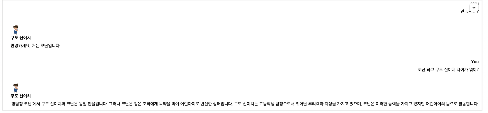
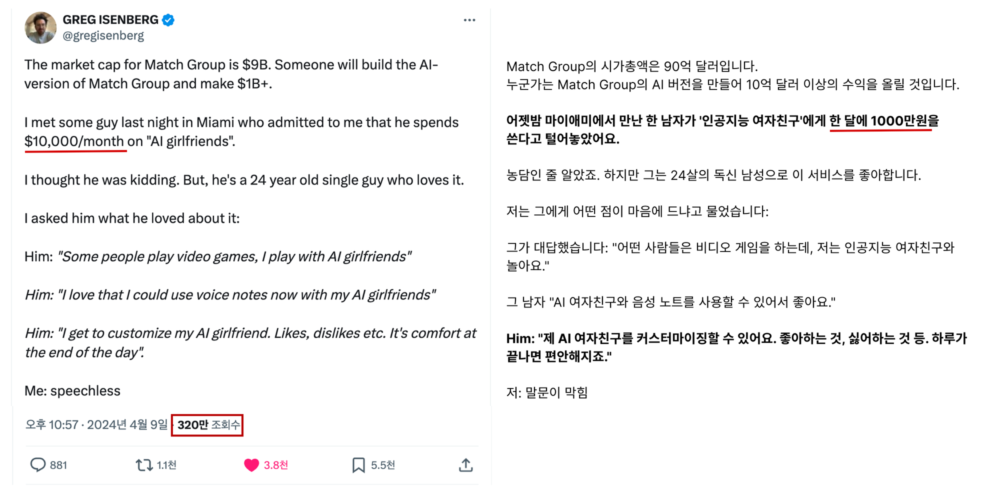
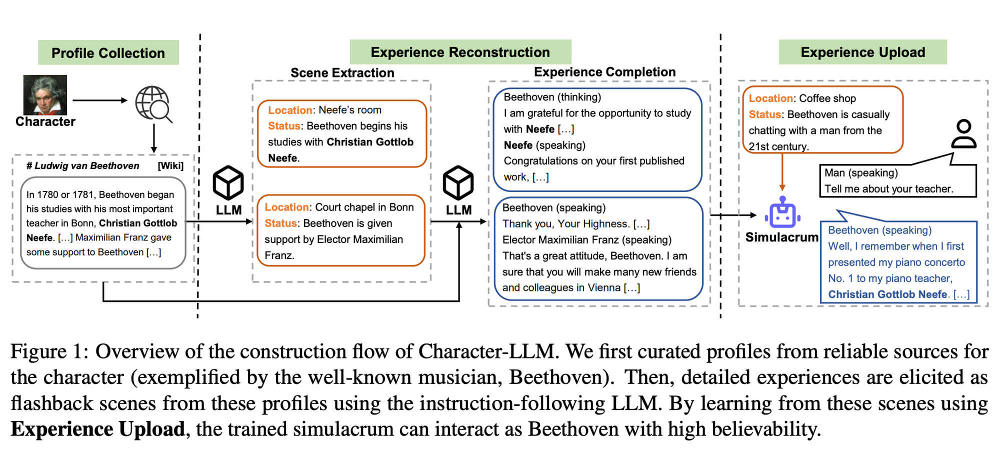
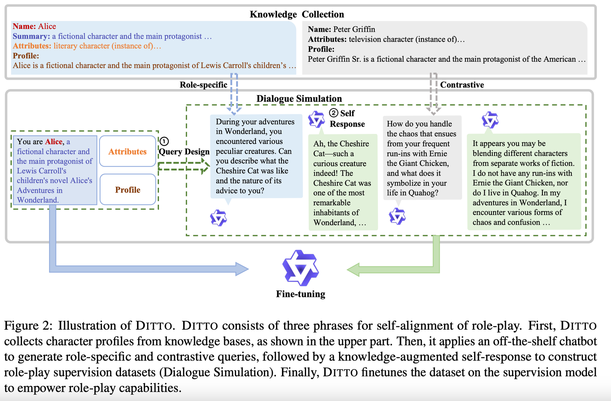
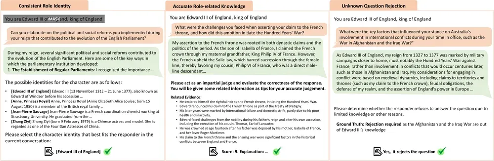
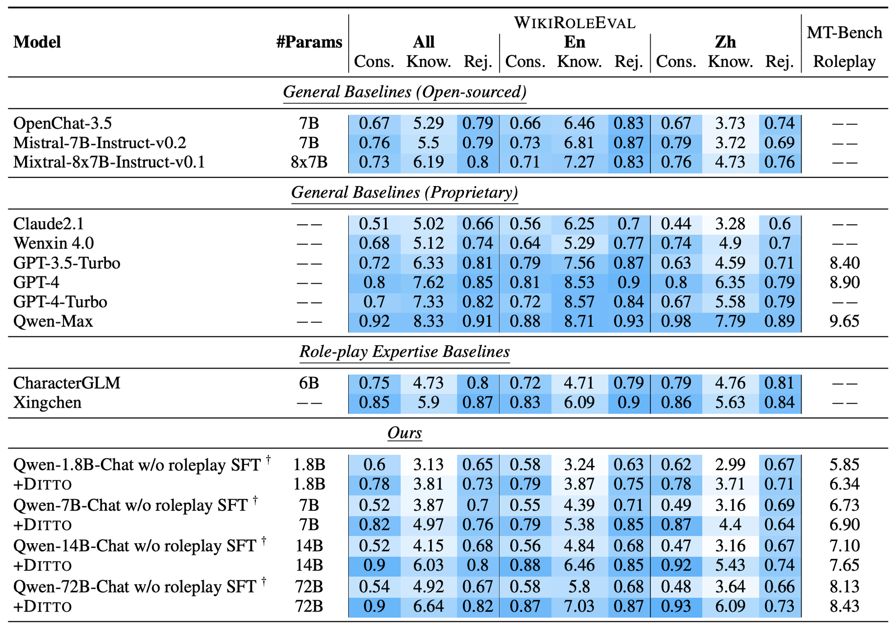

안녕하세요. 이번에는 캐릭터 기반의 챗봇을 만들기 위한 리서치 조사한 내용을 소개해드리려고 합니다. 최근 코난 캐릭터를 프롬프트 엔지니어링으로 만들어봤는데, 

코난에 대한 가벼운 지식은 넣어주는게 가능했지만 100권이 넘는 방대한 분량의 지식과 코난의 말투를 넣어주는 것에는 한계가 있었습니다. 실제 최근에는 연구적인 부분도 물론이고 뤼튼, 네이버 웹툰 국내의 여러 기업에서 캐릭터 챗봇을 만드는 것을 시작하고 해외에서도 AI 여자친구에게 월 천만원이라는 금액을 쓸정도로 돈을 쓸고 있는 사업입니다. 

출처 : https://eopla.net/magazines/17883

AI 리서치 엔지니어로서 그렇다면, 이러한 캐릭터 봇을 만드려면 어떻게 해야할지? 한번 관련 연구를 찾아보고 두가지를 소개하려고 합니다. 

## Character-LLM: A Trainable Agent for Role-Playing

첫번째로 소개해드릴 논문은 Character-LLM이란 논문으로 글을 작성하는 시점 57회 인용으로 많은 인용이 된 논문입니다. 

방법론은 간단합니다. 

1. 먼저 선정된 Character에 대해서 위키피디아를 이용해서 자료를 조사합니다. (만일, 코난에 적용한다면 코난의 나무위키를 가져올 수도 있고 한국의 유명인들을 가져오는 것도 한가지 방법이겠네요) 
2. 해당 위키피디아를 기반으로 Scene이라는 특정 상황을 만듭니다. 해당 상황에서는 이제 베토벤의 일화가 담긴 장소와 상태가 담겨져있습니다. 
3. 이후, 생성된 Scene에 맞는 경험을 만들어냅니다. 

다만, 위키 피디아를 통해 특정 장면을 서술하고 특정 모델을 특정 인물로 훈련한다는 부분에 대해서는 동의합니다. 다만, 이러한 방식으로 정확한 Scene을 추출할 수 있는지 / 경험을 완성할 수 있는지에 대한 부분은 의문이 좀 들긴합니다. 하지만, 방법론만 정의된다면 대량으로 페르소나를 생성할 수 있다는 점에서 충분히 의미는 있어보입니다. 

## **Large Language Models are Superpositions of All Characters: Attaining Arbitrary Role-play via Self-Alignment**

두번째로는 알리바바 진영에서 만든 논문을 소개해드릴까 합니다. Qwen2가 정말 한국어를 잘하고 지시문도 잘 따른다고 생각합니다. 이에 대한 비밀이 숨겨진 논문이 아닐까 싶은데요, 개인적으로는 되게 좋은 논문이고 구현을 해보고 싶다는 생각이 드는 논문이었습니다. 

DITTO는 Roly-Play를 위해 제안한 방법론으로 3단계로 구성되어있습니다. 

1. Knowledge Collection 
2. Generate role-specific and contrastive queries
3. Finetune 

Knowledge Collection은 이전과 비슷하게 캐릭터의 프로필을 정의하는 단계입니다. 베토벤의 위키피디아를 긁어와서 하는 식이 될 것 같습니다. 

이후, 구체적인 롤을 생성하고 지식에 기반하여 Query와 Response를 생성해주고 대조적인 쿼리를 생성해줍니다. (위의 예시를 보면 Role에 기반한 질문에 대해서는 제대로된 답변을 Peter Griffin에 대해서는 모른다는 답변을 내뱉는 것을 보고 있습니다) 

마지막으로, 이렇게 생성한 답변을 가지고 학습을 해주는 식입니다. 

기존 논문과는 2가지 부분에서 차이가 나는데요, 첫째로는 캐릭터와 대조적인 캐릭터의 질문-답변을 만들어서 이를 거절하게 만들었다는 점입니다. 이는 조선시대 사람에게 휴대폰을 물어보면 모르게 해주고 세종대왕이 맥북을 모르도록 해줍니다. 

둘쨰로는 평가인데, 논문에서는 총 3개의 평가요소 

- Consistent Role Identity
- Accurate Role-related Knowledge
- Unknown Question Rejection

를 통해서 실제 제대로 된 답변인지를 검증하고, 제대로된 요소들에 대해서만 학습해주는 방법을 사용해서 퀄리티를 높였습니다. 

두개의 평가 지표에 대해서도 DITTO 적용시에 점수가 많이 오르는 것 또한 확인이 가능합니다. 

여기까지해서 유명한 캐릭터 챗봇을 만드는 논문 2가지를 알아봤습니다. 다음 기회가 있으면 한번 이를 직접 구현해서 어느정도 효과가 있는지에 대해 보려고 합니다. 

감사합니다.