# 시작하며

※ 수식이 깨져보이신다면 새로고침을 해주세요

> 본 게시글은 ‘Mathematics of Machine Learning’ 책을 번역하였습니다. 복습 시 한 호습에 읽히도록 필요한 부분만 개인적인 해석을 달아 적어 놓는 것이 이 글의 목적입니다.

Collaborative Filtering(CF)는 가장 대표적인 추천시스템입니다. CF는 이웃 기반 방법과 Latent Factor 방식으로 나뉩니다.
저는 ‘Mathematics of Machine Learning’ 책을 학교에서 배울 때 Matrix Decomposition이 추천시스템의 Latent Factor 부분에 대해 살짝 다룬다는 걸 알고 있었는데,
이번 기회에 이론적 배경에 대해 정리해보려 합니다. 4챕터 Matrix Decomposition 부분을 번역합니다. 행렬 분해가 어떻게 유저의 선호도를 나타낼 수 있을까요?

이번에는 Determinant와 Eigenvalue, Eigenvector에 대해 먼저 번역하겠습니다.

---

# 4.1 Determinant and Trace

Determinant는 선형 대수에서 중요한 개념이다.
Determinant는 오직 정방행렬에 대해서만 정의된다. 이 책에서는 determinant를 $det(A)$ 또는 $|A|$로 표기한다.

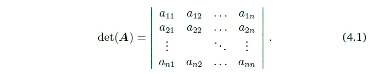

**정방행렬 $A$의 determinant란 $A$를 실수로 mapping하는 함수이다.** 
determinant의 정의를 살펴보기 전에, 동기 부여를 위한 예시를 함께 보자!

> Example 4.1 **행렬 Invertibility 확인하기**
> 
> 정방행렬 $A$가 Invertible인지 아닌지를 알아보자.
> 가장 작은 행렬의 경우 우린 행렬이 invertible일 때를 알고 있다. 
> 만약 $A$가 1×1행렬이라면, 즉, 스칼라라면, $A=a \rightarrow A^{-1}=\frac{1}{a}$이다. 
> $a\ne0$이라면 $a \times (1/a)=1$이 성립하기 때문이다. 
> 2×2 행렬이라면, inverse의 정의(Definition 2.3)에 의해 $AA^{-1}=I$인 것을 알고 있다. 
> 그러면 $A$의 inverse는 다음과 같다.
> 
> 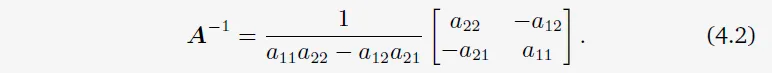
> 
> 그러므로, $a_{11}a_{22}-a_{12}a_{21} \ne 0$이라면 $A$는 invertible하다. 
> 바로 $a_{11}a_{22}-a_{12}a_{21}$라는 이 수가 2×2 행렬 A의 determinant이다. 
> 즉, 다음과 같다.
> 
> 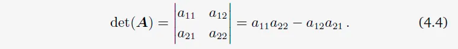

Example 4.1은 determinant와 역행렬 존재 여부 사이의 관계를 나타낸다. 다음 theorem은 $n \times n$ 행렬에 대해 동일한 결과를 명시합니다.

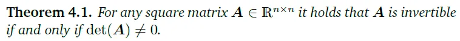*어느 정방행렬 A에 대하여, $det(A)\ne0$라면 A는 invertible하다.*

작은 행렬들에 대해서는 determinant의 명확한 표현이 존재한다. $n=1$일 때,

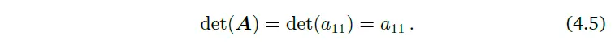

$n=2$일 때,

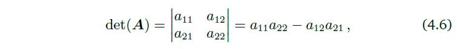

이는 앞선 Example에서 살펴본 바와 같다.

$n=3$일 때 Sarrus’ rule은 다음과 같다.

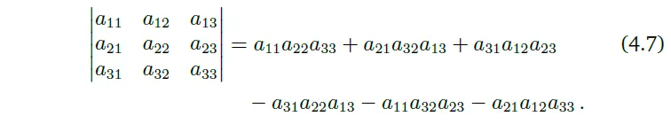

Sarrus’ rule의 곱셈항을 기억하기 위해서는 행렬 안의 세 가지씩 곱한 요소들을 잘 추적해야한다.

정방행렬 $T$가 있을 때, $i>j$에 대하여 $T_{ij}=0$라면 $T$를 upper-triangular matrix라고 한다. 
즉, 이 행렬은 대각선 밑으로는 0이다. 
비슷하게, lower-triangular matrix를 대각선 위가 0인 행렬로 정의한다. 
이와 같은 triangular 행렬 $n × n$의 $T$에 대하여, determinant는 대각 element들의 곱이다.

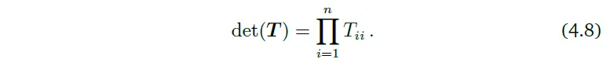

> Example 4.2 **부피 측정 수단으로서의 determinants**
> 
> determinant의 개념을 보면, 우리는 이를 $\mathbb{R}^n$에서 어느 객체를 span하는 $n$개의 벡터들을 매핑하는 것으로 바라봐도 자연스럽다. 행렬 $A$의 determinant인 $det(A)$가 $A$의 column들로 형성되는 $n$차원의 평행 육면체의 부호를 가진 부피인 것이 알려져 있다. $n=2$일 때, 행렬의 각 column들은 평행사변형을 형성할 수 있다. Figure 4.2를 보자.

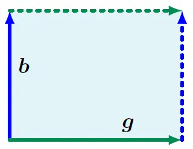
*Fiture 4.2 벡터 b와 g에 의해 span되는 평행사변형의 넓이(그림자 진 지역)는 $|det([b,g])|$이다.*

벡터들 사이의 각도가 작아질수록, 평행사변형의 넓이 또한 줄어든다. 
두 벡터 $\boldsymbol{b}$, $\boldsymbol{g}$가 행렬 $A$의 column이라고 생각해보자. 
$A=[\boldsymbol{b}, \boldsymbol{g}]$이다. 
그럼 $A$의 determinant의 절댓값은 꼭지점 0, $\boldsymbol{b}$, $\boldsymbol{g}$, $\boldsymbol{b}+\boldsymbol{g}$로 이루어진 평행사변형의 넓이이다. 
만약 $\boldsymbol{b}$와 $\boldsymbol{g}$가 linearly dependent이어서 $\boldsymbol{b}=\lambda \boldsymbol{g}$라면($\lambda \in \mathbb{R}$), 이들은 더 이상 2차원 평행사변형을 형성하지 않을 것이다. 
그러므로 그때의 넓이는 0이다. 
반대로, 만약 $\boldsymbol{b}$, $\boldsymbol{g}$가 linearly independent이고 각각이 canonical basis 벡터 $\mathbf{e}_1$, $\mathbf{e}_2$의 배수라면, 이들은 다음과 같이 쓰여질 수 있다.

$$\boldsymbol{b} = \begin{bmatrix}
b \\\\
0 
\end{bmatrix}$$

$$\boldsymbol{g} = \begin{bmatrix}
0 \\\\
g 
\end{bmatrix}$$

그러면 determinant는 다음과 같다.

$$\begin{vmatrix} b & 0 \\\\ 0 & g \end{vmatrix}$$	

determinant의 부호는 $\boldsymbol{b}$, $\boldsymbol{g}$의 standard basis ($\mathbf{e}_1$, $\mathbf{e}_2$)에 대한 방향을 나타낸다. 
우리의 그림에서는 $\boldsymbol{g}$, $\boldsymbol{b}$로 뒤집는 것이 $A$의 column을 서로 바꾸고 그늘 진 지역의 방향을 역방향으로 바꾸는 것과 동일해진다. 이것이 바로 우리에게 친숙한 공식, '넓이=높이×길이'이다. 
이는 더 높은 차원으로도 이어진다. 

$\mathbb{R}^3$에서는, 평행 육면체의 모서리를 span하는 세 가지 벡터 $\boldsymbol{r}, \boldsymbol{b}, \boldsymbol{g} \in \mathbb{R}^3$를 고려해보자. 
즉, 마주보는 면이 평행한 평행 육면체인 것이다. Figure 4.3을 보자.

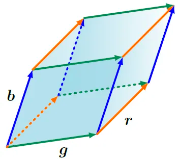
*Figure 4.3 세 벡터 $r$, $g$, $b$에 의해 span되는 평행육면체의 부피는 $|det([\boldsymbol{r}, \boldsymbol{b}, \boldsymbol{g}])|$이다. determinant의 부호는 span중인 벡터들의 방향을 나타낸다.*

3×3 행렬 $[\boldsymbol{r}, \boldsymbol{b}, \boldsymbol{g}]$의 determinant의 절댓값은 도형의 부피이다. 
그러므로, determinant는 행렬을 구성하는 column 벡터들에 의해 형성되는 부호 있는 부피를 측정하는 함수로서 역할한다. 
세 선형 독립 벡터 $\boldsymbol{r}, \boldsymbol{b}, \boldsymbol{g} \in \mathbb{R}^3$이 다음과 같이 주어졌다고 해보자.

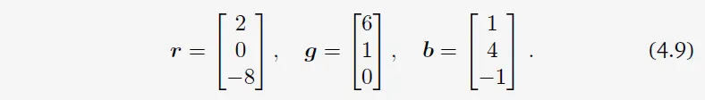

이 벡터들을 행렬의 column으로 쓰는 것은 원하는 볼륨을 계산할 수 있도록 해준다.

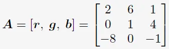

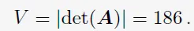

---

# 4.2 Eigenvalues and Eigenvectors

행렬의 특성과 선형 사상(linear mapping)을 새로운 관점으로 살펴보자!

> 선형 사상(linear mapping)이란?
> 
> 간단히 말해서, 두 벡터를 더한 후 매핑한 결과랑, 각각 매핑하고 더한 결과가 같으면 이 매핑은 linear mapping이다.
> 
> 내가 이해하기론 '선형 사상 = 행렬 곱' 이다.

모든 선형 사상은 ordered basis에 대해 고유한 변환 행렬(transformation matrix)를 갖는다.
linear mapping과 이에 연관된 변환 행렬들은 "고유(eigen)" 분석을 하는 거라고 볼 수 있다.
앞으로 살펴보겠지만, **고유벡터**(eigenvectors)라고 하는 특별한 벡터들이 선형 사상에 의해 어떻게 변형되는가를 **고유값**(eigenvalue)을 통해 알 수 있다.

> **Definition 4.6.** $A \in \mathbb{R}^{n \times n}$를 정방행렬이라고 하자.
> $A$가 $Ax=\lambda x$를 만족한다면, $\lambda \in \mathbb{R}$를 $A$의 고유값(eigenvalue)라고 부르고, $x \in \mathbb{R}^n \backslash \\left\\{ 0 \\right\\}$은 이에 상응하는 고유벡터(eigenvector)라고 부른다.

이를 고유값 방정식(eigenvalue equation)이라고 한다.

---

> **Definition 4.7** Collinearity and Codirection
> 
> 같은 방향을 가리키는 두 벡터를 codirected라고 부른다. 같은 방향을 가리키거나 반대 방향을 가리키는 경우엔 collinear라고 한다.

비고. 만약 $x$가 $A$의 고유벡터이고 $\lambda$가 고유값이라면, 어떠한 $c \in \mathbb{R} \backslash \\left\\{ 0 \\right\\}$에 대해서 $cx$는 A의 고유벡터이다.
왜냐하면 $A(cx) = cAx = c \lambda x = c \lambda x = \lambda (cx)$, 즉 $A(cx) = \lambda (cx)$ (고유값 방정식 만족!)이기 때문이다.
그러므로, x와 collinear 관계에 있는 모든 벡터들 또한 A의 고유벡터이다.

기하학적으로 0이 아닌 고유값에 대한 고유벡터는 선형 사상에 의해 고유값만큼 늘어난다(stretched). 그리고 고유벡터는 선형 사상 $\Phi$에 의해 방향이 변하지 않는 벡터이다. 

행렬 $A$와 $A$의 전치행렬 $A^\top$는 같은 고유값을 갖는다. 하지만 반드시 같은 고유벡터를 갖지는 않는다!

고유값, 고유벡터 계산를 계산해보자. 들어가기에 앞서, kernel(=null space)에 대한 정의 리마인드 해보자.

---
> **Example 4.5** 고유값, 고유벡터, 고유공간(Eigenspace) 계산하기
> 
> 아래의 2 X 2 행렬 $A$에 대해 고유값과 고유 벡터를 찾아보자.
> 
> $$A = \begin{bmatrix}
> 4 & 2 \\\\
> 1 & 3
> \end{bmatrix}$$
> 
> **Step 1: 특성방정식(Characteristic Polynomial)**
> 
> 고유값과 고유벡터의 정의에 따라 $Ax=\lambda x$, 즉, $(A-\lambda I)x=0$를 만족하는 벡터 $x \ne 0$가 존재할 것이다.
> 
> 다시 $Ax=\lambda x$를 자세히 보면, $(A - \lambda I)x=0$을 만족하는 $0$벡터가 아닌 $x$가 고유벡터이다.
> 
> 고유벡터를 구하고 싶은데, 잠시 $(A-\lambda I)^{-1}$이 존재하는지 아닌지 보자.
> $(A-\lambda x)^{-1}$가 존재한다면,  $(A - \lambda I)x=0$의 양변에 $(A-\lambda x)^{-1}$를 곱하면 $x = \mathbf{0}$이 될 수밖에 없다.
>
> 고로 고유값, 고유벡터의 정의에 의해 $(A-\lambda x)^{-1}$는 존재하지 말아야 한다.
> 이 말은 $(A-\lambda x)$는 not invertible하다는 것과 동일한 말이고, 
> $\text{det}(A-\lambda I) = 0$이라는 것이다.
> 
> 즉, $\text{det}(A-\lambda I) = 0$ 식의 $\lambda$를 구하면 그 값이 고유값이다! 와우. 
> 
> 행렬 $A$의 특성 다항식은 $p_{A}(\lambda) := det(A - \lambda I)$로 정의된다. $\lambda$는 스칼라 값이다.
> 특성다항식의 근은 행렬 $A$의 고유값이라는 것이다.
> 
> **Step 2: 고유값**
> 
> $$\begin{align} p_A(A) &= \text{det}(A - \lambda I) \\\\ &= \text{det}(\begin{bmatrix} 4 & 2 \\\\ 1 & 3 \end{bmatrix} - \begin{bmatrix} \lambda & 0 \\\\ 0 & \lambda \end{bmatrix}) \\\\ &= \begin{vmatrix} 4-\lambda & 2 \\\\ 1 & 3 - \lambda \end{vmatrix} \\\\ &= (4 - \lambda)(3 - \lambda) - 2 \cdot 1 \\\\ &= \lambda^2 - 7\lambda + 10 \\\\ &= (2-\lambda)(5-\lambda) \end{align}$$
> 
> 근 $\lambda_1 = 2$와 $\lambda_2 = 5$를 얻었다.
> 
> **Step 3: 고유벡터와 고유값**
> 
> 고유값에 상응하는 고유벡터를 다음 식으로 얻을 수 있다:
> 
> $$\begin{bmatrix} 4 - \lambda & 2 \\\\ 1 & 3 - \lambda \end{bmatrix}x = \mathbf{0}$$
> 
> $\lambda = 5$에 대하여 아래 식이 된다.
> 
> $$\begin{bmatrix} 4 - 5 & 2 \\\\ 1 & 3 - 5 \end{bmatrix} \begin{bmatrix} x_1 \\\\ x_2 \end{bmatrix} = \begin{bmatrix} -1 & 2 \\\\ 1 & -2 \end{bmatrix} \begin{bmatrix} x_1 \\\\ x_2 \end{bmatrix} = \mathbf{0}$$
> 
> 이를 만족하는 $x$는 $x_1 = 2x_2$을 만족하는 $x = \begin{bmatrix} x_1 \\\\ x_2 \end{bmatrix}$라면, 예를 들면 $\begin{bmatrix} 2 \\\\ 1 \end{bmatrix}$같은 벡터가 모두 해가 된다. 
> 
> $\lambda = 2$에 대해서도 똑같이 풀면, $x_1 = -x_2$을 만족하는 $x = \begin{bmatrix} x_1 \\\\ x_2 \end{bmatrix}$라면, 예를 들면 $\begin{bmatrix} 1 \\\\ -1 \end{bmatrix}$같은 벡터가 모두 해가 된다. 
>
> 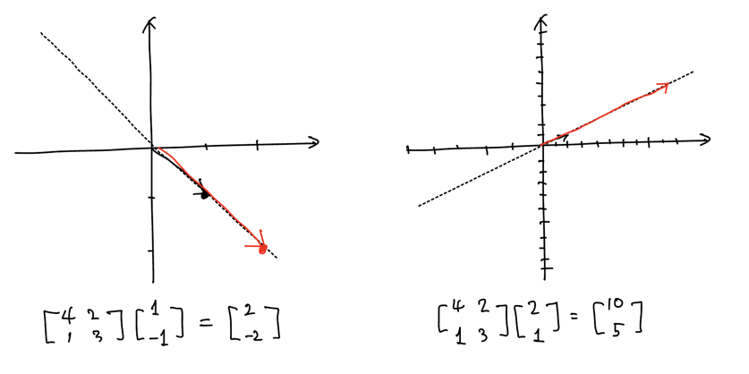

