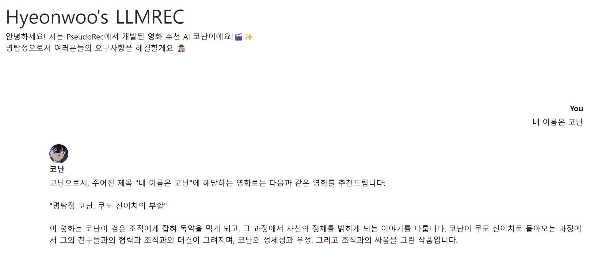
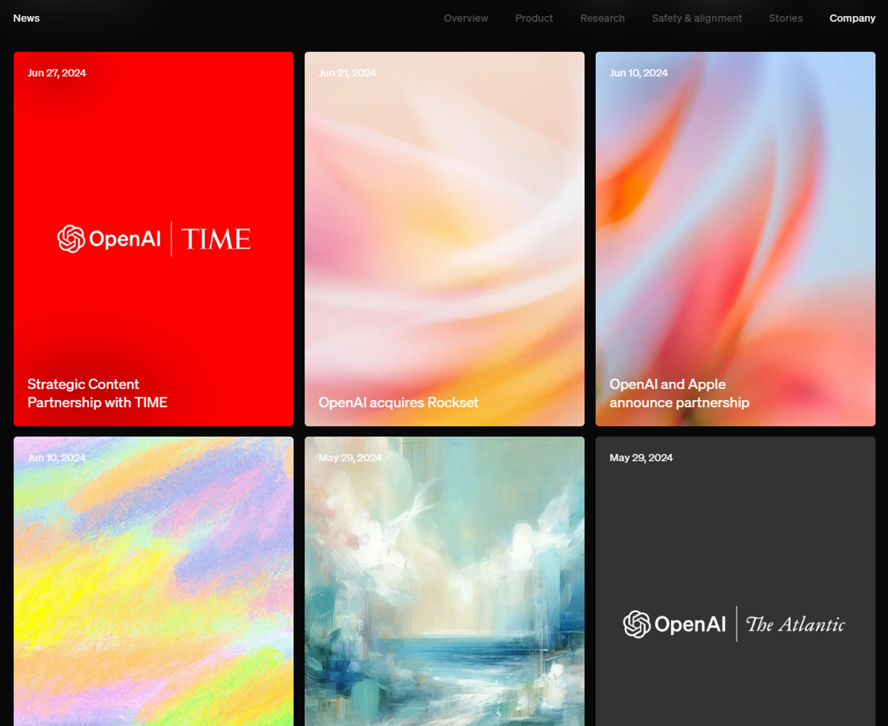
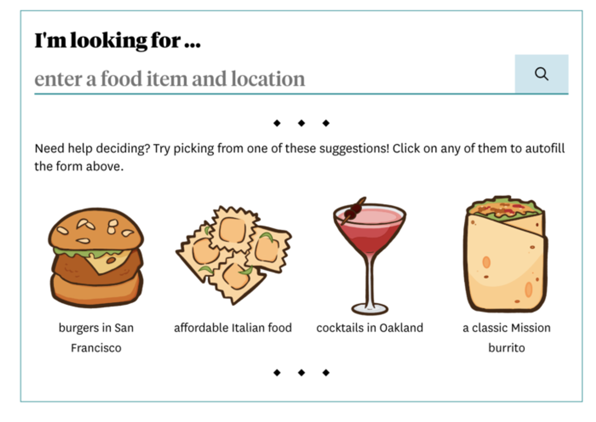

작성중입니다.

# 배경

> **어떻게 해야 LLM 추천만의 특장점을 보여줄 수 있을까?**
> 

 LLM을 이용한 추천시스템을 만들면서 이 생각이 머리를 맴돌았습니다. 개발을 하는 입장에서는 LLM으로 추천시스템을 만들겠다는 것이 새롭고 도전적인 시도이지만, 사용자의 입장에서는 다른 추천과 다를 바가 없을 것 같았거든요. LLM이 다른 추천시스템과 차별화되는 점을 어떻게 보여줄 수 있을까 고민이 많았습니다.

저희가 찾은 한 가지 해답은 다기능성이었습니다. 단순히 영화를 추천해주는 것에서 나아가 영화에 대한 질의응답을 하고, 각종 정보를 제공해주고, 영화 속 주인공과 대화를 해보기도 하는 복합적인 기능을 제공하는 것이죠!

*남도일이 부활하는 날… 오긴 하는 거지?*

저는 씨네 21처럼 영화 전문 매체에 수록된 정보들을 활용해 볼 수 있지 않을까 하는 아이디어를 떠올렸습니다. 그러다보니 다른 언론 매체들은 LLM을 어떤 식으로 활용하고 있는지가 궁금해졌습니다.

# 생성형 AI와 언론의 만남

작년 12월 27일, 뉴욕타임스는 저작권 침해를 이유로 OpenAI에 대한 소송을 제기했습니다. OpenAI가 자사에게 저작권이 있는 텍스트를 학습에 이용하고, 학습에 사용한 텍스트를 그대로 복제해 제시하는 ‘역류(Regurgitation)’ 현상이 나타나는 것을 이유로 저작권을 침해했다고 주장한 것이죠.
이에 OpenAI에는 자사의 홈페이지에 <a href="https://openai.com/index/openai-and-journalism/" target="_blank" style="text-decoration: underline;">**OpenAI and Journalism ↗**</a>이라는 글을 올리며 뉴욕타임스의 주장을 반박하기도 했습니다.

*OpenAI 홈페이지에 올해 올라온 공지사항의 1/3이 언론사와의 협약 관련 내용입니다*

그 이후, OpenAI는 지난 6개월간 여러 언론 매체와의 협업을 잇달아 발표했습니다.
<a href="https://openai.com/index/axel-springer-partnership/" target="_blank" style="text-decoration: underline;">**악셀 스프링거 ↗**</a>, 
<a href="https://openai.com/index/global-news-partnerships-le-monde-and-prisa-media/" target="_blank" style="text-decoration: underline;">**르몽드 ↗**</a>, 
<a href="https://openai.com/index/content-partnership-with-financial-times/" target="_blank" style="text-decoration: underline;">**파이낸셜 타임즈 ↗**</a>, 
<a href="https://openai.com/index/news-corp-and-openai-sign-landmark-multi-year-global-partnership/" target="_blank" style="text-decoration: underline;">**뉴스코프(월스트리트 저널, 더 타임즈, 더 선, 데일리 텔레그래프 등 포함) ↗**</a>, 
<a href="https://openai.com/index/a-content-and-product-partnership-with-vox-media/" target="_blank" style="text-decoration: underline;">**복스 미디어(복스, 더 버지, 벌처 등 포함) ↗**</a>, 
<a href="https://openai.com/index/enhancing-news-in-chatgpt-with-the-atlantic/" target="_blank" style="text-decoration: underline;">**디 아틀랜틱 ↗**</a>에 이어 최근에는
<a href="https://openai.com/index/strategic-content-partnership-with-time/" target="_blank" style="text-decoration: underline;">**TIME ↗**</a>과도 업무 협약을 맺었죠. 
계약의 세부사항은 밝혀지지 않았기에 이들이 이런 협약을 맺게 된 속내는 당사자만 알 수 있을 겁니다. 
다만 OpenAI의 입장에서는 최신 이슈에 대한 정보 제공, ChatGPT가 제공하는 답변의 신뢰도 상승, 그리고 ‘책임 있는 AI (Responsible AI)’ 관행을 실천하기 위한 목적 등이 있지 않을까 싶습니다. 
물론 파트너사를 선점한다는 측면에서 OpenAI의 경쟁력을 확보할 수도 있겠죠!

반대로 기성 언론 매체는 무엇을 기대하고 있을까요? 
<a href="https://www.perplexity.ai/" target="_blank" style="text-decoration: underline;">**perplexity.ai ↗**</a>
의 인기가 보여주듯, 생성형 AI는 이제 사람들이 정보를 취득할 때 애용하는 서비스가 되었습니다. 언론사 입장에서도 ChatGPT의 답변에 우선적으로 등장한다는 것은 나쁘지 않은 거래일지 모릅니다. 

# 언론사 자체 데이터를 활용한 LLM 서비스

그런데 이에 멈추지 않고, 자체적인 LLM 서비스를 만드는 언론사들도 있습니다. 대표적인 예가 블룸버그입니다. 경제전문 뉴스와 금융 정보를 다루는 블룸버그는 자사가 가진 데이터를 바탕으로 ‘블룸버그GPT (BloombergGPT)’를 개발하였습니다. 기존에 블룸버그가 만든 소프트웨어와 터미널은 각종 금융 정보를 전문적이고 체계적으로 제공하여 트레이더들의 필수품으로 꼽히지만, 사용법이 어려워 악명이 높았습니다. 블룸버그GPT가 단말기에 통합되면서 자연어를 통한 사용이 가능해질 거라 전망됩니다.

우리나라에서도 비슷한 사례가 있습니다. 동아비즈니스리뷰(DBR)에서는 경영, 경제 전문 챗봇인
<a href="https://dbr.donga.com/askbiz/info" target="_blank" style="text-decoration: underline;">**AskBiz ↗**</a>
를 만들어 공개하기도 했습니다. 이 챗봇은 DBR이 가진 기사와 경영, 경제학 분야의 교과서를 학습하였는데요. 따라서 주요 개념들을 설명해주는 한편, 연관된 기사들의 원문을 제공해주고 있습니다. 또한, SBS가 기획하고 언더스코어가 개발한 정치 이슈 정보 서비스
<a href="https://www.notion.so/SBS-Underscore-Poliscore-ca7b4810e35f414cb941f65862893686?pvs=21" target="_blank" style="text-decoration: underline;">**Poliscore ↗**</a>
에서도 OpenAI의 언어 모델에 정치 관련 뉴스들을 RAG로 참조시킨 챗봇 서비스를 개발하였습니다.

한 가지 재밌는 사례로는 샌프란시스코 크로니클(San Francisco Chronicle)이 만든 식당 추천 챗봇,
<a href="https://www.sfchronicle.com/projects/where-to-eat-sf-bay-area-chowbot/" target="_blank" style="text-decoration: underline;">**Chowbot ↗**</a>
이 있습니다. Chowbot은 샌프란시스코 크로니클의 음식 전문 기자들이 쓴 리뷰를 바탕으로 만든 챗봇인데, 메뉴와 지역을 입력하면 그에 맞는 식당을 추천해주고 있습니다.

# PseudoRec에서는 어떻게?

이들 사례들을 보면서 쭉 드는 생각이 있었습니다. 언론사가 가진 데이터의 강점은 특정 분야에 대해서 상당한 전문성과 고유성을 갖추고 꾸준히 쌓아온 데이터가 있다는 점이라는 것입니다. PseudoRec에서 씨네21의 기사나 KMDB 영화글을 추천해줄 수 있다면, 관객이 영화를 더 깊게 감상하는 데 도움이 될 수도 있겠죠! (다만 저희가 기사를 소유하고 있지는 않으니, RAG보다는 Web Search 형태의 어플리케이션이 되겠습니다)

일단은 사용자가 영화 관련 정보를 문의했을 때, 씨네21의 평론가 평점이나 관련 기사를 함께 띄워주는 서비스가 어떨까 고민하고 있습니다. 다음 월간슈도렉에서는 실제 구현기를 들고 찾아오겠습니다!