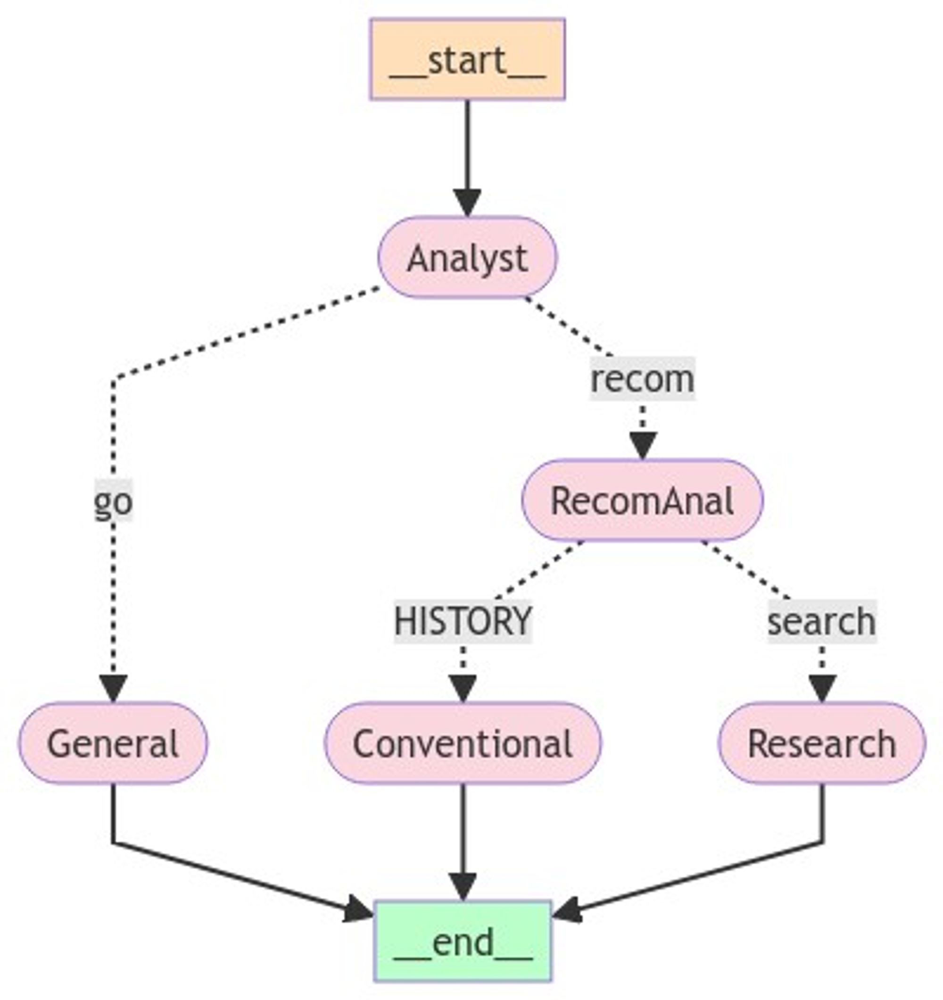

5월호에서 언급했던 Multi Agent를 통해 content를 만드는것이 아닌 영화 추천을 구현해봤습니다. 

## LangGraph

노드를 이동할 때 Graph의 state에 messages 또는 기타 정보를 update 시켜줌으로써, 해당 정보에 따라 다음 과정을 수행하도록 도와주는 Framework입니다. Langchain에서 사용하던 기술을 각 모듈로 만들어 함수 또는 Tool로 만들어 이를 각 노드(Agent)들이 수행하도록 하는 방식입니다.

```python
class AgentState(TypedDict):
    messages: Annotated[Sequence[BaseMessage], operator.add]
    sender: str
```

위와 같이 State를 통해 messages를 추가하고, 최종 messages에서 function calling을 통해 도구를 사용하도록 하는 방식입니다. 

## Recommendation

Query에 따른 간단한 추천시스템을 만들어보고자 했었고, 이에 대한 아키텍처는 다음과 같습니다.

해당 아키텍처는 ‘정보 검색’을 통한 추천, 다시 말해 추천을 위한 **query에서 요구하는 정보에 따른 영화 추천**을 하는 아키텍처입니다. 

유저의 히스토리 또는 아무 상관없는 말부터 추가 힌트를 받아 추천을 제공하는 멀티 턴 등은 추후에 구현할 예정입니다.



1.  Analyst Agent는 초기 router 역할로, 복잡한 쿼리를 세분화 해주는 역할을 합니다.
    - 일반 대화와 추천을 나눠주는 역할을 합니다.
    - 일반 대화와 추천 두 가지 쿼리 목적에 맞춰 큼직큼직하게 분류해주는 역할입니다.
    
    ```python
    [input]
    '오늘 날씨 짱인데?'
    
    [output]
    ----------쿼리분석!----------
    GENERAL
    ```
    
    ```python
    
    [input]
    "내가 마지막으로 봤던 영화 기반으로 볼만한 영화 있어?"
    
    [output]
    ----------쿼리분석!----------
    RECOMMEND
    ```
    
2. General Agent
    - 여기서 일반 대화(General)는 ‘영화 추천’이라는 목적에 맞게 추가정보를 얻을 수 있는 질문을 하도록 구축했습니다.  아직 구현되지 않았지만, 멀티턴을 위해 추후에 더 개선을 목표로 합니다.
        
        ```python
        [input]
        '오늘 날씨 짱인데? 어떤거같아?'
        
        [output]
        '어떤 영화를 추천해 드릴까요? 드라마, 코미디, 액션, 공포 등 어떤 장르를 선호하시나요? 혹은 최근에 본 영화 중에서 인상 깊었던 작품이 있나요? 좀 더 자세한 정보를 알려주시면 더 정확한 추천을 도와드릴 수 있어요.'
        ```
        
3. RecomAnal Agent(Recommendation Query Analyst)
    - 아래 두 가지 사항에 대해 구분을 해주는 추천 쿼리에 대한 분류를 해주는 역할입니다.
        - 추천을 위한 쿼리문이 유저 기록(history)기반의 개인화된 추천을 요청
        - 영화의 Meta 정보 또는 다른 검색 요소 기반으로 추천을 요청
    
    ```python
    [input]
    "내가 마지막으로 봤던 영화 기반으로 볼만한 영화 있어?"
    
    [output]
    ----------추천쿼리분석!----------
    HISTORY
    ```
    
    ```python
    [input]
    "범죄도시4 같은 영화 뭐가 있을까?"
    
    [output]
    ----------추천쿼리분석!----------
    SEARCH
    ```
    
4. Conventional Recommendation Agent
    
    흔히 알고 있는 일반적인 추천 모듈을 탑재한 Agent입니다.
    
    LangGraph 특성상 굳이 LLM을 사용하지 않아도, 함수 형태로 Tool을 사용하는 Agent를 둘 수 있습니다.
    
    따라서 이곳에는 전통적인 추천 모델(CF, NCF, GCN 등)을 넣어볼 예정입니다.
    
5. Research Agent
    
    가장 중요한 파트입니다. meta 정보 기반으로 질문이 들어왔을 때, 해당 meta정보를 내/외부에서 검색해 이용하는 Agent입니다.
    
    - DB 내에 Query에 대한 답변을 하기 위한 정보가 있는 경우, RAG를 이용해 meta정보를 찾아냅니다.
    - 이후에 해당 정보로 답변이 가능하면 그대로 답변하고, 그렇지 않을 경우, Web 검색을 시도해 답변을 찾아냅니다.
    - 이렇게 순서가 있는 경우를 대비하여 Research Agent에서는 sub graph를 생성해 진행합니다.
        - 이렇게 sub graph가 있다면, asynchronous 함수를 통해 비동기적으로 작업 수행도 할 수 있습니다.
        - 현재는 비동기적으로 수행할 일은 없어보입니다. 이는 추후 Query 세분화 분석 에이전트를 추가하여, 더욱 복잡한 질의에 대해 더욱 빠른 속도로 답변할 때에 유용하게 쓸 수 있습니다.
    
    이렇게 멀티에이전트 기반 영화 추천 팀을 간단히 만들어 보았습니다. 
    
    서칭 파트는 사실 손볼 구석이 굉장히 많고(이것 때문에 월간 슈도렉 게재도 늦어졌다 해도 과언이 아닙니다ㅠ) 정확한 정보를 기반으로 한 답변 생성을 위해선 추가적인 검토로직이 필요해 보입니다.
    
    이번 구현에서 빠진 부분은 아래와 같습니다.
    

프롬프트 상에서 Query를 분석해 아래 세 가지의 타입으로 나눈 뒤, 각 타입에 맞춰 Query를 분해하도록 합니다.

- Movie Recommendation Query,
- Complex Movie Recommendation Query,
- Non-Recommendation Dialogue]

```python
@tool
def query_analysis(
    query: Annotated[str, "query to be analyzed for type"]
    ):
  """
  Firstly use this to analyze user's query to make accurate and facinated answer and recommendation for user.
  """

  return anal_chain.invoke({"question" : query})
```

그러면 아래와 같이 하나의 복잡한 쿼리에 대해 명확히 세분화 된 쿼리로 쪼갤 수 있고, 각 항목들을 하나 또는 여러(병렬) 노드에서 분산되어 작업진행을 할 수도 있습니다.

```python
[intput]
text = "타이타닉의 감독이 만든 다른 영화중 2000년도 이후에 만들어진 여자배우가 주연인 영화 추천해줘"
anal_chain.invoke(text)

[output]
{
  "query_type": "Complex Movie Related Query",
  "sub_query": [
    "User wants movies directed by the director of Titanic",
    "Movies featuring a female lead",
    "Movies released after 2000"
  ]
}
```

다음번에는 더욱 개선되고 디테일하게 처리할 수 있는 코드를 구현해서 작성해보도록 할 예정입니다.