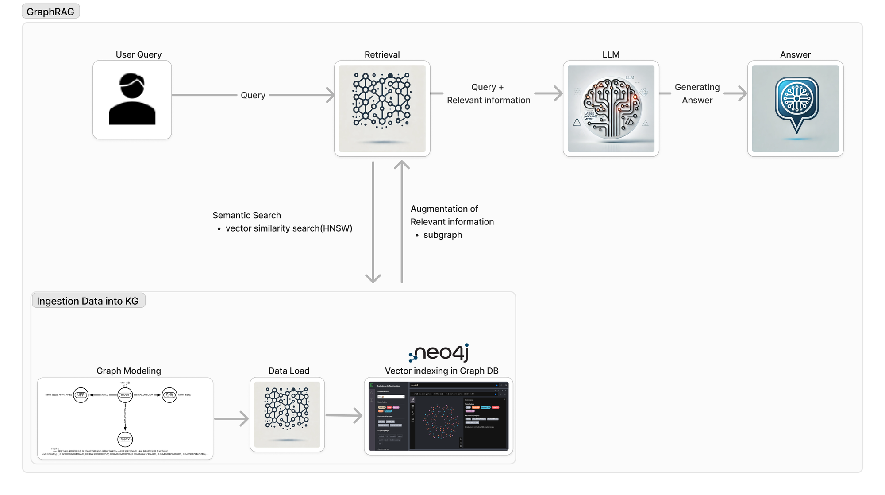
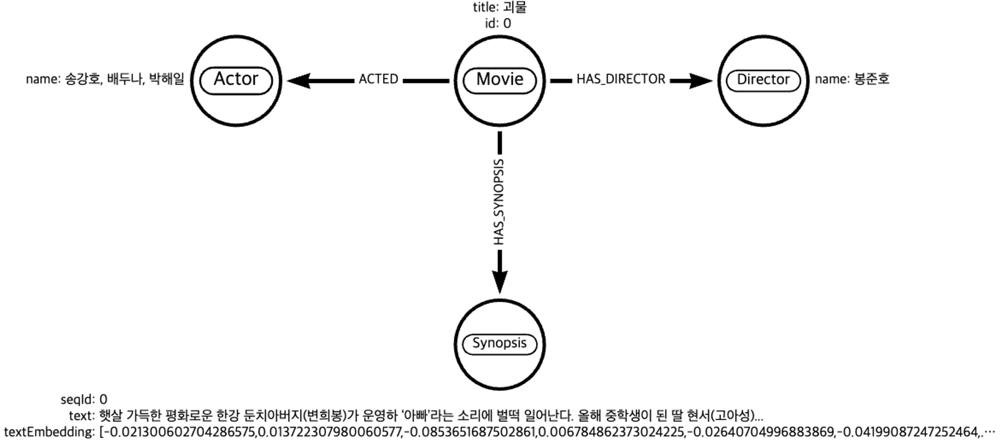
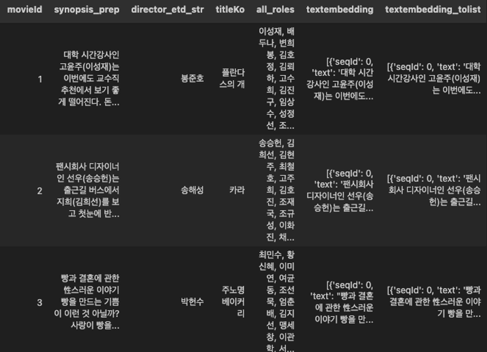
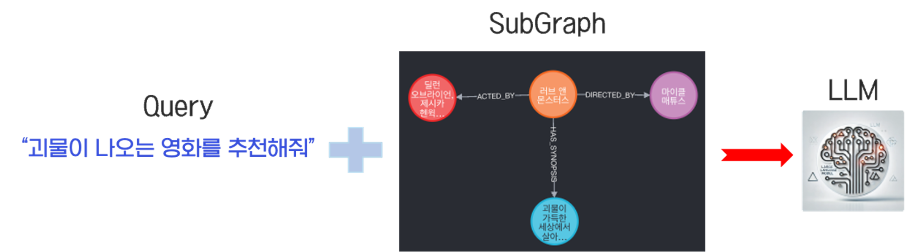
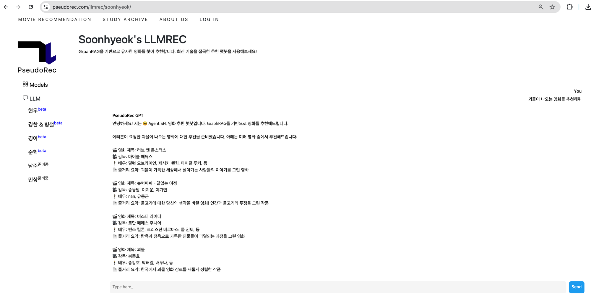

월간 슈도렉 5월호를 작성한 지가 엊그제 같은데 벌써 6월호를 작성하게 되다니 시간이 참 빠르게 지나가는 것 같습니다. 지난
<a href="https://pseudorec.com/archive/monthly_pseudorec/6/" target="_blank" style="text-decoration: underline;">**5월호 ↗**</a>
에 NGCF를 통한 영화 추천에 대해 소개해드렸다면 이번 6월호에는 현재 PseudoRec에 Beta 버전으로 배포되어 있는 제 LLM 모델(Feat. GraphRAG)에 대해 소개하고자 합니다.

프롬프트 엔지니어링에 대한 기초 지식이 있다는 전제하에 설명드리겠습니다.

## RAG와 GraphRAG의 차이

RAG는 알지만 GraphRAG는 처음 들어보시는 분들이 많으실텐데요. 이 둘 간의 차이점은 무엇이고 기존의 RAG 대비 GraphRAG의 장점은 무엇인지에 대해 간략하게 설명드리겠습니다.

RAG : Retrieval시 단일 된 벡터 노드만 가져옴.

GraphRAG : Retrieval시 단일 된 벡터 노드와 연결되어 있는 SubGraph을 가져올 수 있음.

RAG는 Retrieval시 유저의 쿼리와 유사한 k개의 벡터 노드만을 가져옵니다.

그러나 GraphRAG는 노드 간의 연결관계를 통해 각 k개의 벡터 노드와 연결되어 있는 SubGraph를 가져올 수 있습니다. 또한 Explainable 관점에서 어떠한 연결관계를 통해 그러한 정보들이 증강되었는지를 역추적이 가능합니다. 여기에 최적화된 DB가 Graph DB이고 그 중 Neo4j를 사용하여 GraphRAG를 구축했습니다.

# GraphRAG

### 0. Flow Chart



GraphRAG의 Flow chart를 통해 어떻게 영화 추천 챗봇을 구축했는지 단계별로 설명드리겠습니다.

### 1. User Query

첫 번째로 사용자 질의가 들어오면 쿼리 텍스트를 임베딩화시킵니다.(여기서는 OpenAI의 text-embedding-3-small 모델을 활용)

이제 임베딩화된 사용자 질의를 Vector DB에 적재된 값들과 비교하여(Semantic Search) Retrieval을 진행하고자 합니다.

### 2. Retrieval

저는 Retrieval을 위해 Graph DB(Neo4j)를 활용하고자 합니다.

### **2. 1 Graph Modeling**

먼저 데이터를 DB에 적재(Load)하여 KG(Knowledge graph)화 하기 위해서는 어떠한 entity를 도출하여 relation을 부여할지에 대한 고민이 필요합니다. 따라서 DB에 적재하기 이전에 Task별로 특정 도메인에 특화된 그래프 모델링이 필수입니다.



Task는 영화 추천이기 때문에 위 이미지와 같이 영화에 특화된 그래프 모델링을 구축합니다.

Movie라는 노드에 속성으로 title(영화 제목)과 id 값을 부여합니다.

Movie 노드와 해당 Movie(괴물) 노드를 감독한 Director(봉준호) 노드를 HAS_DIRECTOR라는 연결관계로 연결시켜줍니다.

마찬가지로 해당 Movie(괴물) 노드를 연기한 Actor(송강호, 배두나, 박해일, ...) 노드를 ACTED라는 연결관계로 연결시킵니다.

해당 Movie(괴물) 노드의 영화 내용 정보를 담고있는 Synopsis 노드에는 영화 시놉시스를 담고있는 text 속성과 그 텍스트를 임베딩한 textEmbedding 속성이 있고 chunking한 text의 순서정보를 담고있는 seqId 속성이 있습니다.

- **여기서 이 Synopsis 노드가 Retrieval의 대상이 됩니다.**

Synopsis 노드 또한 해당 Movie 노드와 HAS_SYNOPSIS 라는 연결관계로 연결시킵니다.

나중에 **2. 4** 에서 자세히 설명하겠지만 **1. User Query** 에서 임베딩화시킨 사용자 질의 임베딩 값을 DB에 저장된 Synopsis 노드의 textEmbedding 속성값과 비교하여 가장 유사한 Synopsis 노드를 찾아옵니다(retrieval).

이렇게 찾은 Synopsis 노드와 연결된 Movie 노드의 subgraph를 가져와서 context에 넣어 Augmentation(증강)을 합니다.

### 2. 2 Data Load

다음과 같이 구축된 그래프 모델링을 기반으로 Node(노드)와 Edge(연결관계)를 생성하여 데이터를 Neo4j 라는 Grpah DB에 적재합니다.

여기서 py2neo 라는 라이브러리를 활용하여 파이썬과 neo4j를 연결하여 데이터를 적재하고자 합니다.

데이터프레임은 적재가 용이하게 아래와 같이 구성하였고 행별로 node와 edge를 생성하였습니다.

**데이터프레임**



**dataload.py**

```python
from py2neo import Graph, Node, Relationship
import pandas as pd

# Connect to Neo4j
graph = Graph("bolt://localhost:7687", auth=("username", "password"))

def load_data(row):
    # Check for NaN in critical fields and handle it
    if pd.isna(row['director_etd_str']):
        director_name = "Unknown Director"
    else:
        director_name = row['director_etd_str']
    if pd.notna(row['all_roles']) :
        actors = row['all_roles']

    # Cypher query to create/find director and connect with movie
    query = """
    MERGE (director:Director {name: $director_name})
    CREATE (movie:Movie {id: $movie_id, title: $title})
    MERGE (actors:Actor {name: $actor_name})
    MERGE (movie)-[:DIRECTED_BY]->(director)
    MERGE (movie)-[:ACTED_BY]->(actors)
    """
    # Execute the query
    graph.run(query, director_name=director_name, movie_id=row['movieId'], title=row['titleKo'], actor_name=actors)

# 영화 노드가 이미 존재하는 경우, 청킹된 시놉시스를 연결하는 함수
def upload_to_existing_movies(df):
    for index, row in df.iterrows():
        if row['textembedding_tolist'] is not None :
            # Movie 노드를 movieId로 조회
            movie_node = graph.nodes.match("Movie", id=row['movieId']).first()

            if movie_node:
                # Synopsis 청킹된 텍스트와 임베딩 값 노드 생성 및 연결
                for chunk in row['textembedding_tolist']:
                    synopsis_node = Node("Synopsis",
                                        seqId=chunk['seqId'],
                                        text=chunk['text'],
                                        textEmbedding=chunk['textEmbedding'])
                    graph.create(synopsis_node)

                    # 관계 생성
                    rel = Relationship(movie_node, "HAS_SYNOPSIS", synopsis_node)
                    graph.create(rel)

# Applying the function to each row of the DataFrame
df.apply(load_data, axis=1)

# 데이터프레임을 Neo4j에 적재
upload_to_existing_movies(df)

```

Movie, Director, Actor node를 생성하여 각각 연결관계로 edge를 부여하고 해당 Movie 노드와 연결된 Synopsis 노드에는 속성으로 청킹된 순서를 나타내는 seqId, 청킹된 텍스트인 text, 청킹된 텍스트를 임베딩화시킨 textEmbedding을 적재합니다.

**Neo4j**


DB에 적재 후 Neo4j browser를 통해 cypher 쿼리로 Movie(괴물) 노드와 연결되어있는 subgraph를 가져왔습니다.

이와 같이 Graph DB의 장점은 쿼리문을 작성하면 시각적으로 바로 보여줄 수 있다는 것입니다.

또한 해당 Movie(괴물) 노드와 연결되어있는 Director(봉준호) 노드와 또 연결되어있는 다른 Movie 노드들을 확인할 수 있습니다. 즉, 여기서는 봉준호 감독이 감독한 다른 영화들을 바로 확인할 수 있다는 것이죠!

**Semantic Search**

Synopsis 노드의 textEmbedding 속성을 벡터 인덱싱하여 HNSW(Hierarchical Navigable Small World graphs)라는 벡터 검색 알고리즘을 통해 사용자 쿼리 임베딩과 유사한 벡터를 semantic search 합니다.

**Create vector indexes**

```
CREATE VECTOR INDEX queryVector IF NOT EXISTS
FOR (s:Synopsis)
ON s.textEmbedding
OPTIONS {indexConfig: {
 `vector.dimensions`: 1536,
 `vector.similarity_function`: 'cosine'
}}
```

OpenAI의 text-embedding-3-small 모델은 1536차원로 벡터를 구성하기 때문에 vector.dimensions을 1536차원으로 맞춰준다.

**Query vector indexes**

```
CALL db.index.vector.queryNodes('queryVector', 5, $queryVector)
YIELD node AS doc, score
```

### 3. LLM

```python
from langchain.chat_models import ChatOpenAI
from langchain.schema import HumanMessage, SystemMessage, AIMessage
from langchain.prompts.prompt import PromptTemplate
from langchain_core.messages import SystemMessage
from langchain_core.messages import HumanMessage
from langchain.embeddings.openai import OpenAIEmbeddings

from retry import retry
from timeit import default_timer as timer
# import streamlit as st

from neo4j import GraphDatabase
from json import loads
import json

import os
from dotenv import load_dotenv

load_dotenv()

os.environ["OPENAI_API_KEY"] = os.getenv("OPENAI_API_KEY")
openai_key = os.environ["OPENAI_API_KEY"]
os.environ["NEO4J_URI"] = os.getenv("NEO4J_URI")
os.environ["NEO4J_USERNAME"] =os.getenv("NEO4J_USERNAME")
os.environ["NEO4J_PASSWORD"] =os.getenv("NEO4J_PASSWORD")

neo4j_uri = os.environ["NEO4J_URI"]
neo4j_user = os.environ["NEO4J_USERNAME"]
neo4j_password = os.environ["NEO4J_PASSWORD"]

SYSTEM_PROMPT = """You are a movie expert who recommends movies.
* Create answers in Korean
* Don't answer the same sentence repeatedly.

"""

PROMPT_TEMPLATE = """

{questions}

Here is the context in JSON format. This dataset contains information about movies that will be recommended to the user.

<context>
{context}
</context>

When recommending movies to a user related to a question, make sure to recommend at least five movies included in the context!
Create answers in Korean

The following is an example of a response when recommending a movie to a user :
Hello! My name is 😎 Agent SH , a movie recommendation chatbot that specializes in movie recommendations. I recommend movies based on GraphRAG.
Based on your questions, I'll recommend movies you might like.

🎬 Movie Title: Monster
🎥 Film director: Bong Joon-ho
🕴️ Actors: Song Kang-ho, Bae Doo-na, etc ...
📄 Synopsis Summary: Brief synopsis summary
✓ Reasons similar to the movie : It's similar to the movie you asked about in that it features monsters.

"""
PROMPT = PromptTemplate(
    input_variables=["questions","context"], template= PROMPT_TEMPLATE
)

embeddings = OpenAIEmbeddings(model="text-embedding-3-small")

def run_query(uri, user, password, query, params):
    driver = GraphDatabase.driver(uri, auth=(user, password))
    with driver.session() as session:
        # print(params)
        result = session.run(query, params)
        # print(result)
        return [record for record in result]

def vector_graph_qa(query):
    query_vector = embeddings.embed_query(query)
    # print(query_vector)
    uri = neo4j_uri
    user = neo4j_user
    password = neo4j_password
    params = {'queryVector':query_vector}
    cypher_query = """
    CALL db.index.vector.queryNodes('queryVector', 5, $queryVector)
    YIELD node AS doc, score
    match (doc)<-[s:HAS_SYNOPSIS]-(movie:Movie)
    match (movie)-[d:DIRECTED_BY]->(director:Director)
    match (movie)-[a:ACTED_BY]->(actor:Actor)
    RETURN movie.title AS MovieTitle,
        collect('The director of the movie ' + movie.title + ' is ' + director.name +
        ', the actor is ' + actor.name + ' and the synopsis of the movie is ' + doc.text) AS MovieInfo,
        score
    ORDER BY score DESC LIMIT 5
    """
    result = run_query(uri, user, password, cypher_query, params)
    # print(result)
    return result

@retry(tries=5, delay=5)
def get_results(question):
    start = timer()
    try:
        chat_llm = ChatOpenAI(
            model = "gpt-3.5-turbo-0125",
            temperature=0,
            openai_api_key=openai_key,
        )

        df = vector_graph_qa(question)
        # print('df : ', df)
        # ctx = df_to_context(df)
        ans = PROMPT.format(questions=question, context=df)
        print('ans : ', ans)
        messages = chat_llm(
        [
            SystemMessage(content="SYSTEM_PROMPT"),
            HumanMessage(content=ans)
        ]
        )

        result = messages.content
        r = {'context': df, 'result': result}

        return result
    finally:
        print('Response Generation Time : {}'.format(timer() - start))

```

LLM모델은 OpenAI 사의 gpt-3.5-turbo 모델 사용했습니다.

아래 이미지와 같이 사용자 쿼리가 들어오면 유사한 Synopsis 노드를 찾아 연결되어있는 SubGraph를 context에 증강하게 됩니다. 이렇게 증강된 쿼리와 subgraph의 내용을 담은 context를 최종적으로 LLM 모델에 보내 답변을 생성합니다.



### 4. Answer



## Limitation

아직은 Baseline으로 잡은 모델이기에 develop해야하는 부분들이 굉장히 많다고 생각합니다. 간단히 제가 생각하고 있었던 두 가지의 한계점에 대해 말씀드리고 추후에 해결하여 업데이트 하겠습니다.

1. 사용자 쿼리로 Semantic search만 가능하게 해서 추후에 사용자 쿼리의 유형별로 라우팅을 해줘야 할 것입니다.(ex. “안녕”이란 사용자 쿼리가 들어왔을 때 “안녕”과 유사한 Synopsis 를 retrieval함.)
2. 그래프의 장점을 제대로 활용하지 못하는 경우가 생깁니다.
    
    예를 들어, Synopsis 노드만을 retrieval의 대상으로 설정하여 찾다보니 감독이나 배우, 영화 노드와 관련한 질문이 들어왔을 때 답변이 잘 안 나올 수 있습니다.
    
    이러한 부분은 모든 노드들을 임베딩화시켜서 전체 노드를 retrieval의 대상으로 보고 Semantic search 혹은 Lexical search도 가능하게 설정해주면 해결할 수 있을 것입니다. 
    
    추가적으로 사용자 쿼리를 파싱해서 각 entity(keyword)를 추출하여 연결관계가 있는 지를 확인하거나 유사한 것을 retrieval 할 수도 있을 것입니다.(GraphCypherQAChain)
    
    ex.
    
    Q : ‘봉준호’ 감독이 만든 영화 중 ‘송강호’가 나오고 ‘부자와 가난한 사람들의 사회 문제를 다룬 영화’가 무엇이지? 
    
    A:  Cypher Query Generation : “””MATCH (:Director{name:’봉준호’}-[*..2]->(:Actor{name:’송강호’}-[*..2]→(:Synopsis{textEmbedding:[0.002,0.134,…]}—>(m:Movie) Return m””” Answer : 기생충 입니다.)