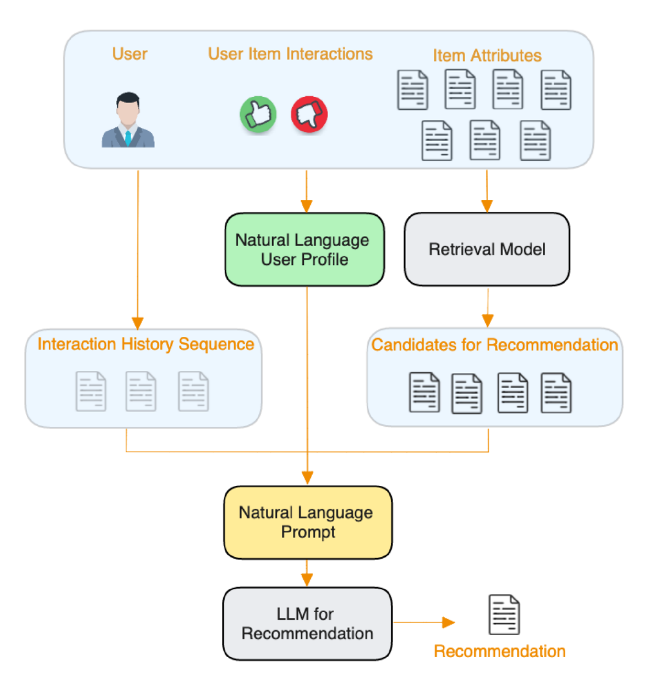
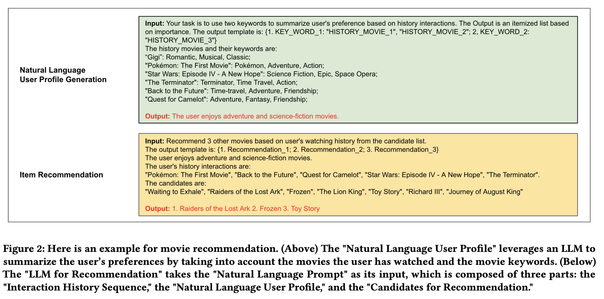
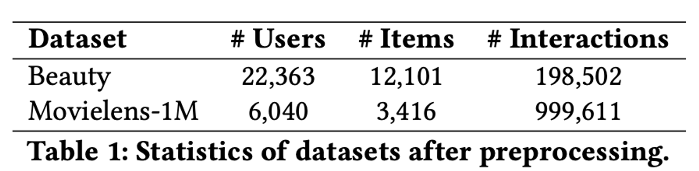
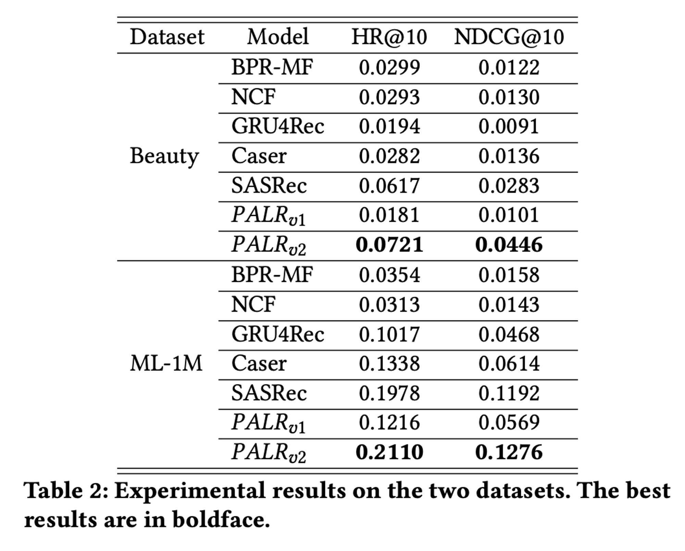

논문 : 🔗 <a href="https://arxiv.org/pdf/2305.07622" target="_blank">**PALR: Personalization Aware LLMs for Recommendation ↗**</a>

# 논문 목적

이 논문의 목적은 LLM(대규모 언어 모델)을 추천 시스템에 통합하는 새로운 프레임워크인 PALR(Personalization Aware LLMs for Recommendation)을 제안하는 것입니다. 이 프레임워크는 사용자 행동 데이터를 기반으로 후보 항목을 추출하고, 70억 매개변수를 가진 LLM을 미세 조정하여 후보 항목을 랭킹합니다. 실험 결과, PALR은 다양한 순차 추천 작업에서 최신 모델들을 능가하는 성능을 보여줍니다.

# 논문 배경

추천 시스템은 사용자가 선호할 만한 아이템을 예측하고 추천하는 정보 필터링 시스템으로, 전자 상거래, 온라인 광고, 소셜 미디어, 엔터테인먼트 산업에서 널리 사용됩니다. 최근 BERT, GPT-3, FLAN-T5와 같은 대규모 언어 모델(LLM)의 등장으로 자연어 처리(NLP) 연구가 크게 발전하였고, 이를 추천 시스템에 활용하려는 연구가 활발히 이루어지고 있습니다.

**LLM의 장점**

1. **귀납적 학습 지원 (Support inductive learning)**: 사전 학습된 임베딩 없이 각 항목을 텍스트로 표현할 수 있어 새로운 항목이 지속적으로 등장하는 산업 환경에 유리합니다.
2. **다양한 신호 통합**: 메타데이터, 문맥, 멀티모달 신호 등을 모델의 프롬프트에 쉽게 통합할 수 있습니다.
3. **지식 전이**: 하나의 도메인에서 얻은 지식을 다른 도메인으로 전이할 수 있어 콜드 스타트 상황에서 유리합니다.
4. **자연어 출력**: LLM은 광범위한 사전 훈련(extensive pre-training)을 통해 가지고 있는 방대한 지식과 우수한 추론(reasoning) 능력을 보유하고 있기에 사람이 읽을 수 있는 설명으로 추천을 제공해서 사용자의 신뢰(trust)와 참여(engagement)를 향상 시킬 수 있습니다. 


**General-purpose LLM의 문제점**

1. **지식 격차**: 새로 출시된 아이템이 LLM의 사전 지식에 포함되지 않을 수 있습니다.
2. **불완전한 결과**: LLM은 불완전하거나 환각적인 결과를 생성하기 쉬워 추가적인 검증이 필요합니다.
3. **입력 길이와 효율성 한계**: 아이템 풀이 광범위할 경우, 모든 아이템을 자연어 입력으로 제공하는 것은 비효율적입니다.

따라서, 최근 연구에서는 LLM을 지식 기반이 아닌 요약 및 추론 엔진으로 사용하는 경향이 있습니다.

# 핵심 요약

이 논문은 개인화된 추천 시스템을 위한 일반적인 프레임워크인 PALR을 제안합니다. 

PALR은 `사용자 행동 데이터를 LLM과 결합하여 사용자 프로필을 생성`하고, 이를 기반으로 `후보 항목을 추출한 후`, `LLM을 사용해 최종 추천 항목을 제공하는 방식`을 취합니다. LLaMa 7B 모델을 추천 시스템에 맞게 개선하고, 사용자 행동 데이터를 텍스트 형태로 변환하여 이 데이터를 활용해 사용자에게 맞는 추천을 합니다. MovieLens-1M 및 Amazon Beauty 데이터셋을 사용한 평가에서 최신 방법들과 비교해 경쟁력 있는 성능을 보였습니다.

### PALR 단계 설명

이 논문의 핵심 목표는 LLM을 활용하여 사용자 행동 데이터를 기반으로 더 나은 개인화된 추천 시스템을 만드는 것입니다. 이를 위해 다음과 같은 단계로 작업을 진행합니다:

1. **사용자 프로필 생성**: LLM과 사용자 행동 데이터를 사용하여 사용자 프로필 키워드를 생성합니다.
2. **후보 항목 추출**: 사용자 프로필을 바탕으로 후보 항목들을 사전 필터링합니다.
3. **최종 추천 제공**: LLM을 사용해 후보 항목들 중에서 사용자에게 맞는 최종 추천 항목을 제공합니다.

이 과정에서 LLM의 추론 능력을 최대한 활용하기 위해 사용자 행동 데이터를 자연어 프롬프트로 변환하고, 70억 매개변수를 가진 LLaMa 모델을 미세 조정합니다. 이를 통해 새로운 사용자나 이전에 보지 못한 항목에 대해서도 잘 일반화할 수 있는 추천 시스템을 개발했습니다.

# 방법론

## 1. PALR Framework

PALR 프레임워크는 LLM(대규모 언어 모델)을 활용한 추천 시스템을 위한 다단계 접근 방법을 제안합니다. 이를 통해 사용자 행동 데이터를 효과적으로 활용하여 개인화된 추천을 제공합니다.

### PALR 프레임워크 설명



1. **자연어 사용자 프로필 생성 (Nature Language user profile generation)**: 
    - 사용자가 많은 항목들과 상호작용하고 다양한 선호도를 보일 때, 모델이 정확한 추천을 제공하기 어려울 수 있습니다.
    - 이럴 때 사용자의 선호도를 요약한 높은 수준의 `요약 정보 (사용자 행동을 분석하여 요약한 자연어 프로필)`를 제공하는 것이 유리합니다.
    - 예를 들어, 사용자의 음악 및 TV 시청 기록을 분석하여 "팝 음악"과 "판타지 영화"와 같은 선호도 요약을 생성합니다.
    - prompt - 초록색 박스
2. **후보 항목 추출 (Candidate Retrieval)** :
    - 생성된 결과에서 환각(비현실적인 결과) 및 불완전성을 해결하기 위해, `다양한 검색 모듈`을 사용하여 지식을 기반으로 필터링합니다.
    - 이를 통해 작업에 관련되지 않은 결과를 제거하고, LLM에 전달할 더 작은 후보 풀을 만듭니다.
    - 이 프레임워크는 사용자 행동을 기반으로 훈련된 `순차 추천 모델과 같은 다양한 검색 모델`을 수용할 수 있습니다.
3. **항목 추천 (Item Recommendation)**:
    - 상호작용 이력, 자연어 사용자 프로필, 그리고 검색된 후보 항목들을 결합하여, `LLM에 입력할 자연어 프롬프트`를 만듭니다.
    - 모델은 이 프롬프트를 이용해 후보 항목들 중 사용자 프로필에 가장 잘 맞는 항목들을 선택합니다.
    - prompt - 노란색 박스

### 자연어 프롬프트

"추천을 위한 LLM"의 "Natural Language Prompt"는 세 가지 구성 요소로 이루어져 있습니다: 

- "`상호작용 이력 시퀀스`"는 사용자가 상호작용한 항목들을 단순히 연결하여 생성됩니다.
- "`자연어 사용자 프로필`"은 사용자의 선호도를 고수준으로 요약한 것으로, 사용자의 항목 상호작용, 항목 속성, 또는 가능한 경우 사용자 정보를 기반으로 LLM을 사용하여 생성됩니다.
- "`추천 후보들`"은 검색 모델의 출력이며, 우리 설계에서는 이 목적을 위해 어떤 검색 모델도 사용할 수 있는 유연성을 가지고 있습니다.



## 2. Fine-tuning

이 섹션에서는 모델의 성능을 향상시키고, 검색 레이어를 인식하도록 하기 위해 미세 조정이 필요하다고 설명합니다. 이를 위해 "Recommend"와 "Recommend_Retrieval"이라는 두 가지 유형의 지시 작업을 사용하여 모델을 미세 조정합니다. 

"Recommend" 작업은 사용자의 과거 상호작용 항목을 기반으로 미래에 상호작용할 가능성이 있는 항목을 예측하는 것이고, "Recommend_Retrieval" 작업은 후보 항목 목록에서 타겟 항목을 검색하는 것입니다. 

(사용한 모델 : llama 7b 모델)

### 미세 조정 방법

1) **Recommend 작업**:

- 사용자가 과거에 상호작용한 항목 목록을 제공하고, 모델이 미래에 상호작용할 항목을 예측합니다. (최대 20개 항목)
- 예시:
        ```arduino
        작업 지시: 사용자의 시청 기록을 기반으로 10개의 다른 영화를 추천하세요.
        입력: 사용자가 시청한 영화 "Pink Floyd - The Wall", "Canadian Bacon", "G.I. Jane", ..., "Down by Law".
        출력: "Almost Famous", "Full Metal Jacket", ...
        ```
2) **Recommend_Retrieval 작업**:

- 후보 항목 목록에서 타겟 항목을 검색합니다. 후보 목록에는 모든 타겟 항목과 타겟 항목과 유사한 몇 가지 부정 항목(예: 같은 장르의 영화, 많은 사용자가 함께 시청한 영화)이 포함됩니다.
- 예시 (Movielens 데이터셋):
        
    ```arduino
    작업 지시: 사용자의 시청 기록을 기반으로 후보 목록에서 10개의 다른 영화를 추천하세요.
    입력: 사용자가 시청한 영화 "Pink Floyd - The Wall", "Canadian Bacon", "G.I. Jane", ..., "Down by Law". 
    후보 목록은 “The Blues Brothers”, "Platoon", ..., "Almost Famous".
    출력: "Almost Famous", "Full Metal Jacket", ...
    ```

        
- 예시 (Amazon Beauty 데이터셋):
    
    ```arduino
    작업 지시: 사용자의 구매 기록을 기반으로 후보 목록에서 10개의 다른 항목을 추천하세요.
    입력: 사용자가 구매한 제품 "B000142FVW (Opi Nail Lacquer, Not So Bora Pink, 0.5 Fluid Ounce)", ..., "B001PPMLS8 (MoroccanOil Treatment Light 3.4 Oz)". 
    후보 목록은 "B000SQRMOS (FHI Heat Hot Sauce (50ml), 1.7 fluid ounces bottle)", ..., "B000G1MT2U (Mixed Chicks Leave-In Conditioner)".
    출력: "B000G1MT2U (Mixed Chicks Leave-In Conditioner)", "B001AO0WCG (Moroccan Oil Hair Treatment 3.4 Oz Bottle with Blue Box)", ...
    ```
        

### 추가적인 미세 조정 기술

> Furthermore, we have found that the fine-tuning process is enhanced by a couple of techniques:
> 
> 
> 1) enriching shorter lists in the datasets with items from the user’s 3-hop affinity; 
> 
> 2) randomly swapping items between the instruction and the generation label.
> 
- **1) 데이터셋 내 짧은 목록을 보완**: 사용자와 관련된 3단계(3-hop) 범위 내의 항목을 추가하여 데이터셋 내의 짧은 목록을 더 풍부하게 만듭니다. 여기서 "3-hop affinity"는 사용자가 직접적으로나 간접적으로 연관된 항목들을 의미합니다.
- **2) 명령어와 생성 라벨 간 항목을 무작위로 교환**: 모델 훈련 시 명령어(instruction)와 그에 대한 응답인 생성 라벨(generation label) 사이의 항목을 무작위로 교환하여 다양성을 높이고, 모델이 더 일반화된 성능을 발휘할 수 있도록 돕습니다.

쉽게 말해, 데이터셋을 더 풍부하게 만들고, 훈련 데이터를 무작위로 섞어 모델의 성능을 높이는 방법을 설명하는 것입니다.

### 참고사항 및 fine tuning에 대한 마지막 요약

모델은 전체 데이터의 20%만을 사용하여 미세 조정되며, LLM의 강력한 귀납 학습 능력((Inductive Learning Capability)을 입증하고자 합니다. 이는 전체 데이터를 필요로 하는 항목 임베딩 기반 모델과 다릅니다.

- **Recommend 작업**은 사용자의 과거 상호작용 데이터를 바탕으로 새로운 항목을 예측하는 데 집중합니다.
- **Recommend_Retrieval 작업**은 주어진 후보 목록에서 사용자가 선호할 항목을 선택하는 데 중점을 둡니다.
    - **𝑃𝐴𝐿𝑅𝑣1 : Recommend 사용**
        - 단순히 사용자의 과거 상호작용 데이터를 기반으로 미래 항목을 예측.
    - **𝑃𝐴𝐿𝑅𝑣2 : Recommend와 Recommend_Retrieval을 모두 사용**
        - 사용자의 과거 상호작용 데이터와 후보 항목 목록을 모두 사용하여, 후보 목록에서 타겟 항목을 선택하는 능력을 추가로 포함.


# Experiments

### 데이터셋



- **Amazon Beauty**: 1996년 5월부터 2014년 7월까지의 사용자-상품 상호작용 데이터를 포함하는 Amazon 리뷰 데이터셋의 한 카테고리.
- **Movielens-1M**: 백만 개의 영화 평점을 포함하는 일반적인 벤치마크 데이터셋.
- **데이터 전처리**:
    - 모든 수치 평점이나 리뷰 존재 여부를 "1"로 변환하고, 나머지는 "0"으로 변환.
    - 각 사용자의 중복 상호작용을 제거하고 시간 순서대로 정렬.
    - 각 사용자/항목이 최소 5개의 상호작용을 가지도록 보장(5-core 데이터셋).

### 평가

- **평가 방법**:
    - leave-one-out 전략 사용.
        - 각 사용자에 대해 마지막 상호작용 항목을 테스트 데이터로 사용.
        - 마지막 바로 전 항목을 검증 데이터로 사용.
        - 나머지 항목은 학습에 사용.
- **평가지표**: Hit Ratio (HR)와 Normalized Discounted Cumulative Gain (NDCG) 사용.
    - HR은 긍정 항목의 존재 여부에 중점, NDCG는 순위 위치 정보를 고려.

### 비교 모델

- **BPR-MF**: 사용자의 순위 매기기 손실(BPR 손실)을 활용한 행렬 분해 모델.
- **NCF**: 행렬 분해의 내적 대신 신경망 구조를 사용하여 비순차적 사용자-항목 상호작용 모델링.
- **GRU4Rec**: GRU를 이용하여 사용자의 순차적 행동을 모델링.
- **Caser**: 사용자 최근 하위 시퀀스 행동을 활용하기 위해 수평 및 수직 CNN을 사용.
- **SASRec**: 자기 주의 모듈을 통해 사용자 시퀀스를 모델링하여 사용자의 동적 관심사를 포착. 순차적 추천에서 경쟁력 있는 벤치마크.

## 최종 결과



- 𝑃𝐴𝐿𝑅𝑣2는 두 데이터셋에서 여러 기준 모델보다 월등히 높은 성능을 보였습니다.
- 𝑃𝐴𝐿𝑅𝑣1과 𝑃𝐴𝐿𝑅𝑣2를 비교해보면, 후보 검색이 성능 향상에 중요한 역할을 한다는 것을 알 수 있습니다. 
우리의 프레임워크는 특정 검색 알고리즘에 의존하지 않습니다.
- PALR은 다양한 검색 방법과 결합하여 효과적인 랭킹 모델로 기능할 수 있습니다. 
이 논문에서는 `SASRec을 검색 레이어`로 사용하여 상위 50개의 추천 항목을 고려했습니다.
    - 𝑃𝐴𝐿𝑅𝑣2와 SASRec을 비교한 결과, PALR이 재정렬한 상위 10개 추천 항목이 원래 SASRec의 추천보다 우수하다는 것을 확인했습니다.
    - BERT4Rec과 LightGCN을 포함한 다른 추천 알고리즘을 사용한 평가에서도 유사한 경향을 보였습니다.
- 다양한 실험을 통해 미세 조정의 중요성을 깊이 이해할 수 있었습니다.
    - 𝑃𝐴𝐿𝑅𝑣1은 과거 상호작용 항목과 미래 상호작용 항목을 어느 정도 연결하는 능력을 보여주었지만, 미세 조정 전에는 주로 인기 있는 항목만 추천하는 경향이 있었습니다.
    - 또한, 𝑃𝐴𝐿𝑅𝑣1은 후보 항목 목록에서 타겟 항목을 검색하는 데 어려움을 겪었습니다. 반면, 𝑃𝐴𝐿𝑅𝑣2는 미세 조정 단계에서 추가 지시를 포함하여 성능을 크게 향상시켰습니다.

# 최종 결론

- PALR 장점
    - 첫 번째 이점은 다양한 소스의 외부 지식을 프레임워크에 쉽게 통합할 수 있다는 점입니다.
    - 두 번째 이점은 LLM을 사용하면 설명 가능한 추천과 대화형 추천을 포함한 더 복잡한 추천 시나리오로 쉽게 나아갈 수 있다는 점입니다.
- 앞으로의 연구

앞으로 우리의 연구는 LLM을 추천 작업에 더욱 활용하면서 그들의 `강력한 능력`과 `지연 시간 사이`의 균형을 유지하는 데 중점을 둘 것입니다. LLM은 계산적으로 집약적일 수 있으므로, 성능을 최적화하고 정확성이나 개인화를 희생하지 않으면서 지연 시간을 줄이는 방법을 탐구할 것입니다.