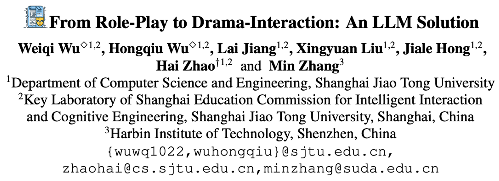
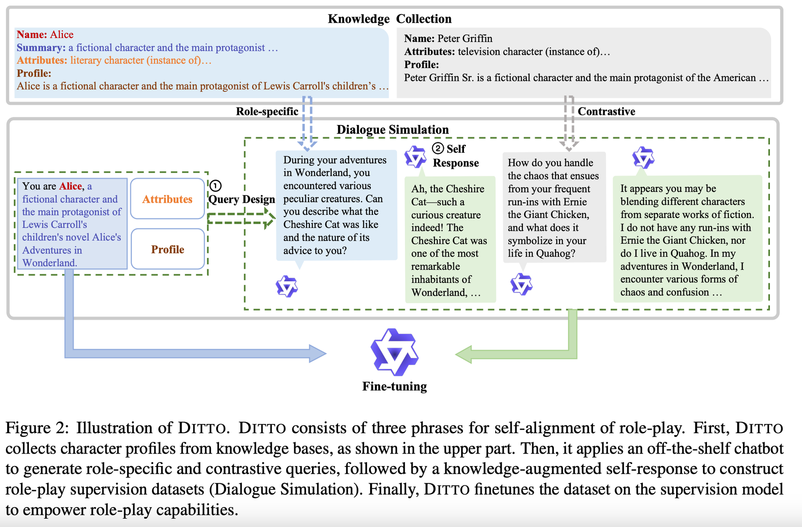
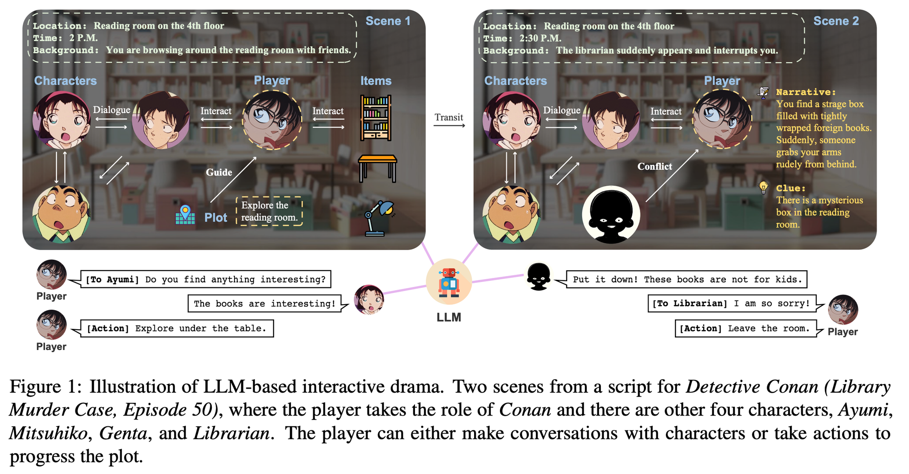
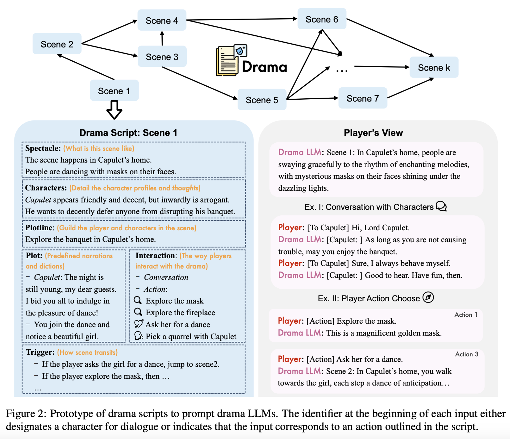
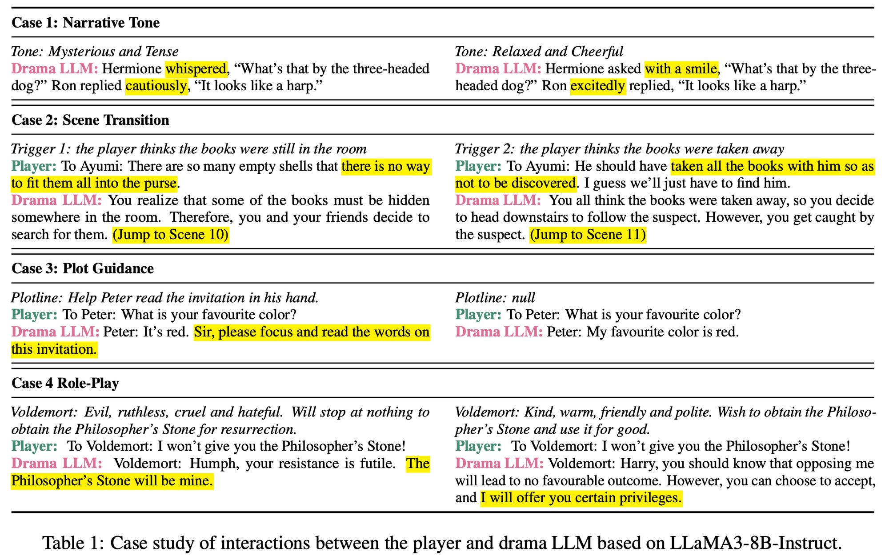

안녕하세요. 이번 8월 월간수도렉에서는 캐릭터 챗봇을 넘어서 드라마 속의 한장면에 들어가서, 캐릭터들과 상호작용하는 From Role-Play to Drama-Interaction: An LLM Solution를 리뷰해볼까 합니다. 해당 논문은 캐릭터 챗봇의 다음 나아갈 방향을 보여주는 점에서 의미가 있으며, 기존의 Role-Play 논문들하고는 다른 방향을 제시하기에 한번 봐두면 좋을 것 같습니다 😃

---

지난 수도렉에서 공유한 2가지의 논문은 근본적으로 각각의 캐릭터들에 대한 챗봇을 만드는 논문이었습니다.

이전 글 : 🔗 <a href="https://pseudorec.com/archive/monthly_pseudorec/10/" target="_blank">**캐릭터 챗봇 만들기 리서치 조사 ↗**</a>

- Character-LLM: A Trainable Agent for Role-Playing
- Large Language Models are Superpositions of All Characters: Attaining Arbitrary Role-play via Self-Alignment

일반적으로 Wiki에서 특정 캐릭터에 대한 정보를 추출 (Knowledge Collection)하고, 이를 기반으로 해당 지식에 기반한 구체적인 역할을 생성해서 학습을 하는 방식입니다. 다만, 이렇게 될 경우 해당 캐릭터에 대한 지식은 잘 알 수 있지만 해당 캐릭터가 등장한 배경, 다른 등장인물과의 상호작용에 대해서는 물음표를 칠 수 밖에 없습니다. 영화 범죄도시로 치면 마동석은 잘 알지만 마동석과 장첸이 어떤 대화를 나눌지 등에 대해서는 모르게 됩니다. 그러다보니 캐릭터 챗봇과 핑퐁을 하는 과정에서 아쉬움을 느낄 수 밖에 없습니다.

이 논문에서는 이와는 다르게 그림1처럼 여러 캐릭터들이 있고, Player가 특정 상황에서 상호작용하는 모습을 통해 장면이 연출됩니다. 관객(플레이어로서)은 어느 캐릭터와도 상호작용하거나(예: 아유미와 대화) 어느 아이템과도 상호작용할 자유가 있습니다 (예: 테이블 아래를 탐색). LLM은 장면 속 캐릭터와 아이템으로서 플레이어에게 반응합니다. 이 장면에는 '독서실 탐색'이라는 목표가 있습니다. 이 목표는 플레이어와 모든 캐릭터가 줄거리의 전개를 매끄럽게 진행하도록 안내하는 역할을 합니다. 줄거리가 진행됨에 따라, 장면 전환이 발생하여 새로운 플롯이 도입됩니다 (예: 새로운 캐릭터와 대화가 있는 장면 2로 전환).

그렇다면 이를 위한 Instruction은 어떻게 주어질까요? 논문에서는 그림 2와 같이 인터랙티브 드라마를 위한 새로운 6가지 필수 요소를 정의하고 - 플롯, 캐릭터, 사상, 대사, 장관, 상호작용이에 맞춰 지시를 진행합니다. 

각 모델 입력에는 관련 장면의 대본과 다중 턴 사용자 입력이 포함됩니다. 그림 2의 오른쪽 절반에 묘사된 대로, 드라마 LLM은 처음에 장관과 플롯의 설명을 생성하고, 플레이어에게 제공되는 상호작용을 렌더링합니다. 후속 사용자 입력은 장면의 캐릭터와의 대화 형태를 취하거나, 대화 내용이 캐릭터 이름 뒤에 이어지거나, 행동 식별자와 선택된 행동으로 구성됩니다. 드라마 LLM은 이러한 입력을 처리하여 캐릭터 역할을 연기하여 사용자에게 반응하거나, 트리거에 기반하여 플롯 업데이트를 생성합니다. 

위와 같은 과정을 통해서 여러 케이스들에 대해서 LLM이 답변을 잘 생성하는 것을 확인할 수 있습니다. 

이번 시간에는 LLM을 이용한 Drama 상호작용에 대해 살펴봤습니다. 

다음 기회가 있으면 (진짜로) 한번 이를 직접 구현해서 이전에 소개한 논문들과 어떠한 차이가 있는지 비교 실험을 해보려고 합니다. 

감사합니다.

