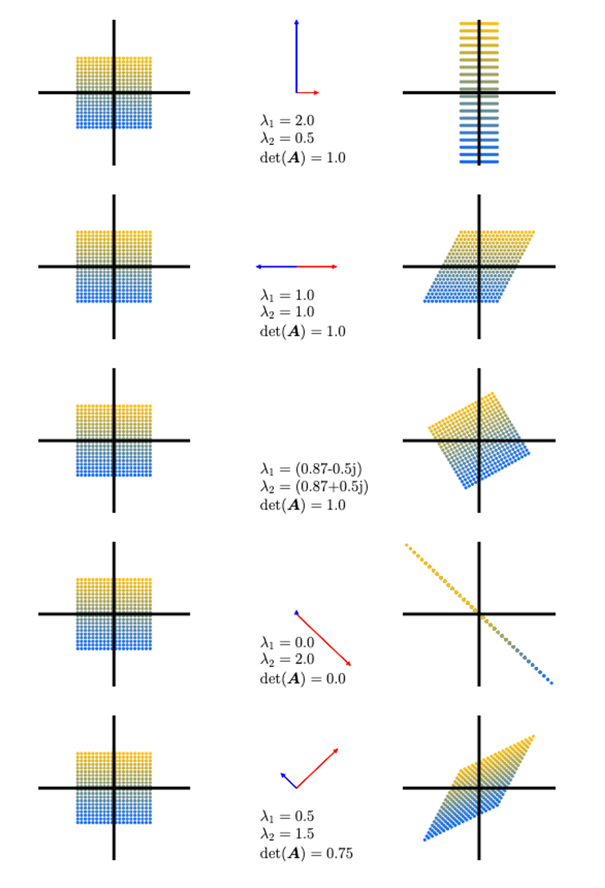
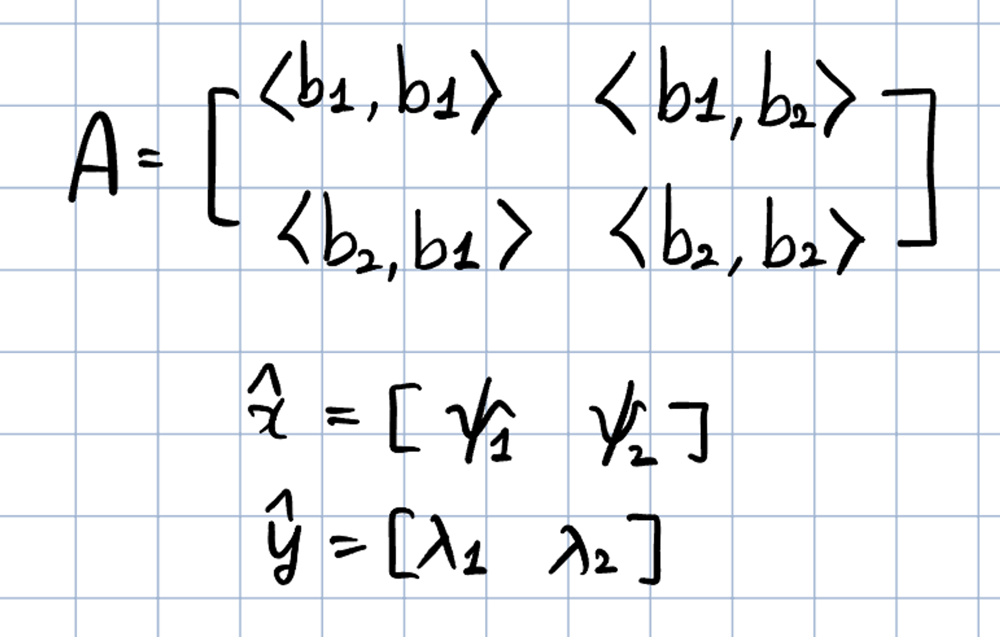
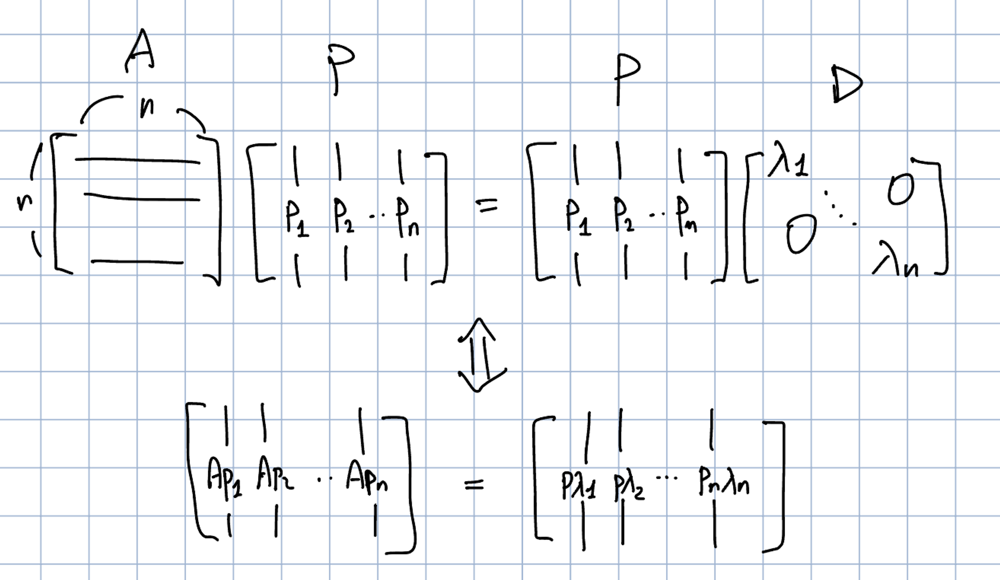
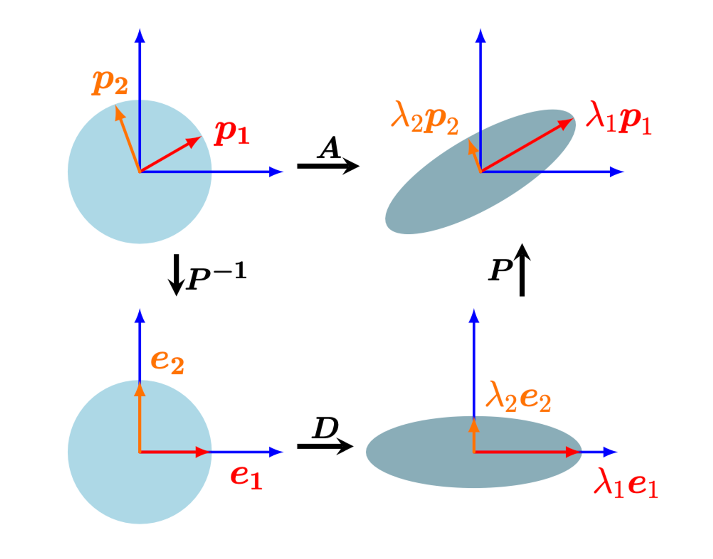

# 시작하며

※ 수식이 깨져보이신다면 새로고침을 해주세요

> 본 게시글은 <a href="https://product.kyobobook.co.kr/detail/S000003103258" target="_blank" style="text-decoration: underline;">**Mathematics of Machine Learning ↗**</a> 책을 번역하였습니다. 복습 시 한 호흡에 읽히도록 필요한 부분만 개인적인 해석을 달아 정리해 놓는 것이 이 글의 목적입니다.

이번엔 내용이 좀 많고 어려웠습니다..! Matrix decomposition의 원리를 다 이해해보려고 며칠동안 독기품고 정리했습니다..!!

4단원 목차를 다시 한 번 정리하고 오늘 다룰 부분을 알아보겠습니다.

> **4. Matrix Decompositions** 
>
> - 4.1 Determinant and Trace
> 
> - 4.2 Eigenvalues and Eigenvectors ← 여기 끝부분
> 
> - 4.3 Cholesky Decomposition ← 여기
> 
> - 4.4 Eigendecomposition and Diagonalization ← 여기
> 
> - 4.5 Singular Value Decomposition

이번 글에서 다룰 내용은 4.2의 끝부분, 4.3, 4.4 단원입니다.

뒤에도 더 있지만, SVD까지 정리하는 것을 목표로 하고 있습니다!

---

Eigenvector 이야기가 아직 끝나지 않았다!

# 4.2 Eigenvalues and Eigenvectors(이어서)

**Graphical Intuition in Two Dimensions**

determinants, eigenvectors, eigenvalues에 대한 직관적인 이해로 들어가보자. Figure 4.4는 행렬 $\mathbf{A}_1$, …, $\mathbf{A}_5$와 이들에 의한 점들의 변형을 보여주고 있다.

*Figure 4.4*

- $\mathbf{A}_1 = \begin{bmatrix} \frac{1}{2} & 1 \\\\
0 & 2
\end{bmatrix}$. 두 고유벡터의 방향이 2차원 canonical basis와 나란한 상황이다. 수직축 방향으로 2만큼 늘어나고(고유값 $\lambda_1=2$), 수평축 방향으로 $\frac{1}{2}$만큼 압축된다. 넓이는 보존된다.
- $\mathbf{A}_2 = \begin{bmatrix} 1 & \frac{1}{2} \\\\
0 & 1
\end{bmatrix}$은 전단 매핑(sheering mapping)인데, 즉, y축의 양의 방향에 있다면 오른쪽으로, 음의 방향에 있다면 왼쪽으로 전단한다. 이 매핑도 넓이를 보존한다. 고유값은 두 값이 동일한 $\lambda_1=1=\lambda_2$이며, 고유 벡터들은 collinear이다. 즉, 그림처럼 수평 축 방향으로만 늘어나거나 줄어든다.
- $\mathbf{A}_3 = \begin{bmatrix} \cos{\frac{\pi}{6}} & -\sin{\frac{\pi}{6}} \\\\
\sin{\frac{\pi}{6}} & \cos{\frac{\pi}{6}}
\end{bmatrix}=\frac{1}{2}\begin{bmatrix} \sqrt{3} & --1 \\\\
1 & \sqrt{3}
\end{bmatrix}$은 점들을 $\frac{\pi}{6}$, 즉 30도만큼 반시계 방향으로 회전시키다. 그리고 허수의 고유값을 갖는다.
- $\mathbf{A}_4 = \begin{bmatrix} 1 & -1 \\\\
-1 & 1
\end{bmatrix}$은 표준 기저에서의 2차원 도메인을 1차원으로 줄이는 매핑이다. 한 개의 고유값이 0이기 때문에, 이에 해당하는 파란색 고유벡터 방향의 점들은 넓이가 0이 된다. 반면 이와 수직인 빨간색 고유벡터 방향으로는 고유값인 $\lambda_2=2$만큼 늘어난다.
- $\mathbf{A}_5 = \begin{bmatrix} 1 & \frac{1}{2} \\\\
\frac{1}{2} & 1
\end{bmatrix}$는 전단도 하고 늘리기도 하는 매핑이다. 이 행렬의 determinant는 $|\det(\mathbf{A}_5)|=\frac{3}{4}$이기 때문에, 넓이를 75%로 만든다. 빨간 고유벡터 방향의 넓이는 $\lambda_2=1.5$에 의해 늘어나고, 파란 고유벡터 방향의 넓이는 $\lambda_1=0.5$에 의해 줄어든다.

---

다음엔 대칭행렬에 대한 이야기가 나온다. 왜 대칭행렬을 중요하게 다루는 것인지 써가면서 이해해볼 수 있겠지..?

> Theorem 4.14 행렬 $A \in \mathbb{R}^{m \times n}$가 주어졌을 때, 언제나 symmetric, positive semidefinite 행렬 $S \in \mathbb{R}^{n \times n}$을 얻을 수 있다.
> 
> 
> $$
> S:=A^{\top}A
> $$
> 

위 정리로부터 symmetric 행렬을 어떻게 활용할 수 있는지 생각해볼 수 있다. Symmetric이라는건 $S=S^{\top}$이라는 것이다. 여기서 잠시 전치(Transpose)의 성질을 알아보면,

1. 이중 전치의 성질 : $(A^{\top})^{\top}=A$
2. 곱의 전치 성질 : $(AB)^{\top}=B^\top A^\top$

두 가지가 있다. $S=A^{\top}A$라고 하면, $A$에 이중 전치의 성질을 적용하면 $S=A^{\top}(A^{\top})^{\top}$이라고 쓸 수 있다. 여기에 곱의 전치 성질을 적용하면(둘을 묶고 순서를 바꿔 밖에 Transpose), $S=(A^{\top}A)^{\top}$이다. $A^{\top}A$를 $S$라고 하였으므로 $S=S^{\top}$이 된다. 그러므로 $S$는 symmetric하다.

또한, $A^{\top}A$로 만들어진 $S$는 positive semidefiniteness를 만족한다! 

Symmetric, positive (semi)definite 행렬은 3단원에 나오는데, 잠시 살펴보자.

> Definition 3.4 (Symmetric, Positive Definite Matrix)
> 
> 
> $$
> \forall x \in V \setminus \\left\\{ \mathbf{0}\\right\\} : x^{\top}\mathbf{A} x > 0
> $$
> 
> 위 식을 만족하는 대칭 행렬 $\mathbf{A} \in \mathbb{R}^{n \times n}$을 symmetric, positive definite,  또는 그냥 positive definite이라고 부른다.
> 

예를 들어 $\mathbf{A} = \begin{bmatrix} 9 & 6 \\\\ 6 & 5  \end{bmatrix}$의 경우, $\begin{bmatrix} x_1 & x_2 \end{bmatrix} \begin{bmatrix} 9 & 6 \\\\ 6 & 5  \end{bmatrix} \begin{bmatrix} x_1 \\\\ x_2 \end{bmatrix} = (3x_1 + 2x_2)^2 + x_2^2 > 0$이기 때문에 symmetric, positive definite이다.

Symmetric, positive definite 행렬은 머신러닝에서 중요한 역할을 담당한다. definite이라는 단어는 수학에서 일관되게 ‘양수’로 결정된다는 의미를 갖는다.

내적(Inner product)는 벡터 공간 전반에서 일반화된 개념이다. 흔히 생각하는 Dot product(점곱, $\mathbf{a}\cdot \mathbf{b}  = \sum_{i=1}^{n}a_ib_i$)는 내적의 특수한 경우라고 볼 수 있다. 일반적인 벡터 공간 $V$에서 두 벡터 $\mathbf{a}, \mathbf{b} \in V$의 내적에 대해 생각해볼까?

$n$차원의 벡터 공간 $V$에서의 내적 $V \times V \rightarrow \mathbb{R}$과 $V$의 ordered basis $B = (\mathbf{b}_1, \cdots, \mathbf{b}_n)$를 생각해보자. 내적의 정의는 Definition 3.3에 나오는데, 다음과 같다.

> Definition 3.3 $V$를 벡터 공간이라고 하고, $\Omega : V \times V \rightarrow \mathbb{R}$를 **두 벡터를 실수로 매핑**하는 bilinear mapping(첫 번째 변수와 두 번째 변수 모두가 선형성을 갖는 매핑, Ex. dot product)라고 하자. 그렇다면 Positive definite, symmetric bilinear mapping $\Omega : V \times V \rightarrow \mathbb{R}$을 $V$에 대한 내적(inner product)라고 부른다. 관례적으로 $\left\langle x \cdot y \right\rangle$라고 쓴다.
> 

Dot product가 아닌 Inner product의 예시로 $\left\langle x \cdot y \right\rangle := x_1y_1 - (x_1y_2 + x_2y_1) + 2x_2y_2$가 있다. 아무튼, 다시 symmetric, positive definite 행렬로 돌아가보자.

벡터 공간 $V$의 모든 벡터 $x, y \in V$는 basis 벡터의 선형 결합으로 표현할 수 있다(Section 2.6.1). $x=\sum_{i=1}^{n}\psi_i b_i$로, $y=\sum_{j=1}^{n}\lambda_j b_j$라고 쓸 수 있을 것이다. 물론 $\lambda$와 $\psi$는 실수이다. 내적의 bilinearity때문에, 모든 $x, y$에 대하여 다음이 성립한다.

$$
\left\langle x \cdot y \right\rangle = \left\langle \sum_{i=1}^{n}\psi_i b_i, \sum_{j=1}^{n}\lambda_j b_j \right\rangle = \sum_{i=1}^{n}\sum_{j=1}^{n} \psi_i \left\langle b_i, b_j \right\rangle \lambda_j = \hat{x}^{\top}A\hat{y}
$$

이 때의 $A_{ij}:=\left\langle b_i, b_j \right\rangle$이고 $\hat{x},\hat{y}$는 $x,y$의 basis $B$에 대한 coordinates이다. 이는 내적 $\left\langle \cdot , \cdot \right\rangle$이 $A$를 통해 유일하게 결정한다는 것을 내포한다. 내적의 대칭성 또한 $A$가 symmetric하게 한다. 즉, 내적이라는 것은 basis 벡터들의 내적으로 이루어진 symmetric 행렬 $A$, 그리고 coordinates 벡터들과의 곱이 되는 것이다.

symmetric positive definite 행렬에 대해서는 여기까지만 알아보도록 하고, 다음에 기회가 되면 더 자세하게 파보도록 하자 😅

positive semidefinite이란, 영벡터가 아닌 벡터 $x$에 대하여 $x^{\top}Ax \geqslant0$를 만족하는 행렬 $A$를 positive semidefinite하다고 한다. $x^{\top}Sx$에서 $S$를 $A^{\top}A$로 바꾸면 $x^{\top}A^{\top}Ax$가 되고, $x^{\top}A^{\top}$에 곱의 전치 성질을 적용하면 $(Ax)^{\top}$이 되므로, 결국 $x^{\top}Sx=(Ax)^{\top}(Ax)$가 된다. Dot product는 항상 0 이상이므로, $S$는 항상 positive semidefinite하다!

Spectral Theorem, eigenvalue에 trace와 대한 기하학적  해석 등이 나오는데 여긴 점프!

> Example 4.9 (Google’s PageRank - Webpages as Eigenvectors)
구글은 행렬 $A$의 고유값 중 최대값에 대응되는 고유벡터를 이용하여 검색 시 페이지에 대한 랭크를 결정한다. 이러한 ‘PageRank’라고 불리는 알고리즘은 1996년 스탠포드 대학교의 래리 페이지(Larry Page)와 세르게이 브린(Sergey Brin)에 의해 탄생했다.
>
> 어느 한 웹페이지의 중요도는 해당 웹페이지를 링크한 페이지의 중요도에 의해 계산될 수 있다. 개발자들은 모든 웹사이트들을 하나의 거대한 directed graph로 만든 후, 각 페이지가 어디에 링크되는지 보았다. PageRank는 웹사이트 $a_i$의 가중치(중요도) $x_i \geqslant 0$로서 $a_i$를 가리키는 페이지의 수를 사용한다. 추가적으로, $a_i$를 가리키는 웹사이트의 중요도도 고려한다.
어느 유저의 탐색은 이 그래프의 전이 행렬(transition matrix) $A$로 나타낼 수 있을 것이다. 그럼 이 행렬은 누군가가 얼마의 확률로 어느 페이지에 도달할지 알려준다. 어느 웹사이트의 초기 중요도 벡터를 $x$라고 해보자. $x$, $Ax$, $A^2x$, $\cdots$ 가 $x^{\*}$라는 벡터로 수렴한다. $A$의 특성이 그렇다. 이 벡터 $x^\*$를 PageRank라고 부르며, $Ax^\*=x^\*$를 만족한다. **즉, 어느 웹사이트의 중요도 벡터는 행렬 $A$의 고유값 1에 상응하는 고유벡터인 셈이다.** $x^\*$를 정규화하면($||x^\* || = 1$), 각 요소는 확률로 해석될 수 있다.
상세한 사항은 원논문 [Page et al., 1999](http://ilpubs.stanford.edu:8090/422/?utm_campaign=Technical%20SEO%20Weekly&utm_medium=email&utm_source=Revue%20newsletter)에서 찾아볼 수 있다.
> 

---

# 4.3 Cholesky Decomposition

머신러닝에서 우리가 자주 마주치는 특별한 유형의 행렬을 분해하는데는 다양한 방법들이 있다. 양의 실수 $9$가 $3\cdot 3$으로 분해되는걸 생각해보자. 다만 행렬에 대해서는 조금 조심해야한다. symmetric, positive definite 행렬에 대해서는, Cholesky 분해가 유용하다!

> Theorem 4.18 (Cholesky Decomposition). Symmetric, positive definite 행렬 $\mathbf{A}$는 $\mathbf{A}=\mathbf{L}\mathbf{L}^{\top}$로 분해될 수 있다. $\mathbf{L}$은 양의 대각 요소를 가진 lower triangular 행렬이다.
> 
> 
> $$
> \begin{bmatrix}a_{11} & \cdots & a_{1n} \\\\\vdots & \ddots & \vdots \\\\a_{n1} & \cdots & a_{nn}\end{bmatrix}=\begin{bmatrix}l_{11} & \cdots & 0 \\\\\vdots & \ddots & \vdots \\\\l_{n1} & \cdots & l_{nn}\end{bmatrix}\begin{bmatrix}l_{11} & \cdots & l_{1n} \\\\\vdots & \ddots & \vdots \\\\0 & \cdots & l_{nn}\end{bmatrix}
> $$
> 
> 이 때의 $\mathbf{L}$을 $\mathbf{A}$의 Cholesky factor라고 부르며, $\mathbf{L}$은 유일하다.
> 

이제 symmetric positive definite 행렬에 대해 Cholesky 분해하는 예제를 보자.

> Example 4.10 (Cholesky Factorization)
Symmetric, positive definite 행렬 $\mathbf{A} \in \mathbb{R}^{3 \times 3}$이 있다고 하자. Cholesky 분해 $\mathbf{A}=\mathbf{L}\mathbf{L}^\top$을 해보자.
> 
> 
> $$
> \mathbf{A} = \begin{bmatrix}a_{11} & a_{21} & a_{31} \\\\ a_{21} & a_{22} & a_{32} \\\\a_{31} & a_{32} & a_{33}\end{bmatrix}=\mathbf{L}\mathbf{L}^{\top}=\begin{bmatrix}l_{11} & 0 & 0 \\\\ l_{21} & l_{22} & 0 \\\\l_{31} & l_{32} & l_{33}\end{bmatrix} \begin{bmatrix}l_{11} & l_{21} & l_{31} \\\\ 0 & l_{22} & l_{32} \\\\0 & 0 & l_{33}\end{bmatrix}
> $$
> 
> 우변을 곱한 결과는
> 
> $$
> \mathbf{A} = \begin{bmatrix}l_{11}^2 & l_{21}l_{11} & l_{31}l_{11} \\\\ l_{21}l_{11} & l_{21}^2 + l_{22}^2 & l_{31}l_{21} + l_{32}l_{22} \\\\l_{31}l_{11} & l_{31}l_{21} + l_{32}l_{22} & l_{31}^2 + l_{32}^2 + l_{33}^2\end{bmatrix}
> $$
> 
> 첫 수식의 좌변과 위 수식의 우변의 대각 요소끼리 비교하면 다음과 같은 관계가 도출된다.
> 
> $$
> l_{11} = \sqrt{a_{11}},\;\; l_{22}=\sqrt{a_{22}-l_{21}^2}, \;\; l_{33}=\sqrt{a_{33} - (l_{31}^2) + l_{32}^2)}
> $$
> 
> 똑같이 대각 아래쪽만 비교하면, 다음과 같이 쓸 수 있다.
> 
> $$
> l_{21}=\frac{1}{l_{11}}a_{21},\;\;l_{31}=\frac{1}{l_{11}}a_{31},\;\;l_{32}=\frac{1}{l_{22}}(a_{32}-l_{31}l_{21})
> $$
> 
> 이런 방식으로 어떠한 symmetric, positive definite $3 \times 3$ 행렬에 대하여도 Cholesky 분해를 할 수 있다.
> 

Cholesky 분해는 머신러닝에서 수 계산을 할 때 매우 중요한 도구이다! 예를 들어, 공분산 행렬은 symmetric positive definite 행렬인데, 많은 곱셈 연산이 필요하다. 하지만 Cholesky 행렬을 사용하면 가우시안 분산으로부터 샘플들을 생성할 수 있다든가(?), 랜덤 변수의 선형 변환을 가능하게 해서 오토인코더같은 통계 모델에서 그래디언트를 계산할 때 널리 사용된다든가 하는 것이다. (음..어렵네)

또, Cholesky 분해를 통해 determinant를 쉽게 계산할 수 있다. $A=L L^{\top}$일 때, $\det(A) = \det({L})\det({L}^{\top})=\det(L)^2$라는 걸 알고있다(전치를 해도 determinant는 변하지 않는다고 이전 글에서 배웠다). $L$은 triangular이기 때문에, determinant는 대각요소들의 제곱의 곱인 $\det(A)=\Pi_i l_{ii}^2$가 된다! 대각행렬의 determinant는 대각 요소들의 곱이기 때문이다.

# 4.4 Eigendecomposition and Diagonalization

대각 행렬(diagonal matrix)은 대각 위치가 아닌 요소들이 모두 0인 행렬이다. 즉,

$$
D=\begin{bmatrix} c_1 & \cdots & 0
\\\\
\vdots & \ddots & \vdots
\\\\
0 & \cdots & c_n
 \end{bmatrix}
$$

와 같은 형태이다. 대각 행렬의 determinant, powers, inverse는 빠르게 계산할 수 있다. Determinant는 대각 요소들의 곱이며, 거듭제곱 $D^k$는 각 요소들의 $k$ 제곱으로 표현되며, 추가적으로, 대각 요소들이 모두 0이 아니라면 역함수 $D^{-1}$는 대각 요소들의 역수로 표현된다.

행렬을 어떻게 diagonal 형태로 변환할 수 있는지 살펴보자. $A$, $D$가 similar 관계라고 하자.

> Definition 2.22 (Similarity). 만약 $\tilde{A}=S^{-1}AS$인 regular(=invertible) 행렬 $S \in \mathbb{R}^{n \times n}$가 존재한다면, 두 행렬 $A$, $\tilde{A}$은 similar하다.
> 

Similarity에 대해서는 추후에 자세히 다뤄보도록 하고… 일단  $A$와 $D$가 similar하다는건 $D = P^{-1}AP$를 만족하는 invertible 행렬 $P$가 존재한다는 것이다. 좀 더 구체적으로는, $A$의 고유값들을 대각 요소로 갖는 대각 행렬 $D$와 $A$가 similar한 상황이다.

> Definition 4.19 (Diagonalizable). 만약 행렬 $A \in \mathbb{R}^{n \times n}$가 diagonal matrix $D$와 similar이면, 즉, $D = P^{-1}AP$를 만족하는 invertible 행렬 $P \in \mathbb{R}^{n \times n}$이 존재하면, $A$는 diagonalizable하다.
> 

이제부터 $A \in \mathbb{R}^{n \times n}$을 대각화(diagonalizing)하는 것이 다른 기저에서의 선형 매핑(Section 2.6.1)을 표현하는 방법이라는 것을 알아볼 것이다. 이는 $A$의 고유벡터로 구성된 기저가 된다는 사실!

$A \in \mathbb{R}^{n \times n}$,  $\lambda_1, \cdots, \lambda_n$라는 스칼라 집합, $p_1, \cdots , p_n \in \mathbb{R}^{n}$이라는 벡터 집합이 있다고 하자. $P:=[p_1, \cdots, p_n]$라고 정의하자. 또한 $D \in \mathbb{R}^{n \times n}$을 $\lambda_1, \cdots, \lambda_n$라는 대각 요소를 가진 대각 행렬이라고 정의하자. 만약 $\lambda_1, \cdots, \lambda_n$가 $A$의 고유벡터이고 $p_1, \cdots, p_n$가 이에 상응하는 $A$의 고유벡터라면, 다음을 보일 수 있다:

$$
AP=PD
$$

말은 복잡하지만, 결국 다음과 같이 표현만 바꾼 것이다.

$$
Ap_1 = \lambda_1 p_1
\\\\
Ap_2 = \lambda_2 p_2
\\\\
\vdots
\\\\
Ap_n = \lambda_np_n
$$

대각화(diagonalization) 정의에 따르면 $P \in \mathbb{R}^{n \times n}$는 invertible이어야만 한다.즉, $P$는 full rank(Theorem 4.3)여야 한다. Rank란 선형 독립인 열의 개수이다. $n$개의 선형 독립 고유벡터 $p_1, \cdots, p_n$, 즉, $p_i$가 $\mathbb{R}^{n}$의 기저를 형성해야한다.

> Theorem 4.20 (Eigendecomposition). 정방 행렬 $A \in \mathbb{R}^{n\times n}$은 다음과 같이 분해될 수 있다.
> 
> 
> $$
> A = PDP^{-1}
> $$
> 
> 이 때 $P\in \mathbb{R}^{n \times n}$이고 $D$는 대각 요소가 $A$의 고유값인 대각 행렬이고, $A$의 고유벡터가 $\mathbb{R}^n$의 기저를 형성해야 한다.
> 

Theorem 4.20은 non-defective인 행렬만이 대각화 될 수 있고 $P$의 열벡터는 $A$의 $n$개의 고유벡터여야 한다는 것을 내포한다. Non-defective란 결함이 없는 행렬은 고유벡터의 개수가 충분해서 대각화할 수 있는 행렬을 의미한다. 즉, $n$차원 행렬 $A$는 $n$개의 독립된 고유벡터를 가질 때 대각화할 수 있다.

Symmetric 행렬에 대하여, 우리는 고유값 분해에 대한 더욱 강력한 결과를 얻을 수 있다.

> Theorem 4.21. Symmetric 행렬 $S \in \mathbb{R}^{n \times n}$은 항상 대각화 될 수 있다.
> 

위 정리는 spectral 정리(Theorem 4.15)로부터 곧바로 정리되는 것이다. 복잡해질까봐 Spectral Theorem을 위에서 다루진 않았는데, 대강의 내용은 대칭행렬은 실수의 고유값과 고유벡터를 가지며 고유벡터들은 서로 직교한다는 것이다. Spectral 정리는 우리가 $\mathbb{R}^n$의 고유벡터의 ONB를 찾을 수 있다는 것을 의미한다. 즉, $D=P^{\top}AP$를 만족하는 orthogonal matrix(직교 행렬) $P$를 만들 수 있다는 것이다.

**Geometric Intuition for the Eigendecomposition**

행렬의 eigendecomposition을 다음과 같이 해석할 수 있다: $A$가 표준 기저 관점에서의 선형 매핑의 변환 행렬이라고 하자. $P^{-1}$는 eigenbasis → 표준 기저로의 기저 변환을 수행한다. 이는 고유벡터 $p_i$ (빨간색, 오렌지색 화살표)를 표준 기저 벡터 $e_i$로 대응시킨다. 그 후, 대각행렬 $D$는 고유값 $\lambda_i$만큼 축방향으로 벡터의 크기를 변환시킨다. 마지막으로, $P$는 이렇게 크기가 바뀐 벡터들을 다시 표준 좌표계로 되돌리며 $\lambda_iP_i$로 만든다.

> Example 4.11 (Eigendecomposition)
$A = \begin{bmatrix}
2 & 1 \\\\
1 & 2
\end{bmatrix}$의 eigendecomposition을 계산해보자.
**Step1 : 고유값과 고유벡터를 계산하자.** $A$의 특성방정식은 다음과 같다.
>
> $$ \begin{align} \det(A - \lambda I) &= \det \left( \begin{bmatrix} 2-\lambda & 1 \\\\ 1 & 2 - \lambda \end{bmatrix} \right) \\\\ &=(2-\lambda)^2 - 1 \\\\ &=\lambda^2 - 4\lambda + 3 \\\\ &=(\lambda-3)(\lambda -1)\end{align}$$
> 
> $A$의 고유값은 $\lambda_1=1$과 $\lambda_2=3$이 된다. 특성 방정식의 근이 곧 고유값이니 말이다. 그리고 고유값과 고유벡터의 정의를 이용해 다음을 계산하면,
> 
> $$
> \begin{bmatrix}
> 2 & 1 \\\\
> 1 & 2
> \end{bmatrix}p_1 = 1p_1,\;\;\;\begin{bmatrix}
> 2 & 1 \\\\
> 1 & 2
> \end{bmatrix}p_2=3p_2
> $$
> 
> 를 계산한 다음과 같이 고유벡터 $p_1$, $p_2$를 계산할 수있다.
> 
> $$ p_1=\frac{1}{\sqrt{2}} \begin{bmatrix} 1 \\\\ -1 \end{bmatrix}, \;\;\; p_2=\frac{1}{\sqrt{2}} \begin{bmatrix} 1 \\\\ 1 \end{bmatrix} $$
> 
> **Step2 : Eigendecomposition 존재여부 판단.** 고유벡터 $p_1,$ $p_2$는 $\mathbb{R}^2$의 기저를 형성할 수 있다. 그러므로 $A$는 대각화 가능하다.
> 
> **Step3 : $A$를 대각화하기 위해 행렬 $P$를 만든다.** $A$의 고유벡터를 모아 $P$를 만들자.
> 
> $$
> P=[p_1, p_2] = \frac{1}{\sqrt{2}}\begin{bmatrix}
> 1 & 1 \\\\
> -1 & 1
> \end{bmatrix}
> $$
> 
> 그러면 다음을 얻을 수 있다.
> 
> $$
> P^{-1}AP=\begin{bmatrix}
> 1 & 0 \\\\
> 0 & 3
> \end{bmatrix}=D
> $$
> 
> 동일하게, 다음을 얻는다. (이 때는 $P^{-1}=P^{\top}$이라는 것을 이용한다. 고유벡터 $p_1$과 $p_2$가 ONB를 구성하기 때문이다.)
> 
> $$ \underbrace{\begin{bmatrix} 2 & 1 \\\\ 1 & 2 \end{bmatrix}}\_{A} = \underbrace{\frac{1}{\sqrt{2}}\begin{bmatrix} 1 & 1 \\\\ -1 & 1 \end{bmatrix}}\_{P} \underbrace{\begin{bmatrix} 1 & 0 \\\\ 0 & 3 \end{bmatrix}}\_{D} \underbrace{\frac{1}{\sqrt{2}} \begin{bmatrix} 1 & 0 \\\\ 0 & 3 \end{bmatrix}}\_{P^{\top}} $$ 

- 대각행렬 $D$의 제곱은 효율적으로 이루어진다. 그러므로, eigenvalue decomposition(만약 존재한다면)을 통해서 행렬 $A \in \mathbb{R}^{n \times n}$에 대한 행렬 제곱을 찾을 수 있다
    
    $$
    A^k=(PDP^{-1})^k=PD^kP^{-1}
    $$
    
    $D^k$를 계산하는 것은 효율적인데, 각각의 대각 요소에 제곱만 하면 되기 때문이다!
    
- eigendecomposition $A=PDP^{-1}$이 존재한다고 가정하자. 그럼,
    
    $$
    \det(A)=\det(PDP^{-1}) = \det(P)\det(D)\det(P^{-1})=\det(D)=\Pi_i d_{ii}
    $$
    

위처럼 $A$의 determinant 계산이 쉬워진다.

고유값 분해는 정방행렬에 대해서만 사용된다. 일반적인 형태의 행렬을 분해하면 매우 유용할 것이다! 다음 챕터에서 일반적인 형태의 행렬 분해 방법인 singular value decomposition에 대해 알아본다!