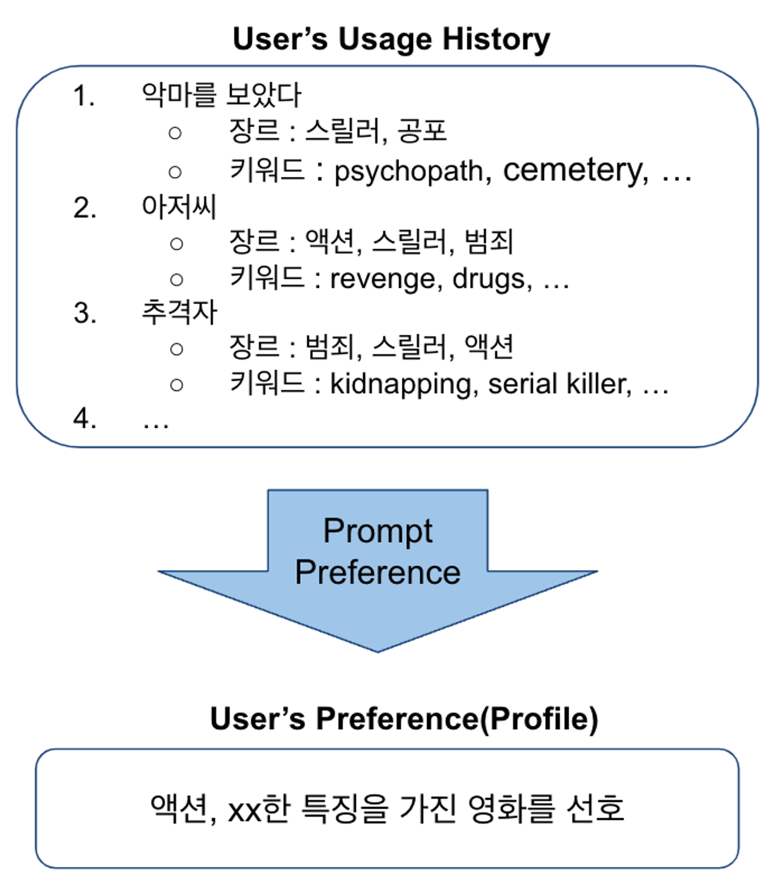
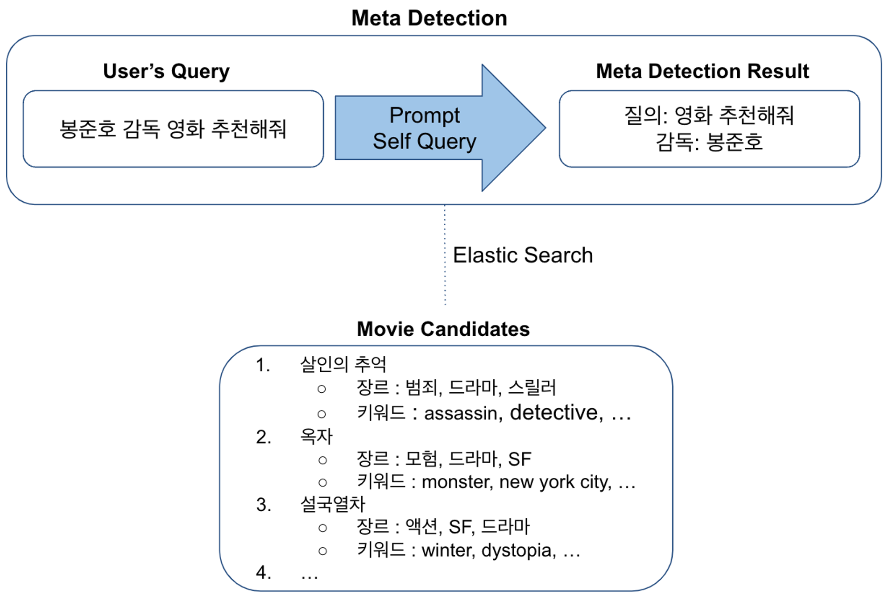
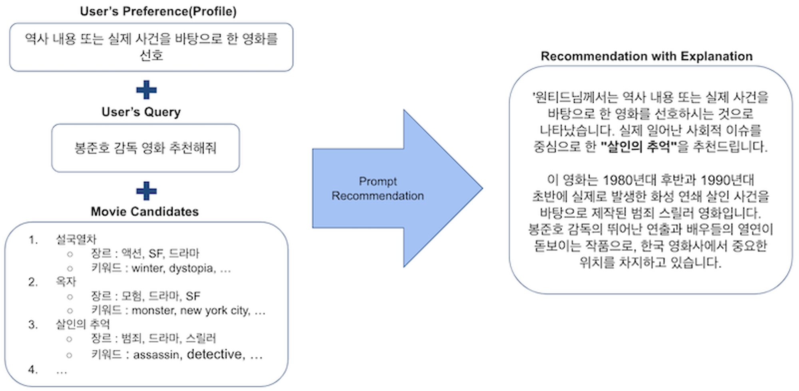
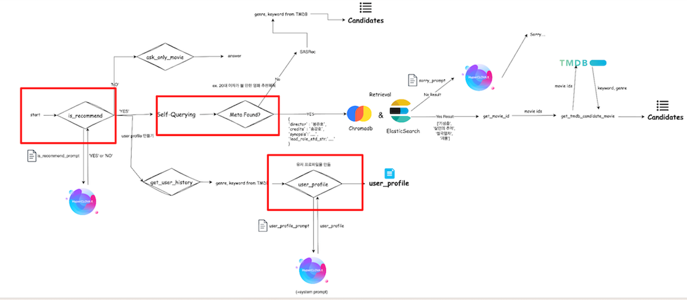
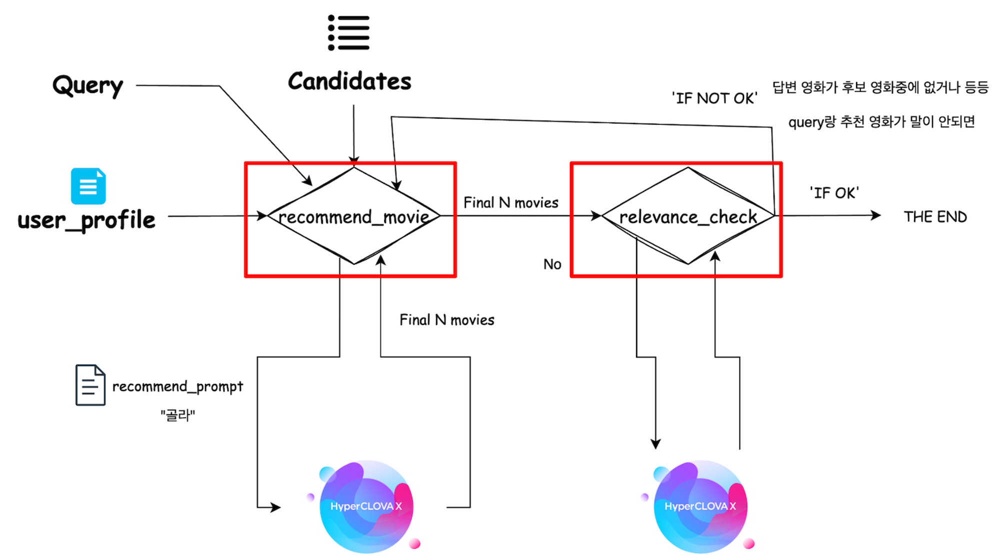
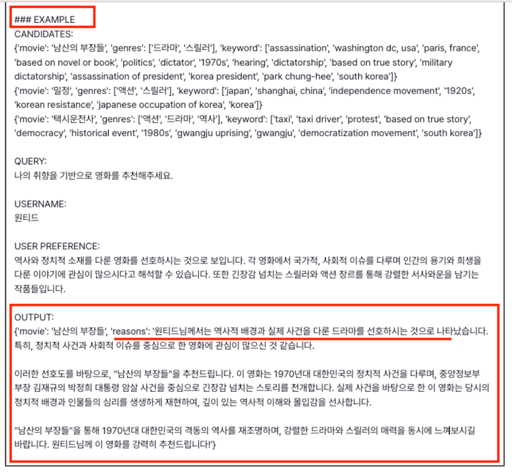

원티드랩 X 네이버클라우드 프롬프톤에서 발표했던 LLM 활용 영화 개인화 추천시스템 구현에 대해 정리해봤습니다.

LaaS를 활용한 후기에 대해선 다른 글에서 집중적으로 다뤄보겠습니다. 

# LLM활용 영화 추천시스템?

‘왜 LLM과 추천이냐?’

LLM을 활용하는 프롬프톤이기도 했지만, LLM과 함께 우리의 주 관심사인 추천시스템을 접목시키고자 했었고, 기존의 영화 추천을 넘어서 LLM을 활용했을 때 어떤 시너지를 보여줄 수 있을지 궁금하기도 했습니다.

특히, LLM의 prompting을 통한 추론(생성)이 워낙 강력하다보니, CoT같은 방식으로 ‘왜 추천되었는지 설명 가능한’ 추천시스템을 만들 수 있겠다 싶어 진행 해봤습니다.

# 개발 과정 

## 1. 아이디어

📄 paper :  <a href="https://arxiv.org/abs/2305.07622" target="_blank" style="text-decoration: underline;">**PALR(Personalization Aware of LLM’s Recommendation) Paper ↗**</a>

이번 프롬프톤에서의 아이디어가 되어준 논문입니다.

여기서 가장 핵심적으로 착안했던 것은 ‘유저의 히스토리’를 활용해 기존에 없던 새로운 feature를 만들어내는 겁니다. 그리고 이것이 위에서 언급했던 ‘추천의 이유’가 되기 위한 핵심 역할을 할 수 있습니다.

## 2. 기능 FLOW

유저의 쿼리가 추천 관련한 내용일 경우를 가정

1. 유저의 특징 파악: PALR에서 처럼, 유저의 사용 내역에 따라 어떤 ITEM(영화)을 선호하는지 TEXT 형태로 추출합니다. 아래와 같이 본 작업에서는 ‘장르’와 ‘키워드’라는 정보를 통해 유저에 대한 feature(또는 profile)을 뽑아내었습니다. 

2. 유저 쿼리의 메타정보 추출 & 후보 아이템 검색: 1. 쿼리 분석을 통해 유저의 입력어 중 영화와 관련된 메타정보가 존재하는지, 질의가 어떻게 이뤄져있는지 확인합니다. 2. 후보 아이템 검색: 이후 해당 메타정보에 매칭되는 후보 영화 리스트를 ES로 검색해 리스트업합니다. 아래 예시의 경우, 감독이 ‘봉준호’로 된 영화를 리스트업 한 케이스입니다. 

3. LLM 기반의 유저 선호에 적합한 영화추천: 1. 위 flow에서 추출한 유저 profile과 영화 후보리스트, 그리고 입력된 쿼리를 바탕으로 영화를 추천합니다. 2. 추천과 함께 이유를 뽑아낼 수 있도록 처리했습니다. 

## 3. 아키텍처

LangGraph 기반으로 기능을 설계했고, 아래와 같이 아키텍처를 확인할 수 있습니다.

\*붉은 색 네모칸 안에서 분기하는 것은 LLM agent가 작업을 수행합니다.

##### **1. 정보 추출 단계** 

- 유저 쿼리분석 agent (is_recommend)
     - 유저의 쿼리에 따라 추천관련 내용인지 아닌지 여부에 따라 router를 통해 분기합니다.
- 유저 profile agent (user_profile)
    - 추천을 원할 경우, DB(dynamoDB)에서 해당 유저의 영화 클릭(또는 시청)과 같은 정보들을 통해 어떤 영화를 좋아하는지 파악해 이를 profile로 형성해줍니다.
- 쿼리 내 메타정보 추출 (self querying)
    - 쿼리 내에서 영화 메타 정보와 관련된 사항이 있는지 파악합니다(e.g. 감독, 장르, 개봉시기, 배우, etc)
- 유저 쿼리에 따른 후보 영화 리스트 추출 - ES
    - 엘라스틱서치를 통해 meta정보와 일치하는 후보 영화를 리스트업합니다.
##### **2. 추천 단계** 

- 영화 추천 agent(recommend_movie)
    - 가장 중요한 파트입니다. 쿼리, 후보아이템, 유저 선호 패턴을 입력으로 후보 아이템으로부터 영화를 추천합니다.
      - 이 때, 프롬프트에서 json 형태로 뽑기 위해 Fewshot을 추가했습니다.
      - 또한, 이유를 뽑고자 ‘reason’도 함께 추가했습니다. 이를 통해 CoT 효과도 낼 수 있습니다. 

## 4. 예시

<video src="../../../static/img/monthly_pseudorec_202408/namjoon/봉준호_범죄_스릴러 (online-video-cutter.com).mp4" width="800px" controls></video>

## 5. 후기 / 느낀점

**설명 가능한 추천**

추천시스템을 연구해오면서 그 동안 블랙박스로 불리었던 부분이 ‘설명 가능한’ 기능으로 될 수 있겠다는 생각이 들었습니다. 하지만, 데이터 처리 속도부터, 토큰 수에 따른 비용까지, 그 때 그 때 바로 보여줘야하는 추천시스템에서 전체 데이터가 아닌 후보를 우선 걸러내고 진행해야 하는 한계점이 명확합니다.

본문에서 설명하지 않았지만, 메타정보가 없는 경우에는 SASRec이라는 Sequential 모델을 활용하여 후보군을 추출하게 되는데, 이러한 점에서 LLM Only의 추천은 아직 어렵겠다는 판단이 듭니다. 이러한 부분은 이미 수억 개의 item을 갖는 경우, 후보 추출 로직이 있기에 커버가 되긴 하겠습니다.

**추천을 위한 Features 정리**

본문의 유저 특징 추출과 관련되어서도 유저 profile을 잘 뽑기 위해선 ITEM Meta data에서 ITEM에 대한 설명력이 강한 feature를 갖고 있어야 합니다. 장르와 키워드 이외에 러닝타임, 시청시간 및 시청 날짜 등 유저의 선택에 도움이 될 수 있을 feature를 item이 담고 그와 함께 LLM 추천을 한다면 더욱 좋은 성능을 보일것으로 보입니다.

**추후 연구 계획**

영화를 추천할 때 유저가 직접 ‘쿼리에 meta정보를 담는 것을 가정한 후보군 추출’을 대체할 수 있는 방법을 찾고자 합니다. 실제로 Netflix나 Disney+에서 사용하는 일반적인 모습은 검색창에 ‘봉준호 감독 영화’를 검색하진 않습니다. 우리는 마우스에서 손을 떼는 것을 싫어하고, 보여지는 것에서 찾아내고 싶어합니다.

그렇기에 추천시스템이 더욱 기본적으로 탑재될 수록 유저들은 이탈하지 않고, 좋은 경험을 쌓을 수 있게됩니다. 따라서 후보군을 LLM으로 추리는 것까진 아니더라도, 다양한 fundermental 추천 모델과 결합해 사용해 여러 추천 Task에 접목해볼 예정입니다.

