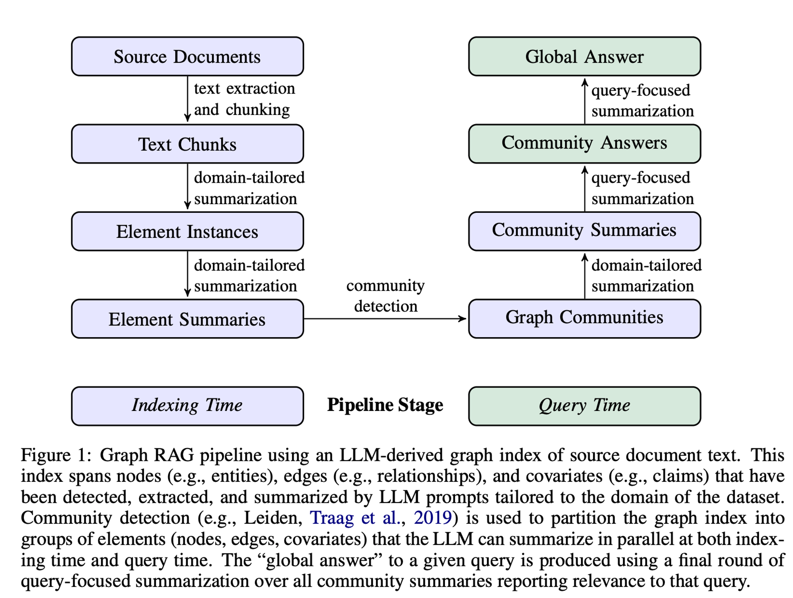
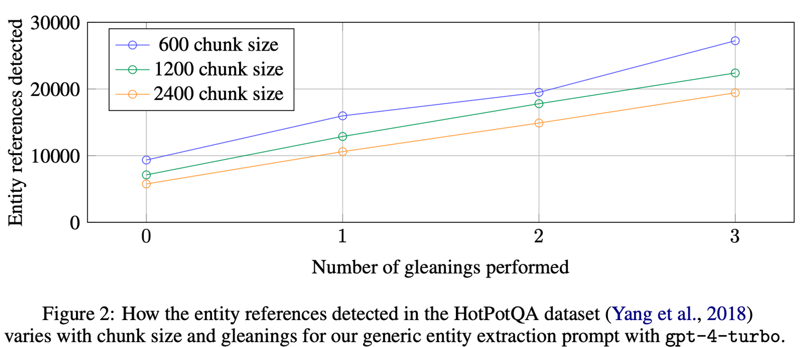
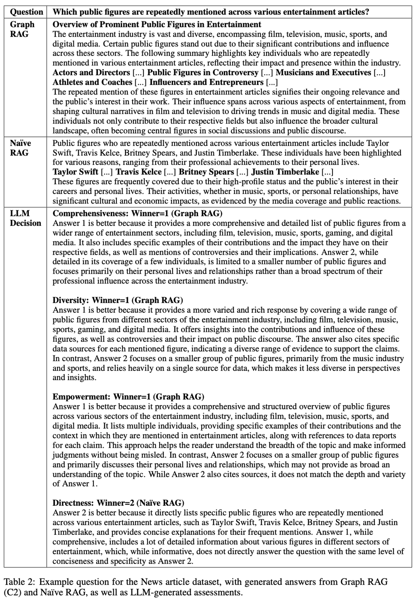
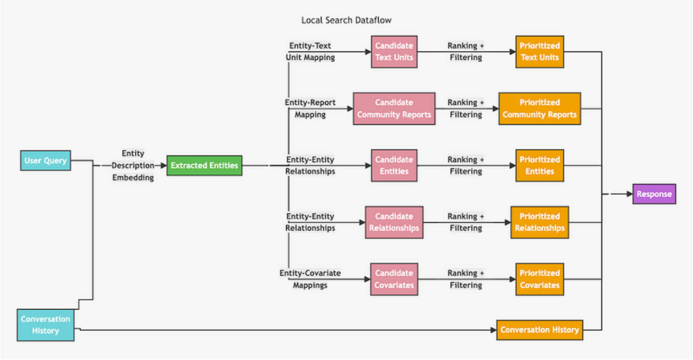
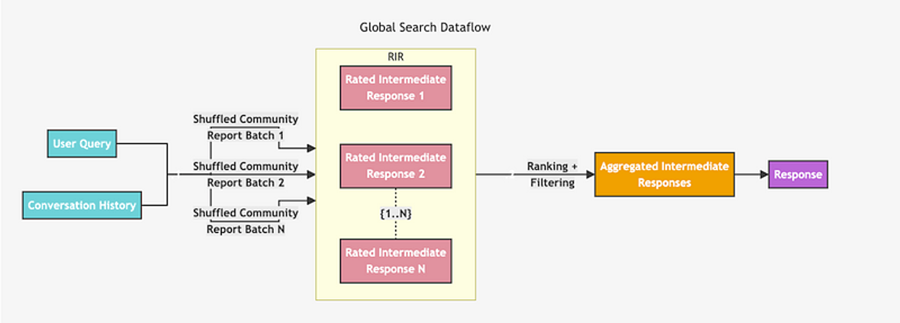

이번 월간 슈도렉 7월호로는 2024년 4월에 Microsoft사에서 발표한 GraphRAG에 대한 논문을 리뷰하고자 합니다. 지난 6월호(링크)에 소개해드렸던 GraphRAG 방식과는 어떠한 차이점이 있을 지 비교해보며 읽으시면 흥미로우실 것 같습니다. 

Microsoft에서 발표한 논문 제목은 ‘From Local to Global: A Graph RAG Approach to Query-Focused Summarization’ 이고 제목에서 알 수 있듯이 QFS(Query-Focused Summarization) 즉, 유저 쿼리에 중점을 둔 요약문을 활용한 GraphRAG 방법론이라고 할 수 있습니다.

지역적인(Local) 질문에서 전역적(Global) 질문까지 Summary를 활용하여 LLM의 context에 주입하여 Naive RAG의 이슈사항인 too long context로 인한 토큰 제한 및 높은 비용 문제를 해결하고 특히, 전역적(Global) 질문은 포괄성(Comprehensiveness) 및 다양성(Diversity) 측면에서 상당한 성능 향상을 보였습니다.

이러한 Summary를 하기 위해서 본 논문에서는 Community detection 알고리즘을 활용하였습니다. 그 중에서도 Agglomerative algorithm 방식 중 Louvain 알고리즘을 develop한 Leiden 알고리즘을 활용하였습니다.

간단하게 설명드리자면 그래프가 잘 분할되었다는 지표인 modularity를 기준으로 연결성이 있는 node와 community를 점진적으로 합쳐나가는 방법 중 하나라고 생각하시면 될 것 같습니다.

Leiden 알고리즘에 대한 자세한 설명은 아래 논문에 나와있으니 참고하시기 바랍니다.

🔗 <a href="https://www.nature.com/articles/s41598-019-41695-z#citeas" target="_blank">**From Louvain to Leiden: guaranteeing well-connected communities ↗**</a>

## Abstract

기존의 RAG는 전체 텍스트 코퍼스를 대상으로 하는 글로벌 질문에는 실패함.(ex. '데이터셋의 주요 주제는 무엇인가?')

그 이유는 명시적인 검색이 아니라 쿼리중심요약(QFS) 작업이기 때문입니다.

**MS GraphRAG 2 stage 접근 방식(LLM 활용)**

1. LLM으로 소스 문서로부터 엔티티 KG를 추출(생성)
2. LLM으로 엔티티와 밀접하게 연관된 모든 그룹의 커뮤니티 요약을 미리 생성

## 1. Introduction

### Background

- **인간의 대규모 문서 처리 능력**: 다양한 도메인에서 인간의 활동은 대규모 문서 컬렉션을 읽고 이해하는 능력에 크게 의존합니다. 예를 들어, 과학적 발견이나 정보 분석과 같은 복잡한 도메인에서는 문서에서 명시적으로 언급되지 않은 결론을 도출하는 것이 중요합니다.
- **대형 언어 모델(LLMs)의 출현**: LLM의 등장으로 인해 과학적 발견과 정보 분석과 같은 복잡한 도메인에서 인간의 이해를 자동화하려는 시도가 이루어지고 있습니다.

### Problem Definition

- **기존 RAG의 한계**: 지역적 질문에는 적합하지만 전체 데이터셋에 대한 글로벌 질문을 해결하지 못함.
- **QFS의 한계**: 질의 중점 요약(QFS) 방법은 대규모 텍스트를 처리하는 데 있어 확장성이 부족합니다. 따라서 RAG 시스템이 인덱싱하는 텍스트의 양을 처리하는 데 어려움이 있습니다.

### Proposed Method

- **Graph RAG 접근 방식**: 연구자들은 사용자 질문의 일반성과 인덱싱할 소스 텍스트의 양 모두에 대응할 수 있는 Graph RAG 접근 방식을 제안합니다. 이 접근 방식은 두 단계로 구성된 LLM을 사용하여 그래프 기반 텍스트 인덱스를 구축합니다:
    1. **엔티티 지식 그래프 생성**: 소스 문서에서 엔티티 지식 그래프를 도출합니다.
    2. **커뮤니티 요약 생성**: 밀접하게 관련된 엔티티 그룹에 대한 커뮤니티 요약을 사전 생성합니다.
- **질문에 대한 응답 생성**: 질문이 주어지면 각 커뮤니티 요약을 사용하여 부분 응답을 생성하고, 최종 응답을 생성하기 위해 모든 부분 응답을 다시 요약합니다.

### Contributions

- **글로벌 이해**: 데이터셋 내 100만 토큰 범위의 글로벌 이해 질문 클래스에 대해 Graph RAG가 나이브 RAG 베이스라인에 비해 생성된 답변의 포괄성과 다양성 측면에서 상당한 개선을 가져온다는 것을 보여줍니다.
- **개발 및 평가**: 향후 글로벌 및 로컬 Graph RAG 접근 방식의 오픈 소스, 파이썬 기반 구현을 제공합니다.

## 2. Graph RAG Approach & Pipeline

이 섹션에서는 Graph RAG 파이프라인의 개요를 설명합니다. 프로세스는 총 6단계로 구성됩니다.

### 2. 1 Source Documents → Text Chunks

소스 문서에서 텍스트를 추출하고 청킹하는 단계입니다. 그래프 인덱스의 다양한 요소를 추출하기 위해 설계된 프롬프트를 LLM에 전달합니다.

600 토큰의 청크 크기를 사용하면 2400의 청크 크기를 사용할 때보다 거의 두 배나 많은 entity가 추출.

참조가 많을수록 일반적으로 더 좋지만, 모든 추출 프로세스는 대상 활동에 대한 재현율과 정밀도의 균형을 맞춰야 함.(HotPotQA, Yang et al., 2018)

### 2. 2 Text Chunks → Element Instances

텍스트 청크에서 그래프 노드 및 엣지 인스턴스를 식별하고 추출하는 단계입니다.

- Text chunk에서 모든 entity를 식별한 다음 entity 간의 모든 relation을 식별하는 multipart LLM 프롬프트를 사용.
- 문서 코퍼스의 도메인에 맞게 few-shot example을 프롬프트에 주입.
- 추출의 효울성과 품질을 높이기 위해 최대 지정된 횟수까지 여러 라운드의 추출을 통해 LLM이 이전 추출 라운드에서 놓칠 수 있는 entity를 탐지하도록 장려함.
    - 모든 Enity가 추출되었는지를 평가하도록 LLM에 요청 -> logit bias를 100으로 설정하여 예/아니오 중 결정하도록 강제.
        
        * logit bias : 모델이 특정 출력을 더 혹은 덜 가능하게 만드는 조정 도구
        
    - LLM이 Entity가 누락되었다고 응답하면 누락된 entity를 탐지하도록 수행
    
    → 이러한 접근법을 통해 더 큰 청크 크기를 사용하더라도 품질 저하없이 노이즈가 생기지 않도록 강제할 수 있음.
    

### 2. 3 Element Instances → Element Summaries

추출된 엔티티, 관계 및 주장을 단일 블록의 설명 텍스트로 요약하는 단계입니다.

### 2. 4 Element Summaries → Graph Communities

커뮤니티 탐지 알고리즘을 사용하여 그래프를 모듈형 커뮤니티로 분할하는 단계입니다.

- 노드 간의 탐지된 관계의 정규화된 개수로 weight 부여.
    
    → 다른 노드들보다 더 강한 연결을 가지는 커뮤니티로 분할할 수 있음.
    
- 대규모 그래프의 계층적 커뮤니티 구조를 효율적으로 구현할 수 있는 Leiden 알고리즘 활용.
- 계층 구조의 각 level은 그래프의 노드를 상호 배타적이고 집합적으로 포괄하는 community partition을 제공 -> divide-and-conquer global summarization을 가능하게 함.

### 2. 5 Graph Communities → Community Summaries

각 커뮤니티에 대한 보고서 같은 요약을 생성하는 단계입니다.

Leiden 알고리즘을 사용하여 그래프 커뮤니티를 식별한 후, 커뮤니티에 대한 요약 보고서를 생성.

이 보고서는 글로벌 구조와 의미를 이해하는 데 유용. 사용자가 전체 데이터셋을 탐색하고 이해하는데 도움.

커뮤니티 요약은 Leaf-level, Higher-level 두 가지 수준에서 생성.

- **리프 수준 커뮤니티**
    - 리프 수준 커뮤니티는 그래프의 가장 작은 커뮤니티 단위
    - 이 커뮤니티의 요소(node, edge, covariate)에 대한 요약이 우선순위를 가지고 생성.
    - **우선순위 설정**:
        - 각 커뮤니티 엣지를 소스 노드와 타겟 노드의 중요도(degree의 합계)에 따라 내림차순으로 정렬합니다.
        - 가장 중요한 엣지부터 시작하여 해당 엣지의 소스 노드, 타겟 노드, 연결된 공변량 및 엣지 자체의 설명을 추가.
        - 이렇게 반복적으로 추가하여 LLM의 컨텍스트 윈도우의 토큰 제한에 도달할 때까지 요약을 생성.
        - **상위 수준 커뮤니티**
            - 상위 수준 커뮤니티는 리프 수준 커뮤니티보다 큰 단위로, 여러 리프 수준 커뮤니티를 포함
            - 모든 요소 요약이 컨텍스트 윈도우의 토큰 제한 내에 맞으면, 리프 수준 커뮤니티와 동일하게 요약
            
            → 그렇지 않으면, 요소 요약 토큰 수에 따라 하위 커뮤니티를 내림차순으로 정렬. 요소 요약(longer)을 하위 커뮤니티 요약(shorter)으로 반복적으로 대체하여 컨텍스트 윈도우 내에 맞도록 합니다.
            

### 2. 6 Community Summaries → Community Answers → Global Answer

커뮤니티 요약에서 부분 응답을 요약하여 사용자 질문에 대한 최종 답변을 생성하는 단계입니다.

1. 커뮤니티 요약 준비 
   **랜덤 셔플링 및 청크 분할**: 커뮤니티 요약을 랜덤하게 섞은 후, 사전 지정된 토큰 크기로 청크를 나눕니다. 이는 관련 정보가 한 번에 집중되지 않도록 분산시키기 위한 방법입니다.

2. 커뮤니티 답변 생성 (Map 단계) 
   **병렬 답변 생성**: 각 청크에 대해 병렬로 중간 답변을 생성합니다. 이 때 LLM은 각 생성된 답변이 질문에 얼마나 도움이 되는지 0에서 100까지 점수를 매기도록 요청받습니다. 도움이 되지 않는다고 판단된 답변(점수 0)은 필터링됩니다.

3. 글로벌 답변으로 축소 (Reduce 단계) 
   **답변 정렬 및 선택**: 생성된 중간 커뮤니티 답변들을 유용성 점수에 따라 내림차순으로 정렬하고, 토큰 제한에 도달할 때까지 가장 유용한 답변들을 선택하여 새로운 컨텍스트 윈도우에 추가합니다. 이 최종 컨텍스트를 사용하여 사용자에게 반환될 글로벌 답변을 생성합니다.

## 3. Evaluation

### 3. 1 Datasets

- **팟캐스트 대본**: 마이크로소프트 CTO인 Kevin Scott와 다른 기술 리더들 간의 팟캐스트 대화 대본을 컴파일한 데이터셋입니다. 총 1,669개의 600토큰 텍스트 청크로 구성되어 있으며, 청크 간 100토큰이 겹칩니다. 전체 약 100만 토큰입니다. 🔗 <a href="https://www.microsoft.com/en-us/behind-the-tech" target="_blank">**https://www.microsoft.com/en-us/behind-the-tech ↗**</a>

- **뉴스 기사**: 엔터테인먼트, 비즈니스, 스포츠, 기술, 건강, 과학 등 다양한 카테고리의 뉴스 기사로 구성된 벤치마크 데이터셋입니다. 총 3,197개의 600토큰 텍스트 청크로 구성되어 있으며, 청크 간 100토큰이 겹칩니다. 전체 약 170만 토큰입니다. 🔗 <a href="https://github.com/yixuantt/MultiHop-RAG" target="_blank">**https://github.com/yixuantt/MultiHop-RAG ↗**</a>

### 3.2 Queries

평가를 위한 질문 세트는 LLM을 사용하여 자동으로 생성되었습니다:

**목표**: 데이터셋 내용에 대한 전체적인 이해를 요구하는 질문을 생성하는 것입니다. 이는 세부적인 텍스트 정보가 아닌 데이터셋 전체에 대한 감을 제공하는 질문을 통해 이루어집니다.

**생성 과정**: 데이터셋에 대한 간단한 설명을 제공하고, LLM에게 잠재적 사용자를 식별하고, 사용자 당 N개의 작업을 생성하도록 요청합니다. 각 작업에 대해 전체 코퍼스를 이해하는 데 필요한 N개의 질문을 생성합니다. 여기서 N=5로 설정하여 각 데이터셋에 대해 총 125개의 질문을 생성했습니다.

### 3.3 Conditions

다음 여섯 가지 조건을 비교했습니다:

**C0**: 루트 수준 커뮤니티 요약을 사용하여 질문에 답변. 매우 광범위한 내용을 포괄.

**C1**: 상위 수준 커뮤니티 요약을 사용하여 질문에 답변. C0의 하위 커뮤니티들로 구성.

**C2**: 중간 수준 커뮤니티 요약을 사용하여 질문에 답변. C1의 하위 커뮤니티들로 구성.

**C3**: 하위 수준 커뮤니티 요약을 사용하여 질문에 답변. C2의 하위 커뮤니티들로 구성.

**TS (Text Summarization)**: 소스 텍스트를 **2. 6**의 map-reduce 방식으로 요약.

**SS (Semantic Search, 나이브 RAG)**: 텍스트 청크를 검색하여 컨텍스트 윈도우에 추가한 후 답변을 생성.

### 3.4 Metrics

LLM을 평가자로 사용하여 다음 네 가지 지표로 답변을 비교했습니다:

**포괄성 (Comprehensiveness)**: 답변이 질문의 모든 측면과 세부 사항을 얼마나 잘 다루는가?

**다양성 (Diversity)**: 답변이 다양한 관점과 통찰을 얼마나 풍부하게 제공하는가?

**이해력 (Empowerment)**: 답변이 독자가 주제를 이해하고 판단을 내리는 데 얼마나 도움이 되는가?

**직접성 (Directness)**: 답변이 질문에 얼마나 명확하고 구체적으로 답하는가?

### 3.5 Configuration

- 컨텍스트 윈도우 크기의 영향을 비교하기 위해 8k, 16k, 32k, 64k의 네 가지 크기를 테스트.
- 가장 작은 컨텍스트 윈도우 크기(8k)가 포괄성(평균 승률 58.1%)에서 가장 좋은 성과를 보였으며, 다른 지표에서도 비교적 좋은 성과를 보임.
- 따라서 최종 평가에는 **8k** 토큰 크기를 사용!

### 3.6 Results

**Global Approaches vs. Naive RAG**: 글로벌 접근 방식이 나이브 RAG 접근 방식에 비해 포괄성과 다양성 측면에서 일관되게 더 나은 성과를 보였습니다. 예를 들어, 팟캐스트 대본에서는 포괄성 승률이 72-83%, 뉴스 기사에서는 72-80%였습니다.

**Community Summaries vs. Source Texts**: 커뮤니티 요약을 사용한 Graph RAG 접근 방식이 소스 텍스트 요약에 비해 포괄성과 다양성에서 약간의 개선을 보였습니다. 중간 수준 커뮤니티 요약이 가장 좋은 성과를 보였습니다.

**Empowerment**: Empowerment 비교에서는 혼합된 결과를 보였습니다. LLM의 분석에 따르면 구체적인 예시, 인용구, 출처가 있는 답변이 독자가 정보를 이해하고 판단하는 데 중요하다고 평가되었습니다.

## 4. Related Work

### 4.2 Graphs and LLMs

이 부분에서는 그래프와 LLM의 결합과 관련된 여러 연구를 다룹니다.

**Knowledge Graph Creation and Completion (지식 그래프 생성 및 완성)**

- **지식 그래프 생성 및 완성**: LLM을 사용하여 지식 그래프를 생성하고 완성하는 연구들이 있습니다.
- **Causal Graphs**: 텍스트에서 인과 관계를 추출하여 인과 그래프를 생성하는 연구도 포함됩니다.

**Advanced RAG with Graphs**

- **Knowledge Graph Index**: 그래프 색인을 사용하는 RAG 시스템(KAPING)과 서브그래프 구조를 검색하는 시스템(G-Retriever)이 포함됩니다.
- **Graph Metrics**: 그래프 메트릭스를 사용하여 질의를 수행하는 시스템(Graph-ToolFormer)도 있습니다.
- **Fact-grounded Narratives**: 검색된 서브그래프의 사실을 기반으로 서사를 생성하는 시스템(SURGE) 및 내러티브 템플릿을 사용하는 시스템(FABULA)이 포함됩니다.

**Open-source Software**

- **Graph Databases**: LangChain과 LlamaIndex 같은 라이브러리가 다양한 그래프 데이터베이스를 지원합니다.
- **General Graph-based RAG Applications**: Neo4J와 NebulaGraph 형식을 사용하는 지식 그래프 생성 및 추론 시스템 등이 있습니다.

**요약**

- **계층적 그래프 색인**: Graph RAG는 그래프의 모듈성을 활용하여 데이터를 글로벌 요약을 위한 모듈형 커뮤니티로 분할합니다.
- **관련 연구와의 차별점**: Graph RAG는 자가 생성된 그래프 색인을 활용하여 데이터 파티셔닝과 글로벌 요약을 지원한다는 점에서 다른 연구들과 차별화됩니다.

## 5. Discussion

### Limitations

- **평가 접근법의 한계**: 평가가 특정 유형의 질문과 약 100만 토큰 범위의 두 가지 데이터셋에 대해서만 수행되었으며, 다양한 질문 유형, 데이터 유형, 데이터셋 크기에 따라 성능이 어떻게 변하는지 추가 연구가 필요합니다.
- **사용자 검증 필요성**: 평가에 사용된 질문과 목표 지표가 실제 사용자에게도 유효한지 검증할 필요가 있습니다.

### Trade-offs of Building a Graph Index

- **성능**: Graph RAG는 가장 좋은 결과를 보였지만, 경우에 따라 그래프 없는 글로벌 텍스트 요약 방법도 경쟁력을 보였습니다.
- **실제 적용**: 그래프 색인을 구축할지 여부는 컴퓨팅 예산, 데이터셋당 예상 질의 수, 그리고 그래프 색인에서 얻을 수 있는 다른 가치(예: 일반 커뮤니티 요약 및 기타 그래프 관련 RAG 접근 방식 사용 가능성)와 같은 여러 요인에 따라 달라집니다.

### Future Work

- **로컬 RAG 접근 방식**: 사용자 질의와 그래프 주석의 임베딩 기반 매칭을 통해 더 로컬한 방식으로 작동하는 RAG 접근 방식을 개발할 수 있습니다.
- **하이브리드 RAG 계획**: 커뮤니티 보고서에 대한 임베딩 기반 매칭과 함께 현재의 map-reduce 요약 메커니즘을 결합하는 하이브리드 RAG 계획을 연구할 수 있습니다.
- **탐색적 접근**: information scent(정보의 단서)를 따라가는 탐색적 “drill down” 메커니즘을 개발할 수 있습니다.

## 6. Conclusion

### Key Findings

- **글로벌 접근 방식**: Graph RAG는 지식 그래프 생성, 검색 보강 생성(RAG), 질의 중심 요약(QFS)을 결합하여 전체 텍스트 코퍼스에 대한 인간의 이해를 지원하는 글로벌 접근 방식을 제시.
- **성능 향상**: 초기 평가에서 Graph RAG는 포괄성 및 다양성 측면에서 나이브 RAG 대비 상당한 성능 향상을 보여주었으며, 그래프 없는 글로벌 텍스트 요약 방법과 비교하여도 유리한 비교 결과를 나타냄.
- **효율성**: 여러 글로벌 질의가 필요한 상황에서, 루트 수준 커뮤니티 요약을 사용한 Graph RAG는 나이브 RAG보다 우수하며, 다른 글로벌 방법과 비교해도 낮은 토큰 비용으로 경쟁력 있는 성능을 제공.

### Implementation

- **오픈 소스 제공 예정**: 글로벌 및 로컬 Graph RAG 접근 방식의 파이썬 기반 오픈 소스 구현을 제공하였습니다. (https://aka.ms/graphrag)

이상 Microsoft에서 발표한 ‘From Local to Global: A Graph RAG Approach to Query-Focused Summarization’ 에 대한 논문 리뷰를 마치겠습니다. 

## **Retrieval Architecture**

논문에서는 Retrieval에 대한 아키텍처가 없어서 https://microsoft.github.io/graphrag/ 해당 링크를 통해 Local과 Global search 아키텍처를 가져왔습니다.

### Local Search

먼저 Local Search 방법론은 유저 쿼리로부터 엔티티를 인식하여 그 엔티티와 유사한 엔티티가 포함된 **1. Source chunk, 2. Community Summary, 3. Entities, 4. Relationship description, 5. Covariate**를 가져와서 질문에 도움이 되지 않는 답변을 필터링하고 각 기준에 따라 점수를 매겨(Ranking) 내림차순으로 토큰 제한에 도달하기 전까지 context를 구성하여 LLM에 보내 최종 답변을 생성합니다.

### Global Search

Global Search 방법론은 우선 모든 Community Summary를 랜덤하게 섞은 후 LLM에게 0~100점까지 점수를 매겨서 도움이 되지 않는다고 판단된 Summary(점수 0)는 필터링합니다. 이 후 생성된 중간 커뮤니티 답변(Rated Intermediate Response)들을 유용성 점수에 따라 내림차순으로 정렬하고, 토큰 제한에 도달할 때까지 가장 유용한 답변들을 선택하여 새로운 context 윈도우에 추가합니다. 이 최종 context를 사용하여 LLM에 보내 유저에게 글로벌 답변을 생성합니다. 이 방식이 위 논문에서 제안한 방법이고 그에 대한 아키텍처입니다.

Local Search 와 Global Search로 나눈 이유는 미시적 / 거시적 질문에 따라서 취사 선택(Routing)하여 답변을 받을 수 있도록 하기 위함입니다. 이러한 제공된 방법론을 잘 활용하면 어떠한 level 단의 질문에도 잘 답변할 수 있는 GraphRAG를 구축할 수 있을 것입니다.