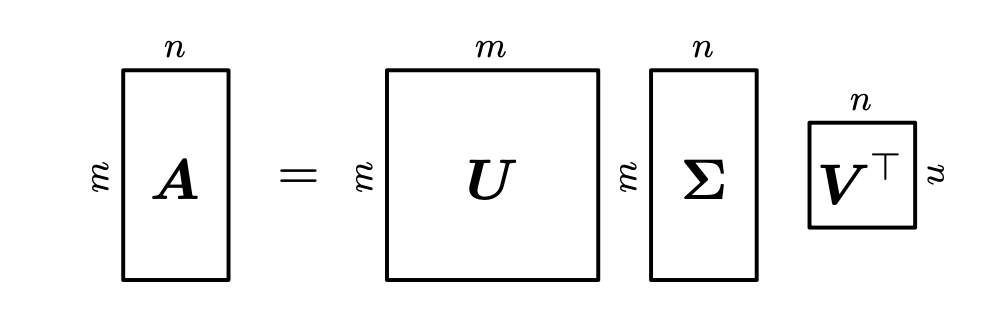

# 시작하며

※ 수식이 깨져보이신다면 새로고침을 해주세요

> 본 게시글은 <a href="https://product.kyobobook.co.kr/detail/S000003103258" target="_blank" style="text-decoration: underline;">**Mathematics of Machine Learning ↗**</a> 책을 번역하였습니다. 복습 시 한 호흡에 읽히도록 필요한 부분만 개인적인 해석을 달아 정리해 놓는 것이 이 글의 목적입니다.

마지막 3탄! SVD 증명 과정이 조금 어려웠지만, 오랜만에 Eigenvalue와 Eigenvector로부터 SVD까지 이어지는 흐름을 보니 재밌기도 했습니다. SVD 챕터 끝자락에 추천시스템에 대한 예시가 있는데, 그 곳까지 차근차근 정리해보았습니다!

# 4.5 Singular Value Decomposition
SVD는 정방행렬뿐만 아니라 모든 행렬에 적용될 수 있기 때문에 선형대수학의 기본 정리라고도 불린다.

#### **Theorem 4.22 (SVD Theorem).**
$A^{m \times n}$을 rank $r \in [0, \min(m, n)]$인 직사각형 행렬(rectangular matrix)이라고 하자. $A$의 SVD는 아래와 같은 형태의 행렬분해이다.

 
여기서 잠깐

- 행렬의 rank(랭크)란? 행렬에서 서로 독립적인 행 또는 독립적인 열의 최대 개수를 의미한다. 예를 들어, 랭크가 1인 행렬은 모든 행이나 열이 하나의 벡터의 스칼라 배수로 나타날 수 있습니다. 즉, 이 행렬은 하나의 독립적인 벡터로 모든 행이나 열을 표현할 수 있다. **랭크가 m (행 개수) 또는 n (열 개수)**인 경우, 행렬의 행 또는 열이 모두 독립적이다. 이 경우 행렬은 그 자체로 최대한 많은 정보를 담고 있다.
- 직교 행렬(orthogonal matrix)이란? $A^\top A=A A^\top=I$를 만족하는 정방 행렬이다. $A^{-1}=A^{\top}$이라는 뜻이 내포돼있다. 즉, 역행렬이 전치행렬과 같다는 뜻이다. 특징으로는 **직교 행렬 내의 행 벡터간 또는 열 벡터간의 내적이 항상 0이다.** 또한 각 벡터의 크기가 1이다.

$A = U \Sigma V^\top$. 여기서 $U$는 직교행렬로, $U \in \mathbb{R}^{m \times m}$이며, 열벡터 $u_i, i=1, \cdots ,m$을 갖고있다. 마찬가지로 $V$는 직교 행렬로, $V \in \mathbb{R}^{n \times n}$이며, 열벡터 $v_i, i=1, \cdots ,n$를 갖고있다. 그리고 $\Sigma$는 $m \times n$ 행렬이자 대각성분 $\Sigma_{ii} = \sigma_i \geqslant$이며 비대각성분은 모두 0($\Sigma_{ij}=0, i\ne j$)이다.

$\Sigma$의 대각성분 $\sigma_i, i=1, \cdots , r$을 특이값 **singular value**라고 하고, 관례적으로 특이값은 정렬되어 $\sigma_1 \geqslant \sigma_2 \geqslant \sigma_r \geqslant 0$이다. $u_i$는 left-singular vector, $v_j$는 right-singular vector라고 부른다. 

특이값 행렬 $\Sigma$는 유일하다. 하지만 주의할 점이 있다. $\Sigma \in \mathbb{R}^{m \times n}$은 $A$와 동일한 사이즈이다. 이는 $\Sigma$가 diagonal submatrix를 갖는다는 의미고, 추가적인 0 패딩이 필요하다는 것이다. 다시 말해, $\Sigma$가 $m > n$라면 $n$번째 행까지만 대각 요소가 존재하고, $n+1$부터 $m$행까지는 $0^{\top}$ 벡터가 된다.

$m < n$이라면 아래와 같은 형태가 된다.

**SVD는 모든 행렬 $A \in \mathbb{R}^{m \times n}$에 대하여 존재한다.**

4.5.1 Geometric Intuitions for the SVD는 일단 패스!

## 4.5.2 Construction of the SVD
왜 SVD가 존재하는지, 그리고 어떻게 계산하는지 알아보자. General한 행렬의 SVD는 정방행렬을 eigendecomposition할 때와 몇 가지의 유사점을 갖는다.

아래 Symmetric Positive Definite 행렬의 eigendecomposition과 비교해보자.

$$S=S^{\top}=PDP^{\top}$$

이에 상응하는 SVD는

$$S=U\Sigma V^{\top}$$

만약 $U=P=V$, $D=\Sigma$라고 한다면, SPD행렬의 SVD는 eigendecomposition한 것과 같다.

위의 Theorem 4.22 (SVD Theorem)이 왜 만족하는지 알아보자. 행렬 $A$의 SVD를 계산하는 것은 직교 기저(orthonormal bases)인 codomain $\mathbb{R}^{m}$에서의 $U=(u_1, \cdots, u_m)$와 $\mathbb{R}^{n}$에서의 $V=(v_1, \cdots, v_n)$을 찾는 일이다. 이러한 정렬된 bases로부터 $U$와 $V$를 만든다.(Codomain은 함수에서 정의된 개념으로, 함수의 출력값이 속할 수 있는 전체 공간을 의미함)

처음 할 일은 right-singular vector인 $v_1, \cdots, v_n \in \mathbb{R}^{n}$의 직교 집합을 만드는 것이다. 그 다음 left-singular vector인 $u_1, \cdots, u_m \in \mathbb{R}^{n}$을 만든다. 그리고 나서 그 두 집합을 연결하고, $A$로 변형시킨 후에도 $v_i$의 orthogonality가 보존되도록 할 것이다. 이는 중요한 과정인데, 왜냐하면 $Av_i$의 image들이 직교 기저 집합을 형성 해야 함을 알고 있기 때문이다.(?? 사실 이해가 잘 안감..왜 알고있지) 그리고 나서 scalar factor로 이 image들을 정규화(normalize)시킨다. 이들이 특이값들이 된다.

 
여기서 잠깐

-  image는 함수의 출력값 또는 변환된 값을 의미합니다. 선형대수에서, 행렬 $A$가 어떤 벡터 $v_i$에 작용할 때 그 결과로 나오는 벡터 $Av_i$를 $v_i$의 이미지 또는 이미지 벡터라고 한다. 즉, 벡터 $v_i$를 행렬 $A$로 변환(매핑)한 결과가 $A v_i$이다. 위에서는 이 $A v_i$들이 직교해야한다고 말하고 있다.

Right-singular vector($v_i$)를 먼저 만들어보자. Spectral Theorem (Theorem 4.15)에 따라 symmetric 행렬은 고유 벡터의 ONB를 갖는다. 이는 대각화 될 수 있음을 의미한다.

### 잠깐, symmetric 행렬은 고유 벡터의 ONB를 갖고, 때문에 대각화 할 수 있다?
Spectral Theorem : 만약 $A \in \mathbb{R}^{n \times n}$가 symmetric이라면, $A$의 고유벡터로 구성된 정규 직교 기저(ONB)가 존재한다.
ONB(orthonormal basis)는 서로 직교하면서 길이가 1인 벡터들이다. 즉, 대칭행렬의 고유벡터들은 항상 직교하며, 그 고유벡터들을 정규화(nomalization)하면 크기가 1인 벡터로 만들 수 있다는 것이다. 이 고유벡터들이 벡터 공간의 기저(basis)를 형성할 수 있다는 것이다. 다시 돌아가자. 대각화 가능하다는건 뭘까?
대각화에 대해서는 2편에서 다룬 적이 있으나...다시 한 번 상기해보자. 대각화는 행렬을 대각행렬로 변환한다는 것이다. 어떤 행렬 $A$가 대각화 가능하다는 것은 다음을 의미한다.
$A=PDP^{-1}$

- $D$는 대각 행렬이다.
- $P$는 행렬 $A$의 고유벡터들로 구성된 행렬이다.

대칭행렬은 정규 직교 기저(ONB, orthonormal basis)를 갖는다고 했다. (용어들에 익숙해지자...!) 이 벡터들로 행렬 $P$를 구성하면, **모든 대칭행렬은 대각화 가능하다.** 대칭행렬의 고유값이 항상 실수이기 때문에, 대각행렬 $D$가 실수로 구성될 수 있다. $P$의 모든 열벡터들이 선형 독립이라면, 직교 행렬이라는 것이고, 직교행렬의 특징은 $P^{-1}=P^{\top}$이기 때문에 $P^{\top}$도 존재한다.

여기까지 해서 **symmetric 행렬은 고유 벡터의 ONB를 갖고, 때문에 대각화 할 수 있다**는 것을 알았다.

 게다가, <a href="https://www.pseudorec.com/archive/monthly_pseudorec/13/#:~:text=%EC%9D%B4%ED%95%B4%ED%95%B4%EB%B3%BC%20%EC%88%98%20%EC%9E%88%EA%B2%A0%EC%A7%80..%3F-,Theorem%204.14,-%ED%96%89%EB%A0%AC" target="_blank" style="text-decoration: underline;">**Theorem 4.14 ↗**</a>에 의해 모든 직사각행렬 $A \in \mathbb{R}^{m \times n}$로부터 symmetric, positive semidefinite 행렬 $A^{\top} A \in \mathbb{R}^{n \times n}$를 만들 수 있다. 그러므로, 우리는 항상 $A^\top A \in \mathbb{R}^{n \times n}$을 대각화할 수 있고 다음을 얻을 수 있다.

위에서 $P$는 orthogonal matrix이고, 이는 orthonormal eigenbasis로 구성되어 있다. $\lambda_i \geqslant 0$은 $A^{\top}A$의 고유값이다. $A$의 SVD가 존재한다고 가정하고 가정하자. 그럼
$A^{\top}A = (U\Sigma V^{\top})^{\top}(U\Sigma V^{\top}) = V\Sigma^{\top}U^{\top}U\Sigma V^{\top}$
이 된다. 이 때 $U$와 $V$는 orthogonal 행렬들이다. 그러므로, $U^{\top}U=I$이므로 다음을 얻는다.

둘을 비교함으로써, $V^{\top} = P^{\top}$, $\sigma_i^{2} = \lambda_i$를 얻을 수 있다.

그러므로, $P$를 구성하는 $A^{\top}A$의 고유 벡터들이 right-singular vector가 된다. $A^{\top}A$의 고유값들은 $A$의 특이값의 제곱과 같다.
Left-singular vectors $U$를 얻기 위해서 위와 비슷한 절차를 밟는다. Right-singular vectors를 얻기위해 $A^\top A$를 분해했다면, left-singular vectors를 얻기 위해 $A A^\top$을 SVD한다.

$AA^{\top} = (U\Sigma V^{\top})(U\Sigma V^{\top})^{\top} = U\Sigma V^{\top}V\Sigma^{\top}U^{\top}$

Spectral Theorem에 의하면(엄청 자주나오네...) $A A^\top$은 $A A^\top = SDS^{\top}$으로 대각화 가능하고, 이를 통해 $AA^{\top}$의 고유벡터의 ONB를 찾을수 있다. 이 벡터들은 $S$에 모이게 된다. $AA^\top$의 orthonormal 고유벡터들이 바로 left-singular vectors인 $U$이고, SVD의 codomain에서의 ONB를 형성한다.

마지막 스텝은 위에서 계산한 부분들을 연결하는 것이다. 현재 우리는 right-singular vectors의 ONB를 $V$에 갖고 있는데, 이들을 orthonormal vectors $U$와 연결시킬 것이다. 이를 위해, $A$에 의한 $v_i$의 image들 또한 직교(orthogonal)해야한다는 사실을 사용할 것이다. 

$(Av_i)^\top (Av_j) = v_i^\top (A^\top A ) v_j = v_i^\top (\lambda_j v_j ) = \lambda_j v_i^\top v_j = 0$

왜 중간에 $A^\top A$가 $\lambda$가 되는가? 대칭행렬 $A^\top A$의 고유값이 $\lambda$라고 했을 때, 고유값의 정의에 따라 $A^\top A v_j = \lambda_j v_j$가 되기 때문이다.

$m \geqslant r$인 경우, $\mathbb{R}^m$의 $r$차원의 subspace에서 $\\left\\{ Av_1, \cdots, Av_r \\right\\}$이 기저임을 만족한다.

SVD를 끝내려면 orthonormal한 left-singular vectors들이 필요하다! Right-singular vector들의 image $Av_i$를 normalizing하자! 그럼 다음을 얻을 수 있다.

 

> 여기서 잠깐
> 
> 갑자기 왜 $u_i$와 $v_i$가 연결되는 식이 나오는지 이해가 되지 않았다..! $v_i$는 $A^\top A$의 고유벡터고 서로 직교한다는 것도 알겠고 $u_i$는 $AA^\top$의 고유벡터고 서로 직교한다는 것도 알겠는데 왜 갑자기 $Av_i$끼리 직교한다는걸 보여주고 $Av_i$를 정규화(길이를 1로 만듦)하면 $u_i$가 되는건지..
> 
> 그나마 ChatGPT한테 물어봐서 이해가 됐던 답은 $A=U\Sigma V^\top$이라고 가정했으니까, 양변에 $v_i$를 곱해보라는거다. 그럼 
> $$Av_i = U\Sigma V^\top v_i$$
> $V^\top v_i=e_i$가 된다. $e_i$는 i번째 요소만 1이고 나머지 요소는 0인 벡터다. 왜냐하면 $v$는 (A^\top A)의 고유벡터고, 고유벡터라는게 원래 서로 직교하는 특성을 가지니까, $v_i$는 $v_j$들과 내적하면 자기 자신과 내적한 1 빼고 나머지 자리는 0이다.
> 
> 그럼 다음과 같아진다.
>
> $$Av_i = U\Sigma e_i$$
>
> 이 때 $\Sigma e_i$는 $\Sigma$에서 $i$번째 열을 선택하는 것이다. 그건 $\sigma$이다.
>
> $$Av_i = \sigma_i u_i$$
> 
> 책에서 설명하는 방식은 우리가 left-singular vector를 얻어야 한다는 것이다. $\lambda_i = \sigma^2$라는 고유값과 특이값의 관계를 이용하여 아래처럼 얻어진다고 한다...
>
> $$u_i := \frac{A_vi}{||A_vi||} = \frac{1}{\sqrt{\lambda_i}}Av_i = \frac{1}{\sigma_i}Av_i$$
> 아무튼..! 다시 이어서 가보자

 

>여기서  다시 잠깐..
>
> 대학원생 때 이 부분을 정리했던 자료를 찾았다. 그 때 정리했던 것은 다음과 같다.
>
> $\frac{1}{\sigma_i}Av_i$는 $AA^\top$의 eigenvector이다. 왜냐하면, 
>
> $$\begin{align}AA^\top(\frac{1}{\sigma_i}Av_i)&=AA^\top Av_i\frac{1}{\sigma_i}\\\\&=A\sigma^2\lambda_i \frac{1}{\sigma_i}\\\\&=\sigma_i^2(\frac{1}{\sigma_i}Av_i)\end{align}$$
> 위와 같이 정리될 수 있기 때문이다. $v_i$는 $A^\top A$의 eigenvector이기 때문에 $A^\top A v_i = \sigma_i^2 \lambda_i$라는 것을 이용했다.
> 
> 따라서, $AA^\top$의 eigenvector인 $u_i$와 $\frac{1}{\sigma_i}Av_i$는 같다.
> 
> $$u_i= \frac{1}{\sigma_i}Av_i$$

그러므로, right-singular vector인 $A^\top A$의 고유벡터, 이들에게 $A$를 곱하고 normalizing한 image들, left-singular vector인 $u_i$, 이들은 $\Sigma$를 통해 연결된 자기 호환적인(self-consistent) ONB를 형성한다. (추가)왼쪽 특이벡터들과 오른쪽 특이벡터들이 각각의 공간에서 독립적으로 직교 기저를 형성하지만, 동시에 특이값을 통해 서로 조화를 이루며 일관된 관계를 형성한다는 것.

다시 위 식을 정리해보자.

$$Av_i = \sigma_i u_i, \;\;\; i=1, \cdots, r$$

이 식은 eigenvalue 식인 $Ax=\lambda x$와 매우 닮아있다. 차이점은 왼쪽과 오른쪽의 벡터들이 다르다는 것.

$v_i$를 $V$의 칼럼으로 모으고 $u_i$를 $U$의 칼럼으로 모으면 다음과 같이 정리된다.

$$AV = U\Sigma$$

위에서 $\Sigma$는 $A$와 같은 차원을 갖고 $1 ~ r$번째 row까지 diagonal 구조를 갖는다. $V^\top$을 양변의 오른쪽에 곱하면 $A=U\Sigma V^\top$과 같이 $A$의 SVD가 된다.

Example 4.13은 패스하자!

## 4.5.3 Eigenvalue Decomposition vs. Singular Value Decomposition

- SVD는 모든 행렬 $\mathbb{R}^{m \times n}$에 대하여 존재한다. eigendecomposition은 오직 정방행렬 $\mathbb{R}^{n \times n}$에 대해서만 정의되며, $\mathbb{R}^n$의 eigenvector의 기저를 찾을 수 있을 때만 존재한다.

- eigendecomposition 행렬 $P$의 벡터는 꼭 orthogonal 할 필요는 없다. 반면, SVD의 $U$와 $V$는 orthonormal하다.

- SVD와 eigendecomposition은 다음 3가지 linear mapping을 합친 것과 같다.
    1. domain에서 기저를 변경하기
    2. 각 새로운 기저벡터의 독립적인 scaling과 domain에서 codomain으로의 매핑
    3. codomain에서 기저를 변경하기
    
    eigendecomposition과 SVD의 핵심적인 차이는 SVD에서는 domain과 codomain이 다른 차원이 될 수 있다는 것이다.

- SVD에서 대각행렬 $\Sigma$의 요소들은 모두 양의 실수이다. eigendecomposition에서는 아닌 경우도 있다.

- SVD와 eigendecomposition은 매우 관련있다.
    - $A$의 left-singular vector는 $AA^\top$의 고유벡터이다.
    - $A$의 right-singular vector는 $A^\topA$의 고유벡터이다.
    - $A$의 nonzero singular vaule는 $AA^\top$의 nonzero 고유값의 제곱근이며 $A^\top A$의 nonzero 고유값과 같다.

- 대칭행렬에 대해서는 Spectral theorem 4.15에 따라 eigenvalue decomposition과 SVD는 고유하며 동일하다.

#### Example 4.14 (Finding Structure in Movie Rating and Consumers)

드디어 영화 평점 예제까지 왔다!

SVD의 현실적인 해석을 해보자. 3명의 유저 Ali, Beatrix, Chandra가 있고, 4개의 영화 Star Wars, Blade Runner, Amelie, Delicatessen이 있다. 평점은 0점부터 5점까지이며 $A \in \mathbb{R}^{4 \times 3}$ 행렬에 기록된다.

각 row는 영화를, 각 column은 유저를나타낸다. 이하 설명은 책의 설명보단 ChatGPT의 도움을 받아 자의적으로 해석한 내용입니다! 책의 설명으로는 이해하기 부족했습니다.

두 가지를 중점으로 해석하려 합니다.

1. 유저-아이템 평점 행렬을 SVD하면 분해된 벡터는 왜 선호도를 나타내는가?
2. 분해된 행렬(벡터) 분석

