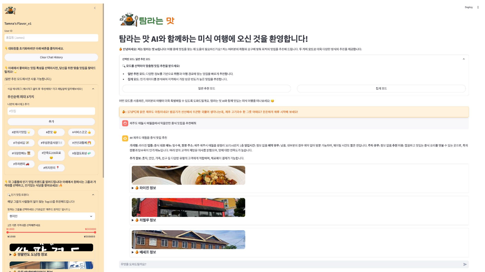

# 월간슈도렉 시리즈물의 주제

2024년 빅콘테스트에서 "**LLM을 활용한 제주도 맛집 추천 대화형 AI 서비스 개발**" 주제로 참가한 **탐라는 맛**팀의 김현우입니다. 이번 대회에서 우수상을 수상하며 값진 경험을 얻었지만, 프로젝트를 완성하는 과정에서 여러 가지 아쉬운 점도 남았습니다.대회가 끝난 지금, 저는 단순히 성과에 만족하기보다, 우리가 만든 서비스의 한계를 돌아보고 개선할 방법을 고민해보고자 합니다. 이 글에서는 개발 과정에서 느꼈던 아쉬운 부분과 이를 어떻게 발전시킬 수 있을지에 대해 시리즈물로 글을 작성해보려고 합니다. 해당 주제는 시리즈물로 크게 아래의 3가지 챕터로 글을 작성해보도록 하겠습니다. 

- 현 서비스 결과물 소개
- 코드 분석
- 개선점 진행

## 대화형 AI 맛집 추천 서비스 데모

먼저, 이번 시리즈물의 첫 글로 현재 서비스가 어떤 모습을 가지고 있고 어떤 기능을 가지고 있는지에 대한 얘기를 해보려고합니다. 저희 팀의 실제 서비스된 모습은 위의 사진과 같습니다. 사용자가 들어오면 [일반 추천 모드], [집계 모드]에서 맛집을 추천 받을지 혹은 정보를 검색할지에 대한 선택을 합니다. (실제 집계 모드가 필요한 이유는 공모전 주제가 위와 같았기 때문입니다.) 

이후, 사용자가 “제주도 애월시 애월읍에서 먹을만한 중식 맛집을 추천해줘”와 같은 질문을 서비스에 던지게 되면 내부 AI 서비스에서 적절한 추천과 답변을 만들어서 띄어주는 형태입니다. 그렇다면, 이러한 서비스는 어떤 아키텍처를 가지고 있을까요? 

## 전체적인 AI 서비스 아키텍처

위의 다이어그램은 탐라는 맛 서비스의 아키텍처를 도식화한 것입니다. 전체적인 순서는 아래와 같습니다. 

1. 사용자가 Streamlit에서 질문 입력
2. Query Rewrite 모듈을 통해 질문 정제
3. 추천 선택 모듈이 적절한 추천 방식 결정 (거리 기반, 키워드 기반, 선호도 조사 등)
4. 추천 결과를 LLM이 가공하여 자연스러운 응답 생성
5. 추천이 잘 이루어지지 않은 경우 Fallback 모델이 보조 추천 제공
6. 최종 추천 결과가 Streamlit을 통해 사용자에게 제공됨

사용자가 Streamlit에서 질문을 입력하면, 먼저 Query Rewrite 모듈을 통해 질문이 정제됩니다. 이는 사용자의 입력이 자연어로 이루어지다 보니 불필요한 노이즈가 포함될 가능성이 있기 때문에, 보다 정확한 처리를 위해 필요한 과정입니다. 

> 실제 사용자의 질문들을 보면서 느낀점은 질문에는 필요한 내용만 있는게 아니라는 점이었습니다. 처음에는 맛집 추천과 관련된 질문만 가정을 하고 서비스를 구축했습니다. 하지만, 실제 사용자의 질문은 그렇지 않고 불필요한 부분이 많습니다. 예를들어, 아래의 예시를 보면 
> 
> "안녕! 난 김현우인데, 나이는 30살이야! 제주도에 이번에 가려고 하는데, 제주도의 맛집이 궁금해!! **제주도 애월시 애월읍에서 먹을만한 중식 맛집을 추천해주시겠어요?"** 
> 
> 실제 인사말등의 앞의 내용은 필요없고 볼드체 한 부분만 정보를 검색하는데 필요합니다.

이후, 추천 선택 모듈이 질문을 분석하여 적절한 추천 방식을 결정합니다. 추천 방식은 크게 거리 기반, 키워드 기반, 그리고 선호도 조사 방식으로 나뉘며, 사용자의 의도와 입력된 정보에 따라 가장 적절한 방법이 선택됩니다. 이러한 과정을 위해 LLM을 기반으로 의도를 분류하게 해줍니다. 이를 Intent Classification 혹은 Router라고 부릅니다. 다만, 실제 이게 정확한 결과를 보장한다고는 할 수 없습니다. 그렇기에, Prompt Engineering을 통해서 개선하거나 Pydantic을 통해서 Structured Output을 통해 성능을 높이려고 시도했습니다. 

그 이후로는 추천모델을 통해서 추천을 하는 부분입니다. 실제, 이러한 부분은 “거리 기반”, “키워드 기반”, “선호도 조사” 등의 선택을 하게 되는데 선택된 추천 방식에 따라 서로 다른 로직을 통해 적절한 결과를 도출합니다.

1. **거리 기반 추천**
    
    사용자의 위치 정보를 활용하여 가까운 맛집을 추천하는 방식입니다. 제주도와 같이 지역 기반의 여행지에서는 사용자의 동선이 중요한 요소가 되므로, 단순히 평점이 높은 맛집이 아니라 이동 거리를 고려한 추천이 필요합니다. 이를 위해 카카오 맵 API와 같은 외부 지도 데이터를 활용하여 일정 반경 내에서 최적의 맛집을 추천합니다.
    
2. **키워드 기반 추천**
    
    사용자가 특정한 키워드를 입력하면, 해당 키워드와 일치하는 맛집을 추천하는 방식입니다. 예를 들어, “흑돼지”, “고기국수”, “분위기 좋은” 등의 키워드가 포함된 경우, LangChain을 활용한 검색을 통해 관련성이 높은 맛집을 찾아 제공합니다. 추가로, 맛집을 추천해주기 위해서 Ranking을 도입했는데 실제 사용자의 별점이나 리뷰수 같은 정보를 기반으로 
    
3. **선호도 조사 기반 추천**
    
    사용자가 UI에 입력한 데이터 혹은 프로필 정보를 바탕으로 맞춤형 추천을 제공하는 방식입니다. (사실 과거의 추천이나 대화이력으로 해야하지만, 아직 거기까지는 구현을 못해서 Cold-Start 상황을 가정하고 웹 UI에 선호도를 클릭하면 이를 기반으로 선호도를 매핑했습니다) 예를 들어, 분위기 좋은 곳을 표시했거나, 특정한 가격대의 맛집을 선호한다고 했을 경우, 이를 반영하여 더욱 개인화된 추천을 제공합니다. 
    

이처럼 다양한 추천 방식이 존재하지만, 모든 질문이 추천으로 이어지는 것은 아닙니다. 때때로 사용자는 단순한 대화를 시도하거나, 특정한 맛집 정보를 직접적으로 묻는 경우도 존재합니다. 이러한 상황을 처리하기 위해, LLM 기반의 **추천 선택(Router) 모듈**이 해당 질문이 추천이 필요한지 여부를 판단하며, 추천이 불필요한 경우에는 일반적인 채팅 응답을 생성하도록 설계되었습니다.

만약, 추천이 정상적으로 이루어지지 않았거나 적절한 결과가 나오지 않았다면, **Fallback 모델**이 작동합니다. Fallback 모델은 기존의 추천 결과가 부족할 경우, 대체 검색 방법을 사용하여 보완된 추천을 제공합니다. 이렇게 함으로써 사용자가 만족할 만한 결과를 받을 가능성을 높였습니다.

최종적으로, 모든 추천 과정이 완료되면 LLM이 추천결과와 첫 질문을 입력으로 받아서 사용자에게 자연스러운 응답을 정제해서 다시 제공하게 됩니다. 

### 데이터 수집 및 기획

저희는 GPT 모델과 사람들을 대상으로 질문 데이터를 수집하는 과정을 통해, 사용자들이 어떤 유형의 질문을 주로 던지는지 분석을 통한 기획을 진행하였습니다. 이 과정은 실제 사용자 쿼리의 사례를 확인하고, 각 사례에 적합한 추천 모델을 설계하기 위한 목적으로 진행되었습니다. 이를 기반으로 총 3가지 쿼리 유형으로 분류할 수 있었습니다. 첫 번째 유형은 **위치 기반의 추천**입니다. 사용자는 현재 위치나 특정 장소를 기준으로 맛집을 추천받고자 하는 경우가 많았습니다. 예를 들어, "내가 지금 있는 곳에서 갈만한 맛집 추천해줘" 또는 "애월시 애월읍에서 가까운 갈치 전문점을 찾고 싶어"와 같은 질문이 이에 해당합니다. 이러한 질문에 대해서는 사용자의 현재 위치 정보나 지정된 장소를 기준으로 적합한 맛집을 추천하는 방식으로 대응하였습니다. 두 번째 유형은 **키워드 기반의 추천**입니다. 사용자가 특정 키워드를 포함한 질문을 통해 원하는 정보를 요청하는 경우입니다. 예를 들어, "애월 근처에서 뷰 좋은 카페 중 디저트 맛집은 어디야?" 또는 "제주시에서 연인들과 갈만한 분위기 좋은 일식점 추천해줘"와 같은 질문이 이에 해당합니다. 이러한 경우에는 질문 속에 포함된 주요 키워드를 분석하여, 관련된 정보를 바탕으로 적합한 맛집을 추천하였습니다. 세 번째 유형은 **추천이 아닌 대화**입니다. 이는 단순히 자연스러운 대화를 목적으로 한 질문들로, 예를 들어 "안녕! 넌 누구야?" 또는 "넌 뭘 할 수 있어?"와 같은 대화형 질문이 이에 포함됩니다. 이 경우에는 사용자의 질문에 맞춰 자연스럽게 대화를 이어가는 방식으로 설계되었습니다.

### Multi-turn 기능을 지원하는 키워드 기반의 맛집 추천

저희 서비스의 핵심 기능 중 하나는 **Multi-turn 상호작용을 통한 키워드 기반 맛집 추천**입니다. 이는 일종의 Function Call과 유사한 방식으로 작동하며, 사용자의 질문에 따라 필요한 정보를 점진적으로 수집하고, 이를 바탕으로 최적의 추천을 제공하는 구조를 가지고 있습니다. (실제, 이후의 지도기반이나 키워드, FallBack 로직등이 해당 방법의 로직을 기반으로 작성되었습니다) 전체적인 프로세스는 아래의 5가지 과정을 통해서 진행됩니다. 

1. **사용자 질문 분석 및 키워드 추출**
    
    사용자가 "제주도 맛집 추천해줘"와 같은 질문을 던지면, LLM은 쿼리에서 주요 키워드(예: 위치, 메뉴, 기타 키워드)를 추출합니다. 예를 들어, "위치"는 제주도, "메뉴"는 비어 있고, "키워드"는 맛집으로 추출됩니다. 하지만 제주도는 지역 범위가 넓고 메뉴 정보가 없기 때문에 추천 과정에서 구체성이 부족합니다. 따라서 추가적인 정보가 필요합니다.
    
2. **추가 정보 요청 (Multi-turn 상호작용)**
    
    만약 위치나 메뉴 정보가 부족한 경우, 시스템은 사용자에게 다시 질문합니다. 예를 들어, "제주도 맛집 추천해드리려면 어떤 지역이 좋으신가요? 특정 지역이나 분위기가 있으신가요? 아니면 특별히 원하는 메뉴나 장소가 있으신가요?"와 같은 방식으로 추가 정보를 요청합니다. 사용자가 "애월 일식"이라고 답변하면, 기존 쿼리와 결합하여 보다 구체적인 정보로 업데이트됩니다. 최종적으로 생성된 쿼리는 {“위치”: 제주도 애월, “메뉴”: 일식, “키워드”: 맛집}의 형태를 갖습니다.
    
3. **RAG 기반 추천 프로세스**
    
    업데이트된 쿼리를 기반으로 RAG(Retrieval-Augmented Generation) 방식을 활용하여 데이터베이스(DB)에서 적합한 정보를 검색합니다. 이 과정에서는 먼저 위치(애월)와 메뉴(일식)를 기준으로 데이터를 필터링합니다. 만약 메뉴나 지역 매핑이 제대로 이루어지지 않는 경우에는 FallBack 전략을 통해 다른 옵션을 추가로 제공할 수 있습니다. 이후 필터링된 데이터에서 Query와 Document 간 임베딩 유사도를 계산하여 가장 적합한 결과를 추출합니다.
    
4. **임베딩 데이터 구성**
    
    Query는 위치, 메뉴, 키워드로 구성됩니다. 사실상 "키워드"만으로도 충분히 유사도를 계산할 수 있지만, 위치와 메뉴를 포함하면 더욱 정확한 결과를 도출할 수 있습니다. Document는 가게명, 메뉴, 리뷰, 가격대, 예약 여부 등 네이버에서 크롤링한 다양한 정보를 포함하며, 이를 통해 보다 풍부한 데이터를 기반으로 추천이 이루어집니다.
    
5. **최종 답변 생성**
    
    RAG를 통해 유사도가 가장 높은 가게 정보를 추출하고 이를 기반으로 사용자의 질문에 적합한 최종 답변을 생성하여 제공합니다. 단순 매핑으로 끝나는 것이 아니라 리뷰 수와 별점 등을 기반으로 가중치를 매겨 더 맛있고 인기 있는 가게가 추천되도록 Ranking 기능을 반영합니다. 예를 들어, "애월에 위치한 일식 맛집으로 '마니주'를 추천드립니다. 대표 메뉴로는 매운탕과 튀김 등이 있으며, 가성비 좋은 제주 애월 광령리의 핫플레이스입니다."와 같은 형태의 답변이 생성됩니다.
    

### 지도 기반의 맛집 추천

지도 기반 맛집 추천 서비스는 사용자의 위치를 중심으로 근처의 맛집을 추천하는 기능을 제공합니다. 특히, "올레시장 근처 치킨 추천"이나 "천지연 폭포에서 먹을만한 맛집 추천"과 같이 특정 장소를 기준으로 한 질문이 많다는 점에서 착안하여 개발되었습니다. 기존의 키워드 기반 추천이 넓은 지역 범위를 다뤘다면, 이 서비스는 보다 지엽적인 지역을 다루며 사용자 경험을 세밀하게 개선하고자 했습니다.먼저, 사용자가 특정 장소를 언급하면 시스템은 해당 장소의 위치 정보를 정확히 파악해야 합니다. 하지만, 천지연 폭포와 같은 넓은 지역에서는 정확한 위치를 특정하기 어렵고, 잘못된 위치로 인식될 가능성도 존재합니다. 이를 해결하기 위해 지도 API를 활용하여 지도를 화면에 띄우고, 사용자가 직접 자신의 위치를 클릭하도록 유도했습니다. 사용자가 선택한 위치는 위도와 경도 형태의 좌표로 저장되며, 이를 기반으로 반경 n km 이내의 맛집을 필터링합니다.필터링된 맛집 목록은 단순히 거리 기준으로만 제공되지 않습니다. 사용자의 추가적인 니즈를 반영하기 위해 RAG(Retrieval-Augmented Generation) 방식을 적용했습니다. 예를 들어, 사용자가 "치킨"이라는 키워드를 입력하면, 거리로 필터링된 결과에서 다시 키워드와 연관된 맛집을 추출합니다. 이 과정에서는 Query와 Document 간 임베딩 유사도를 계산하여 가장 적합한 결과를 도출합니다. Query는 입력한 키워드로 구성되며, Document는 맛집의 이름, 메뉴, 리뷰, 가격대 등 다양한 속성을 포함합니다. 이렇게 생성된 임베딩을 비교하여 유사도가 높은 순으로 정렬하고 최종 추천 리스트를 제공합니다. 예를 들어, 올레시장을 기준으로 반경 3km 내에 있는 치킨 전문점을 필터링한 뒤, "치킨" 키워드와 가장 관련성이 높은 가게를 추천합니다.결론적으로, 지도 기반 맛집 추천 서비스는 사용자 중심의 인터랙션과 RAG 방식을 결합하여 보다 정교하고 개인화된 결과를 제공합니다. 이는 단순히 거리나 평점에 의존하는 기존 방식과 차별화되며, 사용자가 원하는 지역과 메뉴에 맞춘 맞춤형 추천을 가능하게 합니다.

사실 본 글에서는 다루지는 않았지만, 선호도 기반의 추천, FallBack, 집계모드, 후속 추천 등 여러가지 기능을 구현했었습니다. 하지만, 상대적으로 중요도가 떨어진다고 생각해서 본 글에서는 해당 내용은 다루지 않도록 하겠습니다. 다음 글에서는 실제 위의 구조들을 어떤식으로 작성했는지 코드와 함께 살펴보면서 아쉬웠던 점과 개선 방향에 대해 좀 더 본격적으로 논의해보려고 합니다. 

읽어주셔서 감사합니다.