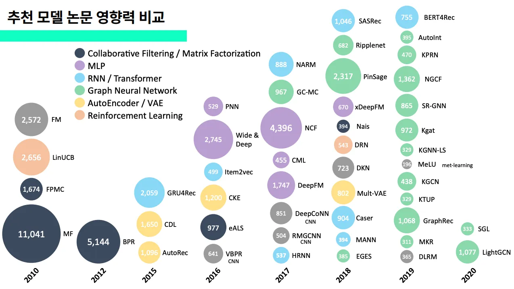
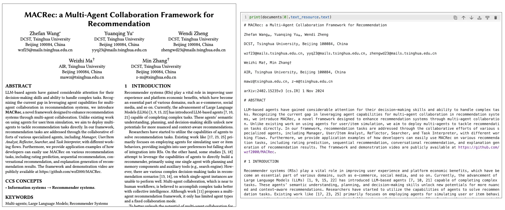
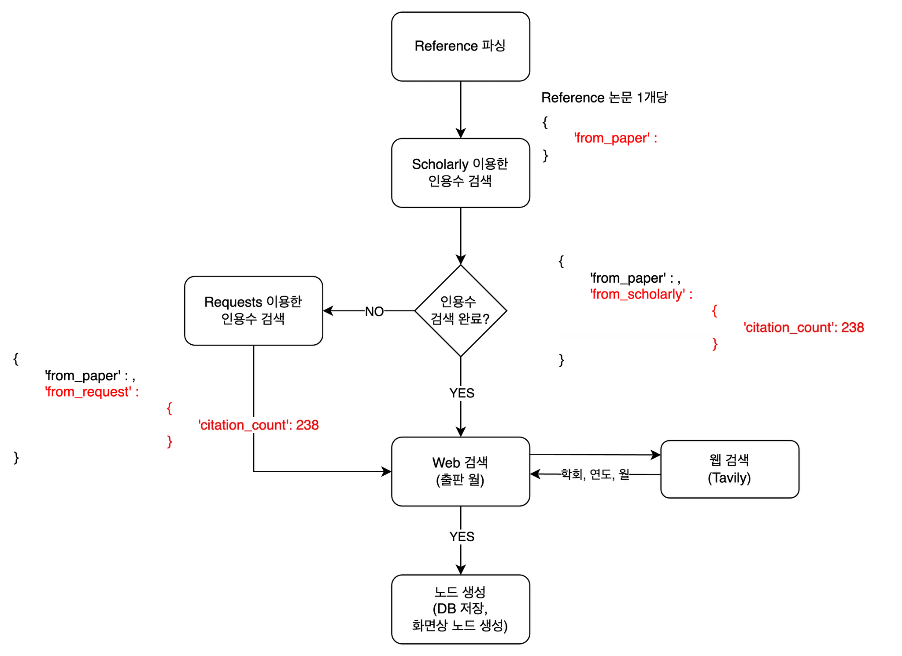

# 들어가며

이번에는 LLM을 가지고 작고 재밌는 개인 프로젝트를 해보려고 합니다. 바로 `LlamaParse`를 이용하여 논문의 Reference를 파싱하고, 파싱된 참조 논문들의 인용수 데이터를 가지고 그래프를 그려보는 것입니다!

- github : 🔗 <a href="https://github.com/kyeongchan92/recom_paper_crawling" target="_blank">**kyeongchan92/recom_paper_crawling ↗**</a>


# 배경

자신에게 중요한 논문을 찾았는데, 이 연구의 줄기는 무엇일까 궁금할 때가 있습니다. 과거에 어떤 중요한 논문이 있는지 한 눈에 파악할 수 있다면 좋겠다고 생각했습니다. 더구나 요즘 LLM을 가지고 앱을 만드는 것은 쉬운 일이 됐고, Agent를 활용하면 복잡한 일도 시킬 수 있겠다는 생각이 들었습니다.

실은 지난 2023년에 있었던 6th 슈도콘에서 아래와 같은 장표를 만들어 발표한 적이 있었는데, 이를 자동화 할 수 있는 LLM Agent를 만들어, 직접 사용하면 좋겠다 생각했었습니다.

*<a href="https://devocean.sk.com/blog/techBoardDetail.do?ID=164944&boardType=techBlog" target="_blank">**DEVOCEAN 블로그 : [PseudoCon: 함께하는 성장 여행] 가짜연구소의 6번째 컨퍼런스 ↗**</a>*

이 장표를 만들 때, 구글스칼라에 ‘Recommendation system’이라고 검색해서 나온 논문 중 인용수 300개 이상의 추천 모델을 다룬 논문만 직접 골라 정리했었는데요. 손수 하나하나 손으로 정리했기 때문에 시간이 오래걸렸는데, LLM이 이러한 트렌드 그래프를 자동으로 만들어줄 수 있지 않을까 생각했습니다! 중요하게 생각하는 것은 인용수입니다. 최근 5년 안에 인용수가 크게 증가한 논문은 학계에서 핵심적인 역할을 한 논문이잖아요~?

일단 결과물은 다음과 같습니다. 아직 완성은 아니고 계속 다듬어 나가서 이 사이트에도 배포해볼까 합니다!


- (테스트용으로 미리 띄워놓은 노드들이 있습니다) pdf 파일을 업로드합니다. 예시로 ‘MACRec’이라는 논문을 업로드해봅니다.
- ‘논문 파싱 시작’ 버튼을 누르면 Llamaparse는 내용을 파싱해서 벡터 DB에 저장합니다. RAG가 가능해집니다.
- ‘Reference 파싱 시작’ 버튼을 누르면 논문에서 Reference 부분을 추출하여 Google Scholar 기준 인용수를 검색하여 화면에 노드로 표시합니다.

일단 이번 달의 목표는 다음과 같이 잡고 작업했습니다.

1. 논문 1개를 업로드하면 LlamaParse로 본문 내용을 파싱한다.
2. 논문의 Reference를 추출한다. `논문명`, `저자`, `출처`를 따로 추출한다. 예를 들면 아래와 같이 dictionary 형태로 추출한다.
3. 논문별로 구글스칼라의 인용수를 검색해서 수집한다.
4. 그래프를 그린다.
   
    ```python
    {
    1 : {
        'title': 'Language models are few-shot learners',  # 논문명
        'authors': 'Tom Brown, Benjamin Mann, Nick Ryder, Melanie Subbiah, Jared D Kaplan, Prafulla Dhariwal, Arvind Neelakantan, Pranav Shyam, Girish Sastry, Amanda Askell, et al.',  # 저자들
        'source': 'Advances in neural information processing systems 33 (2020), 1877–1901'  # 출처
        },
    2 : {...},
    3 : {...},
}
    ```


# 1. 논문 1개를 업로드하면 LlamaParse로 본문 내용을 파싱한다.

```python
from llama_parse import LlamaParse

documents = LlamaParse(result_type="markdown").load_data('./MACRec.pdf')
```

예를 들어 MACRec이라는 pdf 파일을 LlamaParse를 이용해 파싱하면, 결과는 다음과 같아집니다.



논문과 비교해보면, 형식은 차치하더라도 저자 정보같은 글자는 잘 가져오는 것 같습니다! 이렇게 파싱된 문장들을 벡터 DB에 넣어야 LLM으로 RAG를 할 수 있습니다. 저는 <a href="https://medium.com/kx-systems/rag-llamaparse-advanced-pdf-parsing-for-retrieval-c393ab29891b" target="_blank" style="text-decoration: underline;">**RAG + LlamaParse: Advanced PDF Parsing for Retrieval | by Ryan Siegler | KX Systems | Medium ↗**</a> 사이트를 참고하여 KDB라는 무료 벡터DB를 사용했습니다. 아래는 참고 사이트에서 그대로 가져와 사용한 코드입니다.

```python
import kdbai_client as kdbai
from llama_index.core.node_parser import MarkdownElementNodeParser
from llama_index.vector_stores.kdbai import KDBAIVectorStore
from llama_index.core import StorageContext
from llama_index.core import VectorStoreIndex

session = kdbai.Session(api_key=KDBAI_API_KEY, endpoint=KDBAI_ENDPOINT)
db = session.database("default")

schema = [
        dict(name="document_id", type="str"),
        dict(name="text", type="str"),
        dict(name="embeddings", type="float32s"),
    ]
indexFlat = {
        "name": "flat",
        "type": "flat",
        "column": "embeddings",
        "params": {'dims': 1536, 'metric': 'L2'},
    }

KDBAI_TABLE_NAME = "LlamaParse_Table"

try:
    db.table(KDBAI_TABLE_NAME).drop()
except kdbai.KDBAIException:
    pass

#Create the table
table = db.create_table(table=KDBAI_TABLE_NAME, schema=schema, indexes=[indexFlat])

node_parser = MarkdownElementNodeParser(llm=llm, num_workers=8).from_defaults()
nodes = node_parser.get_nodes_from_documents(documents)
base_nodes, objects = node_parser.get_nodes_and_objects(nodes)
vector_store = KDBAIVectorStore(table)
storage_context = StorageContext.from_defaults(vector_store=vector_store)

recursive_index = VectorStoreIndex(
    nodes= base_nodes + objects, storage_context=storage_context
)

table.query()
```

코드를 한줄 한줄 이해하진 못했지만 벡터DB의 조건을 설정해서 테이블을 생성하고, parser로 documents들을 KDB의 벡터DB에 삽입하는 과정이라는 건 알 수 있었습니다. 아무튼 `table.query()`의 결과로 볼 수 있는 것은 다음과 같습니다.


분리된 document별로 id가 생성되고, text와 embedding까지 생성된 것을 볼 수 있습니다. 이 상태에서 RAG가 가능합니다. 아래와 같은 프롬프트를 통해 논문의 Reference를 dictionary 형태로 추출할 수 있습니다.

# 2. 논문의 Reference를 추출한다.

```python
from openai import OpenAI
client = OpenAI()

def embed_query(query):
    query_embedding = client.embeddings.create(
            input=query,
            model="text-embedding-3-small"
        )
    return query_embedding.data[0].embedding

def retrieve_data(query):
    query_embedding = embed_query(query)
    results = table.search(vectors={'flat':[query_embedding]},n=5,filter=[('<>','document_id','4a9551df-5dec-4410-90bb-43d17d722918')])
    retrieved_data_for_RAG = []
    for index, row in results[0].iterrows():
        retrieved_data_for_RAG.append(row['text'])
    return retrieved_data_for_RAG

def RAG(query):
    question = "You will answer this question based on the provided reference material: " + query
    messages = "Here is the provided context: " + "\n"
    results = retrieve_data(query)
    if results:
        for data in results:
            messages += data + "\n"
    response = client.chat.completions.create(
      model="gpt-4o",
      messages=[
          {"role": "system", "content": question},
          {
          "role": "user",
          "content": [
              {"type": "text", "text": messages},
          ],
          }
      ],
      # max_tokens=300,
    )
    content = response.choices[0].message.content
    return content

answer = RAG(f"""Find this paper's References. Give me that References with the given json form. Don't return any other comments except that References

EXAMPLE : 
{{
    1 : {{
            "from_paper : 
                            {{
                                "title" : "Language models are few-shot learners",
                                "authors" : "Tom Brown, Benjamin Mann, Nick Ryder, Melanie Subbiah, Jared D Kaplan, Prafulla Dhariwal, Arvind Neelakantan, Pranav Shyam, Girish Sastry, Amanda Askell, et al",
                                "source" : "Advances in neural information processing systems 33 (2020), 1877–1901",
                                "year" : 2020
                            }}
    }},
    2 : {{
        ...
    }},
    ...
}}
""")
```
위와 같은 few-shot 프롬프팅 코드를 실행시키면 아래와 같은 결과를 얻을 수 있습니다. Reference 부분을 불러와 dictionary 형태로 사용할 수 있습니다.


```python
{
    1: {
        'from_paper': {
                        'title': 'Language models are few-shot learners',
                        'authors': 'Tom Brown, Benjamin Mann, Nick Ryder, Melanie Subbiah, Jared D Kaplan, Prafulla Dhariwal, Arvind Neelakantan, Pranav Shyam, Girish Sastry, Amanda Askell, et al.',
                        'source': 'Advances in neural information processing systems 33 (2020), 1877–1901',
                        'year': 2020
                       }
        },
   2: {
        'from_paper': {
                        'title': 'Trends in distributed artificial intelligence',
                        'authors': 'Brahim Chaib-Draa, Bernard Moulin, René Mandiau, and Patrick Millot',
                        'source': 'Artificial Intelligence Review 6 (1992), 35–66',
                        'year': 1992
                      }
      },
 3: {...},
 ...
}
```

`from_paper` 라는 key를 한 번 더 추가한 이유는, 뒤에서 Google scholar를 이용해 인용수를 검색할 때, 논문명과 저자명을 가지고 비교할 것이기 때문입니다. Google scholar에서 검색한 내용은 `from_scholar`로 삽입할 예정입니다. 즉, `from_paper`와 `from_scholar`의 비교가 필요합니다.

# 3. 논문별로 구글스칼라의 인용수를 검색해서 수집

`scholarly`라는 라이브러리를 이용하면, 논문명으로 구글스칼라에서 검색하여 원하는 정보를 가져올 수 있습니다. 하지만 구글스칼라는 엄격하게 요청 제한이 걸려있어서 하루에 20~30개 요청만 해도 Max Try 에러가 뜨더라구요. 프록시 변경을 통해 해결할 수 있다고는 하지만, 아직 방법을 찾고 있습니다. 아무튼, 특정 논문의 인용수를 아래처럼 쉽게 가져올 수 있습니다.

```python
from scholarly import scholarly
search_query = scholarly.search_pubs('Language models are few-shot learners')

for result in search_query:
    title = result['bib']['title']
    authors = result['bib']['author']
    venue = result['bib']['venue']
    pub_year = result['bib']['pub_year']
    num_citations = result['num_citations']

    print(f"title : {title}")
    print(f"title : {authors}")
    print(f"title : {venue}")
    print(f"title : {pub_year}")
    print(f"title : {num_citations}")
    print()
```

```
title : Language models are few-shot learners
authors : ['T Brown', 'B Mann', 'N Ryder']
venue : Advances in neural …
pub_year : 2020
num_citations : 39991

title : Language models are few-shot learners
authors : ['B Mann', 'N Ryder', 'M Subbiah', 'J Kaplan']
venue : arXiv preprint arXiv …
pub_year : 2020
num_citations : 194
```

‘Language models are few-shot learners’라는 논문을 검색하면 위와 같이 검색 결과를 깔끔하게 가져올 수 있습니다. 하지만 검색 결과가 두 개 이상 나올 때가 있습니다. 구글 스칼라에서 확인해보니 아래와 같습니다.

](<../../../static/img/monthly_pseudorec_202501/kyeongchan/google scholar search result.png>)

첫 번째 결과는 제가 찾는 논문인거고, 두 번째 검색결과는 ‘T Brown’이라는 사람만 빠진 PPT 자료입니다. 제목은 같지만 제가 원하는 논문은 첫 번째 결과인데요. 이를 LLM을 이용해 원하는 검색결과를 가져와야겠다고 생각했습니다. MACRec 논문에서 추출한 Reference 논문 정보와 scholarly 검색 결과들을 비교하면서 같은 논문을 가리키면 YES, 틀리면 NO를 반환하게 했습니다.

```python
PAPER_COMPARE_PROMPT = """🔹 Task Instruction
Determine whether A paper and B paper refer to the same research work. If they do, respond with "YES"; otherwise, respond with "NO".

A paper title : {a_paper_title}
A paper authors : {a_paper_authors}
A paper source : {a_paper_source}

B paper title : {b_paper_title}
B paper authors : {b_paper_authors}
B paper source : {b_paper_source}"""
```

실제로는 태스크 설명과 A, B 논문 리스트 사이에 더 많은 프롬프트가 들어갑니다. 처음엔 이렇게 간단히 했었는데, 같은 논문인데도 제목의 큰따옴표(”)와 작은따옴표(’)만 달라도 다른 논문이라고 반환하더군요! 그래서 수정을 여러번 했습니다.

`scholarly`에서 검색했을 때 검색결과가 없을 때도 있었습니다. 그럴 때마다 `requests`로 Google scholar에 요청보내서 검색하면 사용하면 검색이 될 때도 있더라구요~? 그래서 scholarly로 인용수가 찾아지지 않으면 `requests`로 인용수를 검색하도록 했습니다.



논문의 출판월까지 수집할 수 있으면 논문 노드 정렬을 예쁘게 할 수 있을 것 같아서 Tavily를 이용한 학회 & 출판연월 검색까지 구현해놓았지만, 다음 월호에서 다뤄보려고 합니다!

# 4. 그래프를 그린다.

마지막으로 Django와 javascript를 이용하여 브라우저에 논문 노드를 생성해주었습니다. 결과물은 위에서 보여드렸었죠~? D3.js라는 라이브러리를 이용하여 interactive하게 드래그할 수 있도록 했습니다. 확실히 논문 인용수를 이용해 영향력을 볼 수 있으니 어떤 논문이 중요한지 한 눈에 들어왔습니다. 앞으로는 연도/월별 정렬 기능을 넣을 예정입니다. 그리고 Neo4j에 이 논문들을 추가하여 관리하고, Reference에 있는 논문들로 다시 검색할 수 있도록 할 예정입니다. 그러면 특정 논문이 어떤 흐름을 갖는지 잘 볼 수 있을 것 같아요!

저만의 작은 월간슈도렉 Toy 프로젝트인데 앞으로 Agent를 적용해볼 수도 있을 것 같습니다. 이 프로젝트 결과물을 이용해 앞으로 제 자신이 논문 검색을 편하게 할 수 있었으면 좋겠네요😄 감사합니다!