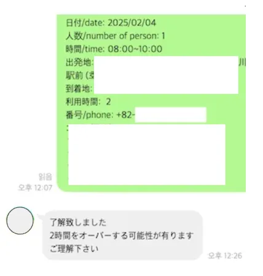

## 인사말

가짜연구소 Life is Short, You need Recommendation System(대략 추천시스템 스터디)에서 이번 기수 부터 월간 슈도렉을 시리즈물로 작성하려고 합니다. ‘Agentic AI를 통한 서비스 운영 자동화’입니다.

대략적으로 제가 업무에서 주로 활용했던 LangGraph 기반 Multi Agent와 RAG를 이용해서 제가 운영하고 있는 관광 서비스의 관리 및 운영을 자동화 하는, 그야말로 1인이지만, Agent들과 함께 작업을 처리하는 것을 목표로 기능 구현을 하고, 최적화를 해나갈 예정입니다.

나름대로 서비스 규모가 점점 커질 것을 기대(?)하며, 미리 자동화 작업을 하면서 연구했던 내용을 Applying 하는 것에 초점을 둡니다 (사실 서비스 품질에 더욱 신경쓰긴 할겁니다 → 그게 기업이 나를 써주는 이유이니만큼..)

추천시스템 스터디인데 너무 다른거 아니냐고 생각하실 분들이 많습니다만, 기능에 추천시스템이 들어갈 예정입니다. 반드시 넣을 예정입니다.

시리즈의 순서는 아래와 같이 진행해보고자 합니다.

- 서비스 소개(홍보는 아니지만 홍보 맞습니다)
- 서비스 아키텍처 및 유저 플로우 (도중 변경 가능성 많음)
- 기능 별 Agent 구현 내용 정리 n 부작
- 종합 Agent 관리 내용으로 마무리

그럼 이번 1월의 월간슈도렉으로써 서비스 소개와 기획 중인 아키텍처를 기록해봅니다. 

## 서비스 소개

잽코라는 일본 관광 상품을 제휴해서 판매하는 서비스를 운영합니다.

일본의 택시사와 제휴를 맺어 여행 상품을 유통하는 역할을 하는 것인데요.

홋카이도하면 삿포로 스스키노, 오타루를 많이들 가십니다만, 정말 예쁜 관광지가 있습니다.

비에이(Biei)라는 곳이고, 눈이 없을 때에도 경치가 정말 예쁘지만, 눈덮인 크리스마스 나무가 굉장히 인상적인 관광지입니다. 

다만, 이렇게 넓은 지역을 걸어서 다니기는 매우 힘들고, 지하철을 타고 돌아다니는 것도 한계가 있지요

](<../../../static/img/monthly_pseudorec_202501/namjoon/vast area.png>)

이러한 문제로 인해 버스투어와 택시투어 등이 존재하는데, 잽코는 그 중 택시투어 상품을 제공하는 역할을 합니다. 

여러가지 기존의 투어에서의 문제점들이 존재하지만, 서비스 소개가 중점이 아니므로, 이 부분은 생략하고…

Agentic AI를 어떻게 활용할 것인지를 이야기 하고, 자동화 서비스의 아키텍처를 기록해보도록 하겠습니다.

## 자동화를 위한 Task 분류

자동화 서비스를 위한 Task 분류를 크게 나눈다면, CS & Operating  / 마케팅 / 행정처리 로 나눠볼 수 있곘습니다.

그 중 가장 먼저 작업하려고 하는 것은 CS & Operating 작업이 되겠습니다.

기능 단위로 나눠보면 사실 더 많지만, 대강 잡아보면 문의, 예약, 알림 정도가 현재 가장 필요한 기능입니다.

](../../../static/img/monthly_pseudorec_202501/namjoon/architecture.png)

이 중 ‘문의’, ‘예약’의 각 세부 Task를 우선 하위 Agent들을 통해 자동화 한뒤, 추후에 Multi Agent 기반으로 전체 자동화 하는 것을 목표합니다. (휴먼인더루프는 어쩔 수 없이 필요하겠지만요)

그럼 이제 어떤 일들을 시킬 것인지 Task 중 한 예시를 들어봅니다.

‘예약’ 파트의 ‘차량 확인’의 경우, 공유되어있는 Google시트로 확인을 우선 하지만 시트 내에서 확인 안되는 경우 일본의 배차담당자한테 재확인 하는 작업을 필요로 합니다. 

따라서 시트를 검사한 뒤에 아래와 같이 신청 정보를 제공(12:07 메시지)할 때의 답변(12:26 메시지)에 따라 배차의 가능 여부를 확인하는 작업을 거치게 됩니다. 

신청 내용을 확인한 담당자가  “了解致しました(이해했다)” 또는 “OKです(오케이!)**”와 같은 반응을 보였을 때, 배차 가능으로 최종 확인하여, 처리를 해주도록 합니다.** 

이 과정에서 배차가 안되는 다양한 원인을 답변 받을 수 있으므로, 그 부분에 대해서 스스로 판단하고, 다음 작업 수행을 요청할 수 있는 Agent를 필요로 합니다. 

### 서비스 스택 및 시스템 아키텍처

위와 같은 Task를 자동화 하기 위한 아키텍처 구성은 아래와 같이 볼 수 있습니다.

최대한 익숙한 것들로 가능한 빠르게, 그리고 인프라 비용을 최소화 할 수 있는 구조로 저렴하게 구현합니다.

](<../../../static/img/monthly_pseudorec_202501/namjoon/stack and architecture.png>)

### User Inputs(Web, UI Channels)

유저를 접하는 것은 온전히 Web 뿐은 아닙니다. 

Web에서 신청서를 바로 던지는 경우도 존재하지만, 소통의 채널은 얼마든지 많아질 수 있습니다. 

카카오톡, 카카오톡비즈, Line, 블로그 등 다양한 채널을 이용하기에 각 채널별로도 데이터를 받아들여 Task를 처리할 수 있도록 해야합니다. → 통합해서 모두 소통하는 Agentic AI를 만드는 것이 최대 목표…

### Serverless Infra

서버리스로 저렴하게 기능을 작동시키기 위한 아키텍처 구성을 했습니다.

1. **Database - DynamoDB**

    DB는 상황에 맞게 사용하는 것이 가장 중요하지만, 저의 상황은 매우 평범한 직장인이기 때문에, 저렴함이 생명입니다.

    Local MySQL을 사용하기엔 실제 웹서비스를 곧 오픈해야 하기 때문에 cloud service 중 가장 저렴이로 골라봅니다. 

    DynamoDB → I/O도 보관도 매우 저렴해서 로그를 담는데에 많이 활용됩니다. 로그 쌓는데에도 활용하겠지만, Static한 User Information과 기타 Payment도 모두 Dynamo쓸 예정입니다.

    → 분석을 위한 데이터 마트 구축에는 어려울 수 있지만, 분석할 정보는 따로 일배치로 cron을 돌려놓을 예정

    (어차피 저 혼자 개발할 것이기 때문에 제가 편하게 쓰면서 합리적 비용을 요구하는 DDB로 선택)

2. **Application Framework - FastAPI**

    익숙한 Framework이자 uvicorn을 통한 비동기 통신에 능해 어렵지 않게 선택했습니다.

3. **API Server(Serverless) - Lambda x ALB(LoadBalancer)**

    서버리스로 구현해 가능한 가볍게 구현할 예정입니다.

    다만, 비용적으로 API Gateway가 저렴할 수 있는데, Load Balancer를 사용하는 것은 추후에 나올 ‘Content Marketer Agent’ 녀석의 추론 시간을 보장하기 위함입니다.

    실제로 너무 많이 겪었던 timeout 문제로 API Gateway의 30초 제한을 피할 구세주같은 방법론입니다.

    (물론 Web Socket API를 활용하면 이 부분은 해결을 할 수 있습니다만, 60초 추론하자고 소켓까지는 좀..)

### Agentic AI

주 Task들을 처리하는 모듈이 되겠습니다. 이번 시리즈의 주인공인데, 할 일이 매우 많아질것 같습니다.

- Line 내 신청서 전달 / 답변에 따라 신청 완료파악
- 카카오톡채널 문의 챗봇 → Multi Turn 구조로 고객 요구사항 및 신청을 위한 요청정보 수집
- 배차 관리
- 결제 관리
- 환불, 취소 관리
- ^^…. etc

## 1월호를 마치며

사실 내용이랄게 많지 않은 제가 운영하는 서비스와 그에 대한 앞으로의 계획에 대한 소개글이 되었네요.

실은 위 내용을 기획하고, 전반적으로 백엔드 개발작업에 포커싱되어 있던터라 ‘Agentic AI 구현’이 많이 진행되지 않아 다소 아쉬움이 있습니다.

2월호에서는 각 기능 별 Agent 구현을 하면서 그 시행착오와 결과를 공유해보도록 하겠습니다.

## References

🔗 <a href="https://papers.ssrn.com/sol3/papers.cfm?abstract_id=5109470" target="_blank">** Agentic AI: Service Operations with Augmentation and Automation AI by Guanling Yang :: SSRN ↗**</a>

🔗 <a href="https://www.researchgate.net/publication/388313991_Agentic_AI_Autonomous_Intelligence_for_Complex_Goals_-_A_Comprehensive_Survey" target="_blank">**(PDF) Agentic AI: Autonomous Intelligence for Complex Goals – A Comprehensive Survey ↗**</a>

🔗 <a href="https://www.akira.ai/blog/ai-agents-for-travel" target="_blank">**Agentic AI in Travel: Redefining Journeys with Smart Workflows ↗**</a>

🔗 <a href="https://www.akira.ai/blog/autonomous-reservation-system" target="_blank">**Streamline Your Bookings: Akira AI Multi-Agent Reservation Management ↗**</a>

